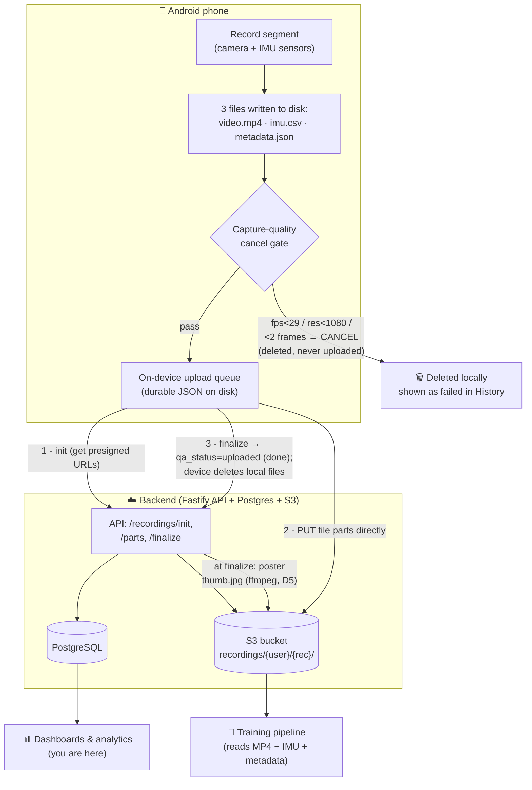
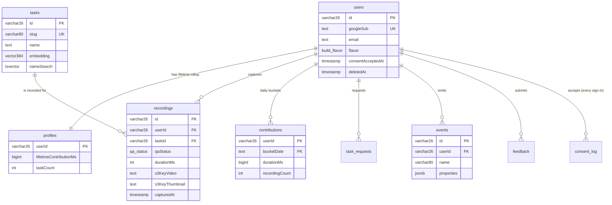
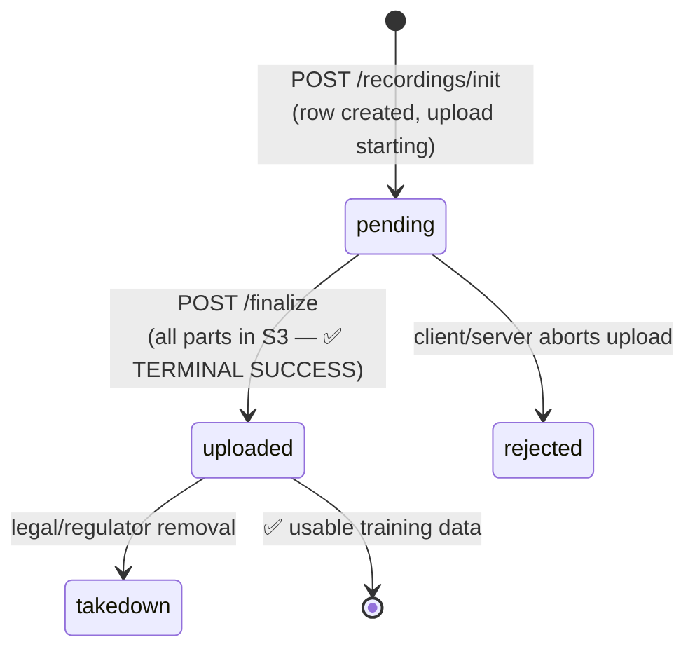
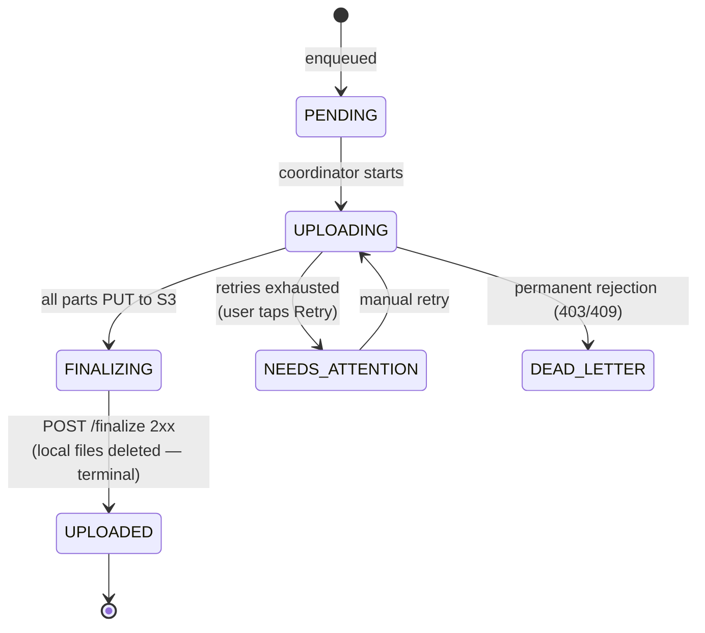
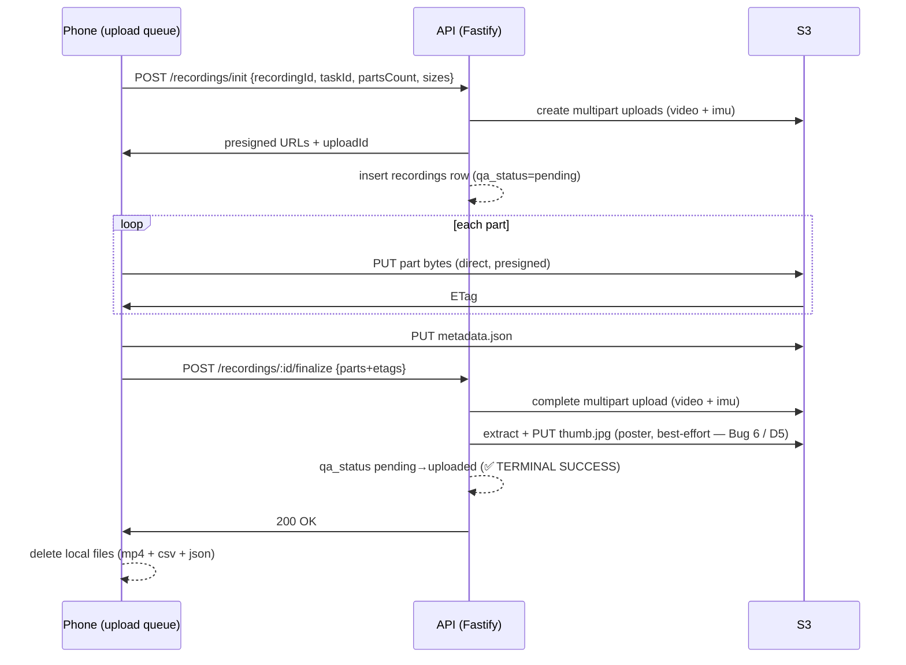

# Homelander — Data Model & Flow

## 1. What this app actually produces

Every recording is called a **segment**. A segment produces exactly **three files**:

| File            | What it is                         | Format                                              |
| --------------- | ---------------------------------- | --------------------------------------------------- |
| `video.mp4`     | The egocentric video               | HEVC, 1080p, 30fps, ultrawide (≥110° field of view) |
| `imu.csv`       | The motion-sensor stream           | CSV, ~100+ Hz accelerometer + gyroscope             |
| `metadata.json` | A "receipt" describing the segment | JSON, ~50 fields (codec, drift, task, device…)      |

These three files travel **byte-for-byte** from the phone to cloud storage — they are
**never re-encoded or modified** server-side. What the phone wrote is exactly what the
training pipeline reads.

There are **three places data lands**, and they answer different questions:

| Store                   | Contains                                                                         | Use it for                                                                                                       |
| ----------------------- | -------------------------------------------------------------------------------- | ---------------------------------------------------------------------------------------------------------------- |
| **PostgreSQL**          | One row per user, recording, task, contribution, event… (metadata + bookkeeping) | Operational queries, fleet health, the server-side `events` mirror — **this is what you query for ground-truth** |
| **S3 (object storage)** | The actual `video.mp4` / `imu.csv` / `metadata.json` payload files               | The training-data lake — large binary/CSV files, consumed by ML pipelines                                        |
| **GA4 + BigQuery**      | Client behavioral events (the GA4 stream) + its daily BigQuery export            | Product funnels, activation/retention, feature usage — see [§12](#12-analytics-events--funnels-ga4--bigquery)    |

Postgres is the **index**, S3 is the **content**, and GA4/BigQuery is the **behavioral
stream**. A recording row in Postgres carries the S3 keys (`s3_key_video`, `s3_key_imu`,
`s3_key_metadata`) pointing at its files. The Postgres `events` table is the **server-side
mirror** of the money-path events that also flow to GA4 — so the upload / finalize / eviction
funnel tail stays trustworthy even when client events are lost on flaky networks (see
[§12](#12-analytics-events--funnels-ga4--bigquery)).

---

## 2. End to end data flow



**In words:**

1. The phone records a segment → 3 files on disk.
2. A **quality gate** runs after recording. If the video dropped below 29fps, isn't 1080p,
   or has too few frames, the segment is **cancelled and deleted locally** — it never reaches
   the server and never appears in any server table. (See [§9](#9-gotchas-for-analysts).)
3. Passing segments enter an **on-device upload queue**. The app asks the API to start an
   upload (`init`), uploads the file chunks **directly to S3** using presigned URLs, then
   tells the API it's done (`finalize`). On a `finalize` 200 the recording is **`uploaded` —
   terminal success** — and the phone **deletes its local copy**. _(Enh 3 / D1, 2026-06-04:
   the former server-side hash-verify worker — re-hash MP4 + IMU, flip to `verified` — was
   removed; `uploaded` is now the final good state. See [§8](#8-the-recording-lifecycle-qa_status).)_
4. At `finalize` the server also extracts a **poster thumbnail** (`thumb.jpg`) for cross-device
   History (Bug 6 / D5) — best-effort, never blocks the upload.
5. **You query Postgres** for dashboards. The **ML team reads S3** for training.

---

## 3. S3 storage layout

Two buckets (names suffixed by environment, e.g. `humyn-recordings-prod`):

```
humyn-recordings-{env}/
└── recordings/{userId}/{recordingId}/
    ├── video.mp4        # ContentType video/mp4   — multipart upload
    ├── imu.csv          # ContentType text/csv     — multipart upload
    ├── metadata.json    # ContentType application/json — single PUT
    └── thumb.jpg        # ContentType image/jpeg — server-generated poster (Bug 6 / D5); best-effort, may be absent

humyn-feedback-{env}/
└── feedback/{userId}/{feedbackId}/
    └── diagnostic.json  # in-app feedback attachments (≤5MB)
```

- `userId` and `recordingId` are both **ULIDs** (26-char sortable IDs). The `recordingId`
  is generated **on the device** and is the same value used as the primary key of the
  `recordings` table — so an S3 key fully determines the DB row and vice-versa.
- Large files (`video.mp4`, `imu.csv`) are uploaded in **8 MiB parts** (5 MiB on cellular)
  via S3 multipart upload, max 1000 parts. `metadata.json` is one small `PUT`.
- The three captured files are **immutable once uploaded** (`finalize` is terminal; the device
  deletes its local copy and there is no re-upload path). _(Enh 3 / D1, 2026-06-04: the former
  hash-mismatch re-upload overwrite was removed with the verification flow.)_ The server-derived
  `thumb.jpg` (Bug 6 / D5) is the only object the backend writes after upload.
- **S3 object keys are independent of the device-local filename.** As of schema `1.2.0`
  (quick 260522-elm) the on-device files are prefixed with the segment's 26-char ULID
  (`{recordingId}_{YYYYMMDD_HHMMSS_NNN}.{ext}`) so they are self-identifying on disk — but
  the S3 object keys are still literally `video.mp4` / `imu.csv` / `metadata.json` (the
  `recordingId` is the folder, not the object name). The upload path derives the key from
  `recordingKeys({userId, recordingId})`, never from the local filename.

---

## 4. The per-segment `metadata.json` (the quality + provenance receipt)

This is the most important file for **data quality and training**. It is written by the
phone (`MetadataComposer.kt`), uploaded byte-for-byte, and most of its fields are also copied
into the `recordings` Postgres row. **Schema version: `1.5.0`** _(two 2026-06-04 changes: Enh 3 / D1 removed `file_sha256` / `imu_sha256` — `1.3.0` → `1.4.0`; Bug 3 / D3 changed `capture_device_info.location` from a coarse string to the precise object `{ lat, lng, accuracy_m, provider, captured_at, label }` — `1.4.0` → `1.5.0`, with the consent text updated + consent version bumped.)_

It has **six** blocks (the sixth, `calibration`, was added in schema `1.2.0` — quick task
260522-elm). Below is every field.

### `contributor_info`

| Field     | Type           | Notes                                |
| --------- | -------------- | ------------------------------------ |
| `name`    | string         |                                      |
| `email`   | string         |                                      |
| `age`     | int \| null    |                                      |
| `gender`  | string \| null |                                      |
| `consent` | boolean        | Did the user accept the consent text |

### `task_info`

| Field           | Type   | Notes                                    |
| --------------- | ------ | ---------------------------------------- |
| `task_id`       | string | FK to `tasks.id`                         |
| `task_name`     | string |                                          |
| `task_category` | string |                                          |
| `environment`   | string | e.g. indoor/outdoor as actually captured |
| `setting`       | string | task's configured setting                |
| `time_of_day`   | string |                                          |

### `capture_device_info`

| Field          | Type           | Notes                                                                                                                                                                    |
| -------------- | -------------- | ------------------------------------------------------------------------------------------------------------------------------------------------------------------------ |
| `type`         | string         | device class                                                                                                                                                             |
| `model`        | string         | phone model                                                                                                                                                              |
| `os`           | string         | "Android"                                                                                                                                                                |
| `os_version`   | string         |                                                                                                                                                                          |
| `app_version`  | string         |                                                                                                                                                                          |
| `dfov_degrees` | number         | diagonal field of view (must be ≥110°)                                                                                                                                   |
| `ip_address`   | string \| null | usually filled server-side                                                                                                                                               |
| `location`     | object \| null | precise GPS `{ lat, lng, accuracy_m, provider, captured_at, label }` (Bug 3 / D3, schema 1.5.0); `label` = optional reverse-geocoded "City, Country"; `null` when no fix |

### `metadata` (the capture-spec block — the heart of quality monitoring)

**File sizes** _(per-file SHA-256 removed 2026-06-04 — Enh 3 / D1; no upload hashing)_
| Field | Type | Notes |
|---|---|---|
| `footage_type` | string | always `"egocentric_head"` |
| `filename` | string | the MP4 filename — local on-disk name `{recordingId}_{YYYYMMDD_HHMMSS_NNN}.mp4` (ULID-prefixed, schema 1.2.0; quick 260522-elm). **S3 object key is UNCHANGED — still literally `video.mp4`** under `recordings/{userId}/{recordingId}/` |
| `file_size_bytes` | number | actual MP4 byte count || `imu_filename` | string | local on-disk name `{recordingId}_{YYYYMMDD_HHMMSS_NNN}.csv` (ULID-prefixed). **S3 object key UNCHANGED — still literally `imu.csv`** |
| `imu_size_bytes` | number | actual CSV byte count |
**IMU rates & video↔IMU drift** _(quality telemetry)_
| Field | Type | Notes |
|---|---|---|
| `imu_gyro_rate_hz` | int | observed gyroscope sample rate |
| `imu_accel_rate_hz` | int | observed accelerometer sample rate |
| `imu_min_rate_hz_observed_p1` | number \| null | 1st-percentile (worst) IMU rate — must stay ≥100 Hz |
| `imu_video_drift_max_ms` | number \| null | max time misalignment between video & IMU clocks |
| `imu_video_drift_mean_ms` | number \| null | mean drift |
| `imu_video_drift_p99_ms` | number \| null | 99th-percentile drift |

**Audio** — _always null_:
`audio_sample_rate_hz`, `audio_codec`, `audio_bitrate_bps`, `audio_channels` → all `null`.

**Timing**
| Field | Type | Notes |
|---|---|---|
| `start_timestamp` / `end_timestamp` | ISO-8601 w/ offset | video wall-clock bounds |
| `imu_start_timestamp` / `imu_end_timestamp` | ISO-8601 w/ offset | first/last IMU sample |
| `duration_seconds` | number | |

**Video spec** _(everything below is measured from the actual encoded file, not hardcoded)_
| Field | Type | Notes |
|---|---|---|
| `container_format` | string | `"mp4"` |
| `resolution` | string | e.g. `"1920x1080"` (from MP4 track header) |
| `fps` | number | measured mean fps (cancel gate fails below 29) |
| `orientation` | string | `"landscape_left"` or `"landscape_right"` |
| `video_codec` | string | `"hevc"` / `"h264"` |
| `video_profile` | string | `"main"`, `"main10"`, `"main-still"`, `"unknown"` |
| `bitrate_bps` | number | encoder-reported (or configured fallback) |
| `bitrate_source` | string | `"reported"` or `"configured"` |
| `bitrate_mode` | string | `"cbr"` / `"vbr"` / `"cq"` / `"unknown"` |
| `gop` | int | group-of-pictures size (frames) |
| `color_depth_bits` | int | 8 (Main) or 10 (Main10) |
| `color_space` | string | `"bt709"` / `"bt2020"` / `"bt601"` / `"unknown"` |
| `hdr` | boolean | always `false` |
| `b_frames` | boolean | true if encoder used B-frames |
| `image_stabilization` | boolean | always `false` |

**`start_gate`** (the pre-record hand-detection gate result — same for every segment in a session)
| Field | Type |
|---|---|
| `type` | string |
| `passed` / `skipped` / `bypassed` | boolean |
| `duration_ms` | int |
| `consecutive_hits_required` | int |
| `platform_cadence_ms` | int |

### `calibration` _(schema 1.2.0 — quick 260522-elm; additive telemetry)_

A **top-level sibling** of `metadata` (NOT nested inside it). Live-Camera2 camera
intrinsics + cam-IMU offset (temporal + spatial), mirroring the SPC2 reference rig's
`meta.json`. It is **ALWAYS present** with the full key structure — when the device reports
`UNCALIBRATED` (common on Pixels) or runs under JVM/CI, the params are `null` and the source
fields say so (the block never throws, never blocks capture). The existing
`imu_video_drift_{max,mean,p99}_ms` fields (in the `metadata` block) are **unchanged** —
calibration _adds_ offset/extrinsics telemetry alongside them.

**`calibration.camera`** (intrinsics, read from the **ultrawide physical sub-camera** — the
lens the HEVC stream actually records on)
| Field | Type | Notes |
|---|---|---|
| `model` | string | `"pinhole"` |
| `resolution` | `[w, h]` \| null | intrinsics reference frame (`SENSOR_INFO_ACTIVE_ARRAY_SIZE`) |
| `params` | object | `{ fx, fy, cx, cy, skew }` — each `number \| null` (null when uncalibrated) |
| `distortion_coeffs` | number[] \| null | radial/tangential (`LENS_DISTORTION`); null when uncalibrated |
| `intrinsics_source` | string | `"camera2"` (real values) or `"camera2_uncalibrated"` (null fallback) |

**`calibration.cam_imu_extrinsics`** (cam-IMU offset)
| Field | Type | Notes |
|---|---|---|
| `T_cam_imu` | 4×4 \| null | homogeneous transform (cam→imu); null unless `LENS_POSE_REFERENCE == GYROSCOPE` |
| `T_imu_cam` | 4×4 \| null | inverse (imu→cam) |
| `T_cam_imu_translation_mm` | `[x,y,z]` \| null | translation in millimetres |
| `timeshift_cam_imu_sec` | number | temporal offset; default `0.0` (Camera2 shares the boottime clock) |
| `timeshift_meaning` | string | verbatim: `"t_imu = t_cam + timeshift"` |
| `clock_sync_note` | string | derived from `SENSOR_INFO_TIMESTAMP_SOURCE` (REALTIME → shared boottime clock) |
| `extrinsics_source` | string | `"camera2"` (real values) or `"camera2_no_imu_reference"` (null fallback) |

> Genuine non-null intrinsics/extrinsics **values** only exist on a real device whose
> ultrawide sub-camera reports a factory calibration; the null-fallback block is the
> expected typical-device + CI output. Android only — iOS analogues deferred.

---

## 5. The `imu.csv` format

Plain CSV. **Line 1 is a header — skip it when parsing.**

```
timestamp_ns,sensor_type,x,y,z
5283001234567,accel,0.4123,9.6087,1.8233
5283002434567,gyro,-0.0148,0.0231,-0.0067
```

| Column         | Type    | Units / meaning                                                                                                                        |
| -------------- | ------- | -------------------------------------------------------------------------------------------------------------------------------------- |
| `timestamp_ns` | int64   | nanoseconds, monotonic clock (`elapsedRealtimeNanos`). **Not** wall-clock — use it for _relative_ timing/alignment, not calendar time. |
| `sensor_type`  | string  | exactly `"gyro"` or `"accel"`                                                                                                          |
| `x`, `y`, `z`  | float32 | gyro → rad/s · accel → m/s² (gravity **not** removed). Raw device axes, no conversion.                                                 |

Notes for whoever parses this:

- Rows are **interleaved by physical timestamp**, not strictly alternating accel/gyro.
- Sensors are batched (~200 ms), so samples can arrive in **bursts** — but each row's
  `timestamp_ns` is the true sample time, so timing stays correct.
- No magnetometer, no audio.
- To map a sample to calendar time, anchor against the metadata's `imu_start_timestamp`.

---

## 6. PostgreSQL — entity relationships

This is the database you query for analytics. Below is the relationship map, then the full
column-by-column DDL for every table.



**The three relationships analysts use most:**

- **User → videos:** `recordings.user_id = users.id`. Each recording row has the S3 keys to its files.
- **Recording → task:** `recordings.task_id = tasks.id`.
- **Daily activity:** `contributions` is **pre-aggregated** (a DB trigger rolls up per user
  per UTC day) — use it instead of `GROUP BY` over raw recordings when you can.

---

## 7. Full DDL — every table, every column

> Types are the Drizzle/Postgres types. `varchar(26)` IDs are **ULIDs**. All `timestamp`
> columns are UTC. PK = primary key, FK = foreign key, UK = unique.

### Enums (controlled vocabularies)

```
qa_status            : pending | uploaded | verified | hash-mismatch | rejected | takedown
                       (NOTE: 'verified' / 'hash-mismatch' are LEGACY — kept in the enum
                        because Postgres can't cheaply drop values, but NOTHING writes them
                        since Enh 3 / D1, 2026-06-04. 'uploaded' is terminal success; any
                        legacy 'verified' row is read as a success synonym.)
build_flavor         : apkRollout | playStore | iosAppStore
integrity_verdict    : passed | bypassed_apk
task_setting         : indoor | outdoor | either
task_request_status  : pending | reviewed | rejected | accepted
(recording_event_type enum REMOVED — Enh 3 / D1, migration 0011)
```

### `users` — one row per signed-in person

| Column                      | Type                  | Notes                                                                                                                                                                                                            |
| --------------------------- | --------------------- | ---------------------------------------------------------------------------------------------------------------------------------------------------------------------------------------------------------------- |
| `id`                        | varchar(26) PK        | ULID                                                                                                                                                                                                             |
| `google_sub`                | text UK NOT NULL      | Google account ID (stable identity)                                                                                                                                                                              |
| `email`                     | text NOT NULL         |                                                                                                                                                                                                                  |
| `name`                      | text NOT NULL         |                                                                                                                                                                                                                  |
| `age`                       | integer               | nullable                                                                                                                                                                                                         |
| `gender`                    | text                  | nullable                                                                                                                                                                                                         |
| `avatar_url`                | text                  | nullable                                                                                                                                                                                                         |
| `consent_version`           | text NOT NULL         | latest consent version accepted (denormalized)                                                                                                                                                                   |
| `consent_accepted_at`       | timestamp NOT NULL    |                                                                                                                                                                                                                  |
| `deleted_at`                | timestamp             | set when user requests deletion                                                                                                                                                                                  |
| `delete_grace_until`        | timestamp             | grace window before hard delete                                                                                                                                                                                  |
| `flavor`                    | build_flavor NOT NULL | which build (`apkRollout` at MVP)                                                                                                                                                                                |
| `application_id`            | text NOT NULL         | Android package id                                                                                                                                                                                               |
| `current_installation_id`   | text                  | nullable; Bug 4 / D2 (2026-06-04) — most-recent sign-in's installation id; `requireAuth` 401s (`device-evicted`) any JWT whose `installationId` diverges. NULL for pre-Bug-4 rows. Overrides LOCKED `D-AUTH-03`. |
| `practice_completed_at`     | timestamp             | nullable; Bug 5 / D7 (2026-06-04) — set once when the user finishes the practice tutorial; surfaced on `GET /me` so a reinstall / new device skips the walkthrough forever. NULL until completed.                |
| `created_at` / `updated_at` | timestamp             |                                                                                                                                                                                                                  |

_Indexes:_ unique on `google_sub`; index on `deleted_at`.

### `profiles` — lifetime rollup, one row per user

| Column                     | Type                    | Notes                         |
| -------------------------- | ----------------------- | ----------------------------- |
| `user_id`                  | varchar(26) PK FK→users | ON DELETE CASCADE             |
| `lifetime_contribution_ms` | bigint DEFAULT 0        | total recorded time, all-time |
| `task_count`               | integer DEFAULT 0       | distinct tasks contributed    |
| `updated_at`               | timestamp               |                               |

### `tasks` — the catalog of things people record

| Column                      | Type                    | Notes                                                 |
| --------------------------- | ----------------------- | ----------------------------------------------------- |
| `id`                        | varchar(26) PK          |                                                       |
| `slug`                      | varchar(80) UK NOT NULL |                                                       |
| `name`                      | text NOT NULL           |                                                       |
| `description`               | text NOT NULL           |                                                       |
| `category`                  | varchar(40) NOT NULL    |                                                       |
| `setting`                   | task_setting NOT NULL   | indoor/outdoor/either                                 |
| `icon_key`                  | text NOT NULL           | which task icon                                       |
| `instructions`              | jsonb NOT NULL          | up to 3 steps                                         |
| `embedding`                 | vector(384) NOT NULL    | pgvector — semantic search (descoped from MVP client) |
| `name_search`               | tsvector (generated)    | full-text search index over name+description          |
| `created_at` / `updated_at` | timestamp               |                                                       |

_Indexes:_ unique `slug`; `category`; HNSW on `embedding`; GIN on `name_search`.

### `recordings` — **one row per uploaded segment (the analyst's main table)**

| Column                        | Type                        | Notes                                                                                                                                                                                                                                                                                                                           |
| ----------------------------- | --------------------------- | ------------------------------------------------------------------------------------------------------------------------------------------------------------------------------------------------------------------------------------------------------------------------------------------------------------------------------- |
| `id`                          | varchar(26) PK              | = device-side `recording_id` = S3 folder name                                                                                                                                                                                                                                                                                   |
| `user_id`                     | varchar(26) FK→users        | ON DELETE RESTRICT (can't delete a user with recordings)                                                                                                                                                                                                                                                                        |
| `task_id`                     | varchar(26) FK→tasks        | ON DELETE RESTRICT                                                                                                                                                                                                                                                                                                              |
| `practice`                    | boolean DEFAULT false       | practice runs (note: practice is normally **not** uploaded)                                                                                                                                                                                                                                                                     |
| `qa_status`                   | qa_status DEFAULT 'pending' | lifecycle state — see [§8](#8-the-recording-lifecycle-qa_status)                                                                                                                                                                                                                                                                |
| `duration_ms`                 | integer NOT NULL            | segment length                                                                                                                                                                                                                                                                                                                  |
| `file_size_bytes`             | bigint NOT NULL             | _(Enh 3 / D1, 2026-06-04: `file_sha256` + `imu_sha256` columns dropped — migration 0011; no upload hashing)_                                                                                                                                                                                                                    |
| `imu_size_bytes`              | bigint NOT NULL             |                                                                                                                                                                                                                                                                                                                                 |
| `imu_video_drift_max_ms`      | integer                     | quality telemetry (nullable)                                                                                                                                                                                                                                                                                                    |
| `imu_video_drift_mean_ms`     | integer                     |                                                                                                                                                                                                                                                                                                                                 |
| `imu_video_drift_p99_ms`      | integer                     |                                                                                                                                                                                                                                                                                                                                 |
| `imu_min_rate_hz_observed_p1` | integer                     | worst-case IMU rate                                                                                                                                                                                                                                                                                                             |
| `calibration`                 | jsonb                       | the whole metadata.json `calibration` block (camera intrinsics + cam-IMU extrinsics); nullable (schema 1.2.0; quick 260522-elm)                                                                                                                                                                                                 |
| `s3_key_video`                | text NOT NULL               | path to `video.mp4`                                                                                                                                                                                                                                                                                                             |
| `s3_key_imu`                  | text NOT NULL               | path to `imu.csv`                                                                                                                                                                                                                                                                                                               |
| `s3_key_metadata`             | text NOT NULL               | path to `metadata.json`                                                                                                                                                                                                                                                                                                         |
| `s3_key_thumbnail`            | text                        | nullable; Bug 6 / D5 (2026-06-04) — server-generated poster JPEG (`…/thumb.jpg`) for cross-device History; best-effort (NULL if ffmpeg failed / legacy row)                                                                                                                                                                     |
| `location`                    | jsonb                       | nullable; Bug 3 / D3 (2026-06-04) — precise-GPS block `{ lat, lng, accuracy_m, provider, captured_at, label }` mirrored from `metadata.json`'s `capture_device_info.location` (sibling to `ip_address`). `null` when no fix / partial grant. Overrides the formerly-LOCKED coarse-only rule (consent updated + version-bumped). |
| `liveness_score`              | integer                     | 0–100, anti-fraud (nullable; descoped at MVP)                                                                                                                                                                                                                                                                                   |
| `captured_at`                 | timestamp NOT NULL          | when recorded on device                                                                                                                                                                                                                                                                                                         |
| `upload_started_at`           | timestamp                   |                                                                                                                                                                                                                                                                                                                                 |
| `upload_completed_at`         | timestamp                   | _(Enh 3 / D1, 2026-06-04: the `verified_at` column was dropped here — migration 0011; no verify step)_                                                                                                                                                                                                                          |
| `created_at`                  | timestamp                   | row insert time                                                                                                                                                                                                                                                                                                                 |
| `ip_address`                  | text                        | server-populated                                                                                                                                                                                                                                                                                                                |
| `flavor`                      | build_flavor NOT NULL       |                                                                                                                                                                                                                                                                                                                                 |
| `s3_upload_id`                | text                        | AWS multipart upload id (video)                                                                                                                                                                                                                                                                                                 |
| `parts_count`                 | integer                     | number of upload parts (1–1000)                                                                                                                                                                                                                                                                                                 |

_Indexes:_ `(user_id, captured_at)`, `qa_status`, `task_id`, and `recordings_user_qa_idx` on `(user_id, qa_status)` INCLUDE `(duration_ms, task_id)` (covering index for the two `/contributions` per-user scans — Bug 10, 2026-06-04, migration 0016).

### `contributions` — **pre-aggregated daily activity** (use for time-series dashboards)

| Column            | Type                    | Notes                      |
| ----------------- | ----------------------- | -------------------------- |
| `user_id`         | varchar(26) PK FK→users |                            |
| `bucket_date`     | text PK                 | `'YYYY-MM-DD'` UTC         |
| `duration_ms`     | bigint DEFAULT 0        | total recorded ms that day |
| `recording_count` | integer DEFAULT 0       |                            |
| `task_count`      | integer DEFAULT 0       | distinct tasks that day    |

PK is `(user_id, bucket_date)`. Maintained by a DB trigger as recordings reach `uploaded` _(was "as recordings verify" pre-Enh-3 / D1; `uploaded` is now terminal success)_.

### `events` — **behavioral / funnel analytics**

| Column        | Type                 | Notes                   |
| ------------- | -------------------- | ----------------------- |
| `id`          | varchar(26) PK       |                         |
| `user_id`     | varchar(26) FK→users | ON DELETE SET NULL      |
| `name`        | varchar(80) NOT NULL | event name              |
| `properties`  | jsonb DEFAULT '{}'   | arbitrary event payload |
| `occurred_at` | timestamp NOT NULL   | client event time       |
| `flavor`      | build_flavor         |                         |
| `created_at`  | timestamp            |                         |

_Indexes:_ `(user_id, occurred_at)`, `name`.

**Ingest contract (`POST /events`, API-11 — `apps/api/src/routes/events/post.ts`):** authed
(`requireAuth`); `user_id` = JWT `sub`, `flavor` from the JWT; one row per call; returns
`201 { id }`. The event **`name` is validated against the `EVENT_NAMES` allowlist** in
`@humyn/shared-types` — unknown names are rejected `400`. Schema-creep guards (T-1.8-05):
**≤32 property keys**, **≤4 KB** serialized `properties`, and **each value is a string ≤256
chars** (`EventCreateSchema` — note: string-only, so numeric params like `duration_ms` must
be stringified to travel this path). Per-user rate limit **600/min** (~10/s), keyed on JWT
`sub`. ⚠ This server allowlist (14 generic names) is **separate from and not in sync with**
the mobile client's 62-event allowlist — see [§12.7](#127-allowlist-status-two-disjoint-lists).

**This table is also the server-side mirror of the money-path funnel events**
(`srv_user_signed_in`, `srv_recording_finalized`, `srv_device_evicted`, …): the relevant API
handlers insert these rows **directly** (not via `POST /events`, so they bypass the route's
allowlist gate — `name` is a plain `varchar(80)` with no DB-level enum), capturing the
upload / finalize / eviction tail even when the client's GA4 event is lost. Full catalog:
[§12](#12-analytics-events--funnels-ga4--bigquery).

### `task_requests` — user-suggested new tasks

| Column                | Type                                  | Notes           |
| --------------------- | ------------------------------------- | --------------- |
| `id`                  | varchar(26) PK                        |                 |
| `user_id`             | varchar(26) FK→users                  |                 |
| `name`                | varchar(80) NOT NULL                  |                 |
| `description`         | text NOT NULL                         |                 |
| `category`            | varchar(40) NOT NULL                  |                 |
| `setting`             | task_setting NOT NULL                 |                 |
| `sample_video_s3_key` | text                                  | optional sample |
| `status`              | task_request_status DEFAULT 'pending' |                 |
| `created_at`          | timestamp                             |                 |

### `feedback` — in-app feedback

| Column       | Type                 | Notes                                                        |
| ------------ | -------------------- | ------------------------------------------------------------ |
| `id`         | varchar(26) PK       |                                                              |
| `user_id`    | varchar(26) FK→users |                                                              |
| `category`   | varchar(40) NOT NULL |                                                              |
| `message`    | text NOT NULL        |                                                              |
| `diagnostic` | jsonb NOT NULL       | device/app diagnostics, first 100KB inline (full file in S3) |
| `created_at` | timestamp            |                                                              |

### `app_versions` — update/force-upgrade control, keyed by build flavor

| Column                     | Type                  | Notes           |
| -------------------------- | --------------------- | --------------- |
| `flavor`                   | build_flavor PK       |                 |
| `min_supported` / `latest` | text NOT NULL         | semver          |
| `force_upgrade`            | boolean DEFAULT false |                 |
| `apk_url` / `apk_sha256`   | text / varchar(64)    | apkRollout only |
| `play_store_url`           | text                  | playStore only  |
| `updated_at`               | timestamp             |                 |

### Compliance / legal tables (append-only by convention)

**`consent_log`** — one row **every sign-in**:
`id` PK, `user_id` FK, `consent_version`, `consent_text_hash` (sha256), `accepted_at`,
`ip`, `user_agent`, `build_flavor`. Index `(user_id, accepted_at)`.

**`takedown_log`** — regulator/legal takedowns:
`id` PK, `request_received_at`, `request_authority`, `affected_user_id` FK,
`affected_recording_ids` (jsonb string[]), `action_taken`, `completed_at`,
`counsel_reviewer`, `notes`, `created_at`.

**`dsr_log`** — data-subject requests (access/portability):
`id` PK, `user_id` FK, `request_type` (`access`|`portability`), `request_received_at`,
`fulfilled_at`, `ops_engineer`, `notes`, `created_at`.

### Plumbing tables (rarely queried for analytics, listed for completeness)

- _(Enh 3 / D1, 2026-06-04: **`recordings_to_verify`** and **`recording_events_outbox`** were dropped with the hash-verify flow — migration 0011. `uploaded` is terminal; there is no verify queue and no server→device event outbox.)_
- **`idempotency_keys`** — dedupes retried API calls: `(user_id, key)` PK, `method`, `path`,
  `request_hash`, `status_code`, `response_body` (jsonb), `expires_at`.
- **`auth_nonces`** — anti-replay for sign-in: `id` PK, `nonce_sha256`, `expires_at`.

---

## 8. The recording lifecycle (`qa_status`)

This is the single most important state for analytics. Every uploaded recording moves through it:



> **Enh 3 / D1 (2026-06-04): `uploaded` is now terminal success.** The former
> `uploaded → verified` / `hash-mismatch` hash-verify transitions were removed with the
> verification flow. The `qa_status` enum still _contains_ the legacy `verified` /
> `hash-mismatch` values (Postgres can't cheaply drop them) but **nothing writes them** —
> any pre-existing `verified` row is read as a success synonym for `uploaded`.

| `qa_status`     | Meaning                                 | Counts as good data?             |
| --------------- | --------------------------------------- | -------------------------------- |
| `pending`       | Row created, upload in progress         | No — in flight                   |
| `uploaded`      | All files in S3 — **terminal success**  | ✅ **Yes**                       |
| `verified`      | _Legacy_ — pre-Enh-3 hash-verified rows | ✅ Yes (success synonym)         |
| `hash-mismatch` | _Legacy_ — never written anymore        | No                               |
| `rejected`      | Upload aborted                          | No                               |
| `takedown`      | Removed for legal/compliance reasons    | No — **exclude from everything** |

> **For "real" training-data and contribution counts, filter `qa_status IN ('uploaded','verified')`**
> (`uploaded` is the live terminal state; `verified` only appears on legacy pre-Enh-3 rows).
> The app's own History view and contribution rollups count these as success.
> `takedown` rows should be excluded from every analysis.

---

## 9. How uploads actually happen (device → S3 → uploaded)

The upload is **resumable, chunked, and survives app restarts**. The phone owns a durable
upload queue; the API only hands out S3 permissions and records state.

### On-device upload queue

- Stored as JSON on the app's private disk (`filesDir/upload-queue/queue.json`), written
  atomically (write-to-`.partial`-then-rename) so a crash mid-write can't corrupt it.
- Each row carries the `owner_user_id`, so on a **shared phone** one account never uploads
  another account's files.
- **Practice recordings and quality-cancelled segments are refused at enqueue** — they never
  upload. (This is why they never appear in any server table.)

### The client-side state machine (one segment's journey)



### The wire sequence



**Key facts for engineers:**

- File bytes go **straight to S3** via presigned URLs — they do **not** pass through the API
  server. The API only orchestrates and records metadata.
- **Idempotency:** each step carries a stable idempotency key, so retries (flaky networks)
  don't create duplicate rows or double-count.
- **`finalize` is terminal:** a `/finalize` 200 transitions the row to `uploaded` (final
  success) and the phone deletes its local copy. _(Enh 3 / D1, 2026-06-04: the former
  independent hash-verify worker + the 5-min "stuck in uploaded" re-enqueue cron were removed
  — there is nothing left to re-hash or sweep.)_

---

## 10. Data references

| Question                                 | Where                                                                                                                                                                               |
| ---------------------------------------- | ----------------------------------------------------------------------------------------------------------------------------------------------------------------------------------- |
| How many users signed up?                | `users` (filter `deleted_at IS NULL` for active)                                                                                                                                    |
| A user's recordings + their video files  | `recordings WHERE user_id = …`, then `s3_key_video`                                                                                                                                 |
| Only _usable_ recordings                 | `recordings WHERE qa_status IN ('uploaded','verified')` (`verified` = legacy)                                                                                                       |
| Recordings per day / contribution time   | `contributions` (pre-aggregated, UTC daily)                                                                                                                                         |
| Lifetime totals per user                 | `profiles`                                                                                                                                                                          |
| Most-recorded tasks                      | `recordings` joined to `tasks`, group by `task_id`                                                                                                                                  |
| Capture quality (fps/res/drift/IMU rate) | `recordings` drift columns + the per-segment `metadata.json` in S3                                                                                                                  |
| Funnels / feature usage / retention      | **GA4 + BigQuery** for the client behavioral stream (see [§12](#12-analytics-events--funnels-ga4--bigquery)); the Postgres `events` table mirrors the money-path (`srv_*`) outcomes |
| Hash-mismatch / re-upload rate           | _n/a — removed with the hash-verify flow (Enh 3 / D1, 2026-06-04)_                                                                                                                  |
| Consent audit trail                      | `consent_log` (one row per sign-in)                                                                                                                                                 |
| New-task demand                          | `task_requests`                                                                                                                                                                     |
| The raw motion data for training         | `imu.csv` in S3 (skip header row)                                                                                                                                                   |

**Joining users to their videos (the common one):**

```sql
SELECT u.id AS user_id, u.email,
       r.id AS recording_id, r.qa_status, r.duration_ms,
       r.captured_at, t.name AS task_name,
       r.s3_key_video, r.s3_key_imu, r.s3_key_metadata
FROM recordings r
JOIN users u ON u.id = r.user_id
JOIN tasks t ON t.id = r.task_id
WHERE r.qa_status IN ('uploaded', 'verified')  -- 'uploaded' = terminal success; 'verified' = legacy pre-Enh-3
ORDER BY r.captured_at DESC;
```

---

## 11. Gotchas (read before you trust a number)

1. **Filter `qa_status IN ('uploaded','verified')`** for anything about real data volume
   (`uploaded` is terminal success since Enh 3 / D1, 2026-06-04; `verified` only on legacy
   pre-Enh-3 rows). `pending` is in-flight; `rejected`/`hash-mismatch` (legacy) failed;
   **`takedown` must always be excluded.**
2. **Drift is telemetry, not a gate.** `imu_video_drift_*` of ~1.7–6.2 ms is _expected and
   acceptable_ — the ultrawide lens causes it. Do **not** flag recordings as bad on drift.
   The relevant hard quality bars are **fps (≥29 effective), resolution (1080p), IMU rate (≥100 Hz)**.
3. **Cancelled & practice segments never reach the server.** If a recording dropped below
   29fps / 1080p / had <2 frames, it was deleted on-device and you will never see it in
   Postgres or S3. Same for practice runs. So server data is **survivorship-biased toward
   good captures** — to study capture _failures_ you'd need on-device telemetry/`events`,
   not `recordings`.
4. **Audio fields are always null** — audio was dropped from the spec.
5. **IMU timestamps are monotonic-clock nanoseconds, not wall-clock.** Use them for relative
   alignment; anchor to `imu_start_timestamp` in metadata for calendar time.
6. **`contributions` is UTC daily buckets**, maintained by trigger. For per-user-timezone
   views, the API re-buckets using an `Accept-Timezone` header — raw `contributions` is UTC.
7. **The dev Postgres gets wiped by the API test suite** (test `beforeEach` truncates). Don't
   run analysis against a dev DB that someone is testing on; re-seed first.
8. **MVP scope:** `liveness_score` and `vector(384)` semantic search exist in the schema but
   are **descoped/unused at MVP** — `liveness_score` will usually be null.
9. **The client analytics layer and the server `events` table are two disjoint pipelines.**
   The mobile `logEvent` wrapper (62 screen-specific names) currently only fills the on-device
   telemetry ring — GA4 emit is stubbed — while `POST /events` gates on a different 14-name
   server allowlist with string-only props. They are not wired together today. See [§12](#12-analytics-events--funnels-ga4--bigquery).

---

## 12. Analytics, events & funnels (GA4 + BigQuery)

> _Added 2026-06-14._ Single source of truth for the analytics event catalog + funnels;
> mirrors **`analytics-events-funnels.xlsx`** (repo root). **Destination:** client behavioral
> analytics is **Firebase Analytics (GA4)** with **BigQuery export**; the Postgres
> [`events`](#events--behavioral--funnel-analytics) table is the **server-side mirror** for
> money-path outcomes. **Identity:** `setUserId(<server user UUID>)` + `installation_id`.
> **GA4 collection is ON from first launch** (`analytics_collection_enabled = true`) — _not_
> gated on the consent modal (owner decision; India DPDP / Brazil LGPD posture is covered by
> the launch consent text). Behavioral funnels are built in **GA4 Funnel Exploration**; deep
> funnels and any funnel with a server step are built in **BigQuery SQL**, joined to
> `recordings` / `users` on `user_id`.

### 12.1 The two emit paths (today's reality)

| Path                               | Code                                                                               | Sink                                                                     | State                                                                                                                                                                                                                                                                     |
| ---------------------------------- | ---------------------------------------------------------------------------------- | ------------------------------------------------------------------------ | ------------------------------------------------------------------------------------------------------------------------------------------------------------------------------------------------------------------------------------------------------------------------- |
| **Client `logEvent(name, props)`** | `apps/mobile/src/util/analytics.ts`                                                | on-device telemetryRing (HELP-05 diagnostic) **+ GA4** → BigQuery export | Single call site, allowlist-gated at runtime, props typed `string \| number \| boolean`. ⚠ The GA4 `analytics().logEvent` emit is the plan-02-09 handoff and is **still stubbed** — today it only appends to the telemetryRing, and it does **not** call `POST /events`. |
| **Server `events` row**            | `POST /events` (`apps/api/src/routes/events/post.ts`) **or** direct handler insert | Postgres `events` table → BigQuery                                       | `POST /events` is the client-driven ingest (contract in [§7](#7-full-ddl--every-table-every-column)); the `srv_*` money-path events are written **directly** by API handlers (bypassing the route allowlist).                                                             |

### 12.2 Identity & user properties

`setUserId(<server user UUID — NOT the raw Google sub>)`. GA4 auto-collects country / device
model / app version. User properties:

| Property                   | Value                                              | Why                                                            |
| -------------------------- | -------------------------------------------------- | -------------------------------------------------------------- |
| `installation_id`          | UUID generated at install (MMKV `INSTALLATION_ID`) | reinstall / device-eviction churn                              |
| `app_flavor`               | `apk` \| `playstore`                               | exclude internal/test builds via a GA4 internal-traffic filter |
| `consent_version`          | FNV-1a hash of the canonical terms text            | consent-version cohorts (bumps force re-consent)               |
| `locale` / `chosen_locale` | `en` \| …                                          | India/Brazil, English-only at MVP                              |
| `compat_passed`            | `true` \| `false`                                  | segment funnels by device capability                           |

### 12.3 Common params (ride on most events)

Omitted from the per-event rows in §12.5 for readability — **assume them present**:

- `installation_id` + `chosen_locale` — every post-launch event.
- `user_email` — every **authenticated** (post-sign-in) event. ⚠ **PII change** — see [§12.4](#124-pii-posture-updated).
- `network_type` (`wifi` \| `cellular` \| `offline`) — every event.
- `is_practice` (`true` \| `false`) — every recording/upload event (practice is refused at enqueue, D-08, and must stay separable).

### 12.4 PII posture (updated)

The legacy guard (T-2.4-01, the `analytics.ts` header comment) forbids passing **email, name,
task name, search-query text, recording filename** in event props. **This spec deliberately
relaxes the email rule:** `user_email` is now an intended identity param on authenticated
events (per the `.xlsx`). **Still forbidden:** task NAME, search QUERY text, recording
filename, raw `lat`/`lng`. ⚠ When GA4 is wired, update the `analytics.ts` PII-guard comment
and the plan-checker grep so `user_email` isn't flagged as a violation.

### 12.5 The four funnels

(common params per §12.3 omitted; **NEW** = not yet in either allowlist — see §12.7; **(ADD)** = new param on an event that already exists.)

**Funnel 1 — Activation (install → first successful upload)**

| Step | Event                                                                                                   | Source   | Event-specific params                                           | Role / notes                                                                                                                                             |
| ---- | ------------------------------------------------------------------------------------------------------- | -------- | --------------------------------------------------------------- | -------------------------------------------------------------------------------------------------------------------------------------------------------- |
| 1    | `first_open`, `session_start`                                                                           | GA4 auto | —                                                               | Install + session boundary.                                                                                                                              |
| 2    | `splash_shown`                                                                                          | client   | —                                                               | App launched.                                                                                                                                            |
| 3    | `locale_chosen`                                                                                         | client   | —                                                               | First-launch language pick.                                                                                                                              |
| 4    | `signup_started` / `signup_terms_opened` / `signup_consent_checked`                                     | client   | —                                                               | Signup + consent scroll-gate.                                                                                                                            |
| 4    | `consent_shown`                                                                                         | client   | `consent_version`                                               | **NEW** — consent modal shown; needed to measure scroll-gate dropoff.                                                                                    |
| 4    | `consent_agreed`                                                                                        | client   | `consent_version`, `time_to_agree_ms` (ADD)                     | Consent persisted; gates Continue-with-Google.                                                                                                           |
| 5    | `signup_google_started` / `signup_google_completed`                                                     | client   | —                                                               | Google sheet → JWT minted.                                                                                                                               |
| 5    | `signup_google_failed`                                                                                  | client   | `reason`                                                        | Sign-in error / cancel.                                                                                                                                  |
| 5    | `signup_device_evicted_notice`                                                                          | client   | —                                                               | Newest-login-wins superseded this device.                                                                                                                |
| 6    | `permission_camera_*` / `permission_mic_*`                                                              | client   | `result`                                                        | Camera / mic gates.                                                                                                                                      |
| 6    | `permission_location_*`                                                                                 | client   | `result` (+`partial`)                                           | Precise-location gate; coarse-only ⇒ `partial`.                                                                                                          |
| 6    | `permission_settings_opened`                                                                            | client   | `permission`                                                    | **NEW** — "Open Settings" recovery after a denial.                                                                                                       |
| 7    | `compat_started` / `compat_check_passed` / `compat_completed`                                           | client   | —                                                               | EncoderProbe → ImuProbe → DeviceCaps.                                                                                                                    |
| 7    | `compat_check_failed`                                                                                   | client   | `fail_reason` (ADD: `encoder`\|`imu_hz`\|`device_caps`)         | Terminal device rejection — key India/Brazil fleet-kill signal.                                                                                          |
| 8    | `battery_exemption_requested/_granted/_denied`                                                          | client   | —                                                               | **NEW** — CompatPass battery-optimisation ask.                                                                                                           |
| 9    | `rig_tutorial_shown` / `rig_no_rig_link_tapped`                                                         | client   | —                                                               | Rig walkthrough.                                                                                                                                         |
| 10   | `practice_intro_shown` / `practice_started` / `practice_complete_shown` / `practice_complete_continued` | client   | —                                                               | Practice tutorial.                                                                                                                                       |
| 11   | `srv_user_signed_in`                                                                                    | server   | `user_id`, `installation_id`, `is_new_user`, `evicted_previous` | Authoritative activation anchor.                                                                                                                         |
| 12   | **first upload** (milestone)                                                                            | BigQuery | —                                                               | Derive as the first `upload_completed` / `srv_recording_finalized` per `user_id` (the client can't know "first ever" across reinstalls; the server can). |

**Funnel 2 — Task discovery (browse/search → capture started).** _Every event here is **NEW**._

| Step | Event                                                  | Source | Event-specific params                        | Role / notes                                               |
| ---- | ------------------------------------------------------ | ------ | -------------------------------------------- | ---------------------------------------------------------- |
| 1    | `tasks_view`                                           | client | `source` (`tab`\|`home_tile`)                | Tasks surface opened.                                      |
| 2    | `task_category_selected`                               | client | `category`                                   | Category pill.                                             |
| 2    | `task_list_paginated`                                  | client | `page`, `category`                           | Next page (50 of 65).                                      |
| 2    | `task_search_performed`                                | client | `query_length`, `result_count`, `latency_ms` | Lexical search (debounced; log on results, no query text). |
| 2    | `task_search_no_results`                               | client | `query_length`                               | Catalog-gap signal.                                        |
| 3    | `task_card_tapped`                                     | client | `task_id`, `category`, `position`, `source`  | Card tapped in the grid.                                   |
| 3    | `task_details_viewed`                                  | client | `task_id`, `category`, `source`              | Details sheet opened.                                      |
| 3    | `task_request_sheet_opened` / `task_request_submitted` | client | `source` (`footer`\|`empty_state`)           | "Request a task" — demand signal.                          |
| 4    | `task_capture_started`                                 | client | `task_id`, `category`, `source`              | **Conversion** — handoff into the Recording screen.        |

**Funnel 3 — Capture success (recording-screen open → upload finalized; the money path)**

| Step | Event                                         | Source | Event-specific params                                                                      | Role / notes                                                                                                                              |
| ---- | --------------------------------------------- | ------ | ------------------------------------------------------------------------------------------ | ----------------------------------------------------------------------------------------------------------------------------------------- |
| 1    | `recording_screen_opened`                     | client | `task_id`                                                                                  | **NEW** — funnel entry (capture "attempt" = a screen visit, per decision).                                                                |
| 2    | `rotate_prompt_shown`                         | client | —                                                                                          | **NEW** — portrait → rotate-to-landscape gate.                                                                                            |
| 2    | `landscape_detected`                          | client | `time_to_landscape_ms`                                                                     | **NEW** — rig-fumbling friction before Start is possible.                                                                                 |
| 3    | `record_start_pressed`                        | client | `task_id`                                                                                  | **NEW** — the true Start tap.                                                                                                             |
| 3    | `pre_flight_failed`                           | client | `reason` (`thermal`\|`storage`\|`battery`)                                                 | **NEW** — device distress kicked back to ready.                                                                                           |
| 4    | `recording_gate_started`                      | client | `locale`, `task_id` (ADD)                                                                  | MediaPipe hand-gate poll begins.                                                                                                          |
| 4    | `recording_gate_passed`                       | client | `gate_wait_ms`, `poll_count`, `miss_count` (ADD)                                           | 2 consecutive 2-hand frames — rig-placement UX quality.                                                                                   |
| 4    | `recording_gate_skipped`                      | client | `gate_wait_ms` (ADD)                                                                       | User tapped Skip (HAND-10).                                                                                                               |
| 4    | `recording_gate_bypassed`                     | client | —                                                                                          | HandDetector native module unavailable.                                                                                                   |
| 5    | `recording_start_failed`                      | client | `reason`                                                                                   | **NEW** — CAPTURE_START_FAILED → back to ready.                                                                                           |
| 5    | `recording_started`                           | client | `recording_id`, `task_id` (ADD)                                                            | Encoder up, first frame written.                                                                                                          |
| 5    | `recording_orientation_lost`                  | client | `substate`                                                                                 | **NEW** — left landscape mid-pre-record; gate reset.                                                                                      |
| 5    | `battery_alert_shown` / `thermal_alert_shown` | client | `elapsed_ms`                                                                               | **NEW** — capture overlays.                                                                                                               |
| 6    | `recording_stopped`                           | client | `reason`, `duration_ms`, `segment_count`, `task_id` (ADD)                                  | `reason` ∈ {background, orientation, phone_call, battery_critical, storage_full, permission_revoked, thermal, practice_hard_cap, logout}. |
| 6    | `recording_stop_failed`                       | client | `reason`                                                                                   | `HumynCapture.stop()` rejected.                                                                                                           |
| 7    | `segment_finalized`                           | client | `recording_id`, `segment_index`, `duration_ms`, `mean_fps`, `drift_max_ms`, `drift_p99_ms` | **NEW** — FinalizeWorker passed; carries fleet-health drift telemetry (2026-05-12 owner decision) for free.                               |
| 7    | `segment_canceled`                            | client | `recording_id`, `reason`, `duration_ms`, `mean_fps`                                        | **NEW** — `reason` ∈ {fps_dropped, resolution_dropped, insufficient_frames, too_short}. The cancel-gate dropout step.                     |
| 7    | `recording_too_short`                         | client | —                                                                                          | <3 min non-practice OR <60 s practice.                                                                                                    |
| 8    | `upload_enqueued`                             | client | `recording_id`, `task_id`, `bytes_total`, `duration_s`                                     | **NEW** — queued (practice refused at enqueue, D-08).                                                                                     |
| 8    | `upload_started`                              | client | `recording_id`, `attempt_count`                                                            | **NEW** — multipart upload begins.                                                                                                        |
| 8    | `upload_retry`                                | client | `recording_id`, `attempt_count`, `failure_state`, `failure_reason`                         | **NEW** — auto-retry (e.g. `failure_state=FINALIZING`).                                                                                   |
| 8    | `upload_paused` / `upload_resumed`            | client | `reason` (`recording`\|`auth`\|`connectivity`)                                             | **NEW** — queue pause/resume.                                                                                                             |
| 8    | `upload_auth_failure`                         | client | `slug` (`device-evicted`\|`reauth-required`\|`unknown`)                                    | **NEW** — 401 on init/parts/finalize; row parked, queue paused.                                                                           |
| 8    | `upload_needs_attention`                      | client | `recording_id`, `attempt_count`, `last_failure_reason`                                     | **NEW** — auto-retries exhausted; manual retry available.                                                                                 |
| 8    | `upload_dead_letter`                          | client | `recording_id`, `dead_letter_reason`                                                       | **NEW** — permanent rejection (409/403/missing bundle).                                                                                   |
| 8    | `history_row_retry`                           | client | `recording_id`, `reason`                                                                   | Manual `reviveDeadLetter` / `retryNeedsAttention`.                                                                                        |
| 9    | `upload_completed`                            | client | `recording_id`, `bytes_total`, `elapsed_ms`, `attempt_count`                               | **NEW** — terminal success on `/finalize` 200 (client view).                                                                              |
| 9    | `srv_recording_finalized`                     | server | `user_id`, `recording_id`, `bytes`, `duration_s`, `ms_since_init`                          | Trustworthy funnel tail — client `upload_completed` undercounts on flaky networks.                                                        |

**Funnel 4 — Retention / repeat capture** (mostly derived in BigQuery)

| Step | Event                                                                      | Source   | Event-specific params   | Role / notes                                         |
| ---- | -------------------------------------------------------------------------- | -------- | ----------------------- | ---------------------------------------------------- |
| 1    | `session_start`                                                            | GA4 auto | —                       | Return-visit signal → D1/D7/D30 retention.           |
| 2    | `home_view` / `home_tile_filter_changed`                                   | client   | `tile`, `value`         | Home engagement.                                     |
| 3    | `history_view` / `history_filter_changed` / `history_row_opened`           | client   | `value`, `recording_id` | History engagement.                                  |
| 3    | `pending_uploads_view`                                                     | client   | `pending_count`         | **NEW** — pending-uploads queue screen.              |
| 4    | time-to-2nd-upload, uploads/user/week                                      | BigQuery | —                       | Derived from `srv_recording_finalized`.              |
| 5    | `srv_device_evicted`                                                       | server   | `user_id`               | Eviction churn input (→ churn if no return session). |
| 5    | `profile_logout` / `profile_delete_requested` / `profile_delete_confirmed` | client   | —                       | Voluntary / hard churn.                              |

### 12.6 Server-emitted money-path events (written directly to the `events` table)

These reuse the existing `events` table — the API handlers insert rows **directly** (not via
`POST /events`), so the funnel tail survives client loss. The `name` values are `srv_*`; they
should also be added to the `@humyn/shared-types` allowlist for consistency (see §12.7), but
the direct insert isn't blocked by it.

| Event                     | Trigger                                   | `properties`                                                              | Why server-side                                                                            |
| ------------------------- | ----------------------------------------- | ------------------------------------------------------------------------- | ------------------------------------------------------------------------------------------ |
| `srv_user_signed_in`      | `POST /auth/google`                       | `user_id`, `installation_id`, `is_new_user`, `evicted_previous`           | Activation anchor; `evicted_previous` distinguishes phone-upgrade from credential-sharing. |
| `srv_consent_accepted`    | `POST /auth/google` (consent_log)         | `user_id`, `consent_version`                                              | LEGAL-02 record.                                                                           |
| `srv_recording_init`      | `POST /recordings/init`                   | `user_id`, `recording_id`, `task_id`, `bytes_expected`, `has_calibration` | Upload intent the client may never report if it dies mid-upload.                           |
| `srv_recording_finalized` | `POST /recordings/:id/finalize` (200)     | `user_id`, `recording_id`, `bytes`, `duration_s`, `ms_since_init`         | Trustworthy upload-success tail.                                                           |
| `srv_device_evicted`      | `requireAuth` 401 (installation mismatch) | `user_id`                                                                 | Only the server sees the eviction.                                                         |
| `srv_feedback_received`   | `POST /feedback`                          | `user_id`, `category`                                                     | Confirms feedback landed even if the client request looked like it failed.                 |

### 12.7 Allowlist status (two disjoint lists)

There are **two allowlists, and they are not in sync** — reconciling them is prerequisite work
for any of the funnels above:

- **Client** — `EVENT_NAMES` in `apps/mobile/src/util/analytics.ts`: **62 screen-specific
  events** wired today (splash/version, signup, permission, compat, onboarding, practice,
  recording-gate, recording, profile, help, home, history, locale groups). Props typed
  `string | number | boolean`.
- **Server** — `EVENT_NAMES` in `shared/types/src/events.ts` (the `POST /events` gate):
  **14 generic events** — `app_started`, `sign_in_attempted`, `sign_in_succeeded`,
  `sign_in_failed`, `task_browsed`, `task_searched`, `recording_started`,
  `recording_completed`, `recording_uploaded`, `task_request_submitted`, `feedback_opened`,
  `feedback_submitted`, `app_backgrounded`, `app_foregrounded`. Props **string-only, ≤256 chars**.

The two lists **overlap on only two names** (`recording_started`, `task_request_submitted`).
The funnel spec in §12.5 uses the **client** naming; almost none of those names exist in the
server allowlist, and the `srv_*` money-path names exist in neither. **To realize these funnels
you must:** (1) wire the client `logEvent` GA4 emit (plan 02-09), (2) extend the client
`EVENT_NAMES` with the **NEW** events, and (3) extend the shared-types `EVENT_NAMES` with the
`srv_*` names (and any client events you also want mirrored to Postgres via `POST /events`,
remembering to stringify numeric props for that path).

### 12.8 Decisions (from `analytics-events-funnels.xlsx` → Notes)

- **GA4 collection ON from launch** (`analytics_collection_enabled = true`) — not gated on consent.
- **Drift telemetry rides analytics** — `drift_max_ms` / `drift_p99_ms` / `mean_fps` on `segment_finalized` give the fleet-health drift dashboard with no extra pipeline.
- **Practice = same event names + `is_practice` flag** (not a separate namespace).
- **Server-event transport = the Postgres `events` table, joined in BigQuery** (not GA4 Measurement Protocol).
- **Allowlist hygiene = additive** — keep existing names verbatim; only add.
- **Capture "attempt" = a Recording-screen visit** (`recording_screen_opened`), with `record_start_pressed` as a downstream step.
- **Eviction attribution** — flag the evicting sign-in with `evicted_previous = true` on `srv_user_signed_in`.
