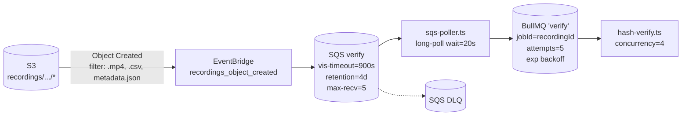
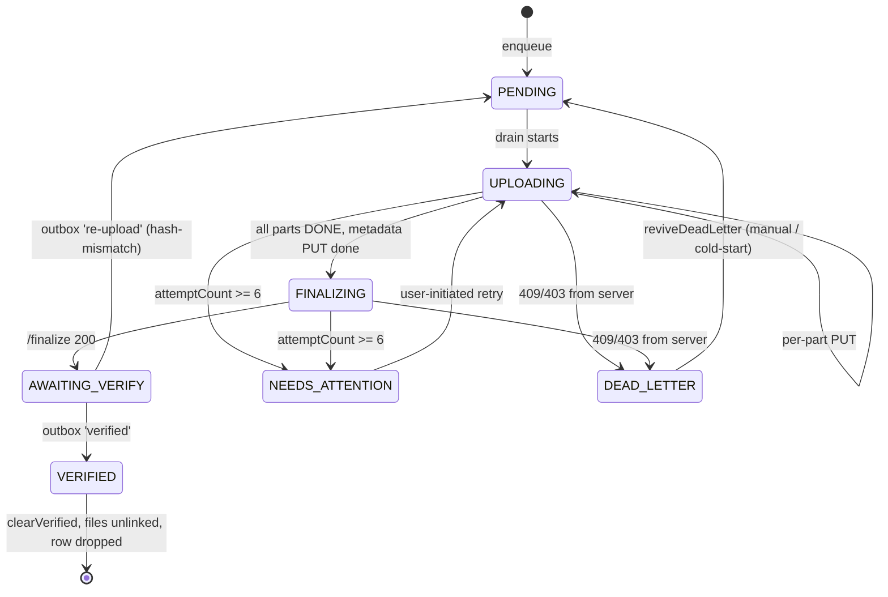
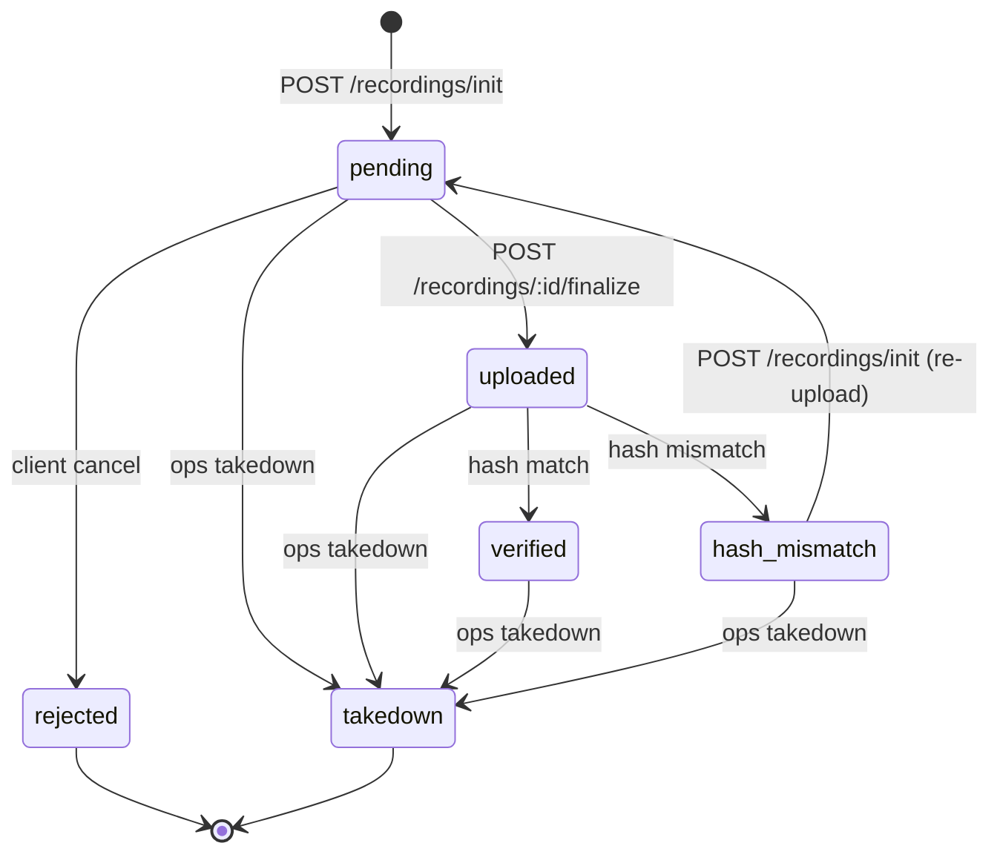

# Video Upload Pipeline — End-to-End

A knowledge-session reference for a senior backend engineer. Covers the full lifecycle of a captured recording bundle from the moment `FinalizeWorker` writes the last byte of MP4 on the device, through S3, through the hash-verify worker, to the final `qaStatus = 'verified'` row in Postgres.

> **Audience assumption:** comfortable with AWS S3 multipart + presigned URLs, BullMQ / Redis-backed queues, Android FGS / app-lifecycle basics, and the React Native ↔ native-module model. Primers on those skipped intentionally.

> **Scope:** Android only. iOS native-module analogues are deferred (`IOS-01..07` in `.planning/REQUIREMENTS.md` §v2). Where this doc says "the app", read "the Android APK". The backend has no idea what platform is uploading — the contract is the same.

> **As of:** 2026-05-23. Reflects metadata schema 1.2.0 (calibration block added 2026-05-22), the capture-quality cancel gate (2026-05-17), and the per-route idempotency-key contract (Wave-1.5, 2026-05-13).

---

## Reading guide

If you read top-to-bottom you get the linear story. If you only have 10 minutes, read:

1. **§1 Thirty-second TL;DR**
2. **§3 The bundle contract** — what literally travels over the wire
3. **§4 Happy-path sequence diagram**
4. **§18 State machines (device + server)**
5. **§19 Idempotency contract**
6. **§20 Failure modes — read the table**

Everything else is reference material for when oncall pings you and the queue is backed up.

---

## §1. Thirty-second TL;DR

- A recording is **three files**: `video.mp4` (HEVC), `imu.csv` (RFC 4180), `metadata.json`. **Files are never re-encoded.** They travel byte-for-byte device → S3.
- On-device queue is **JSON-on-disk, native-owned, atomic-rename persisted**. NOT MMKV (CLAUDE.md is slightly stale — the upload queue specifically lives in `filesDir/upload-queue/queue.json`; everything else app-wide is MMKV).
- Upload runs inside an **Android FGS** that starts as `camera|microphone|dataSync` during recording, then **downgrades in-place to `dataSync`** once recording ends and uploads start. Idles itself after 5 min with no work. Hands off to a UIDT JobService at the Android-15 6-hour cap.
- Three S3 multipart uploads per recording (one each for `video.mp4`, `imu.csv`, `metadata.json` — the last is a single PUT, not multipart). All **presigned by the backend**; the device never holds AWS credentials.
- Two handshakes with the backend: **`POST /recordings/init`** (mint upload IDs, presign every part, persist the pending row) and **`POST /recordings/:id/finalize`** (S3 CompleteMultipartUpload server-side, transition row to `'uploaded'`, enqueue verify).
- Verification is **out of band**. In prod: S3 → EventBridge → SQS → thin poller → BullMQ → hash-verify worker → row flips to `'verified'` or `'hash-mismatch'`. In dev: `/finalize` directly enqueues on BullMQ.
- The hash-verify worker re-hashes `video.mp4` + `imu.csv` from S3 (memory-bounded streaming) and compares against the SHA-256 hashes the device wrote into `metadata.json`. **`metadata.json` is never hashed.**
- **`hash-mismatch` is terminal until re-upload.** The worker emits an outbox event, the client drains the outbox on next authenticated request, sees the `re-upload` event, and starts a fresh `/init → /finalize` cycle on the same `recordingId` (idempotently re-presigned multiparts).
- Durability backstop: a `recordings_to_verify` row is inserted in the same transaction as the `'pending' → 'uploaded'` transition. A 5-min cron re-enqueues anything stale > 10 min. Survives Redis hiccups and EventBridge drops.

---

## §2. System map

```mermaid
flowchart LR
    subgraph Device["📱 Android device"]
        Cap[HumynCapture<br/>Camera2 + MediaCodec]
        Fin[FinalizeWorker<br/>cancel gate + metadata]
        Q[(upload-queue/<br/>queue.json)]
        Coord[UploadCoordinator<br/>drainer]
        Chunk[ChunkUploader<br/>OkHttp + watchdog]
        FGS[HumynForegroundService<br/>camera|microphone|dataSync<br/>→ dataSync]
        UJS[UploadJobService<br/>UIDT fallback]
        Bridge[HumynUploadModule<br/>RN ↔ Kotlin]
        JS[uploadReconcile.ts<br/>+ History UI]
    end

    subgraph Backend["🖥 Fastify backend (apps/api)"]
        Init["/recordings/init"]
        Parts["/recordings/:id/parts"]
        Final["/recordings/:id/finalize"]
        DB[(Postgres 17<br/>recordings<br/>recordings_to_verify<br/>outbox_events)]
        Sweep[verify-sweep cron<br/>every 5 min]
    end

    subgraph AWS["☁️ AWS"]
        S3[(S3<br/>humyn-recordings)]
        EB[EventBridge<br/>S3 Object Created]
        SQS[(SQS<br/>verify queue)]
    end

    subgraph Worker["⚙️ Worker ECS task"]
        Poll[sqs-poller.ts]
        BMQ[BullMQ 'verify'<br/>Redis 7]
        HV[hash-verify.ts<br/>concurrency=4]
    end

    Cap --> Fin --> Q
    Q <--> Coord
    Coord --> Chunk
    Coord -- "/init, /parts, /finalize" --> Init
    Chunk -- "PUT presigned" --> S3
    FGS -. drives .-> Coord
    UJS -. fallback .-> Coord
    Bridge <--> Coord
    Bridge <--> JS
    Init --> DB
    Final --> DB
    Final --> BMQ
    S3 --> EB --> SQS
    Poll --> SQS
    Poll --> BMQ
    BMQ --> HV
    HV --> S3
    HV --> DB
    Sweep --> DB
    Sweep --> BMQ
    DB -. outbox drain on auth req .-> JS
```

The diagram lies in two small ways for readability:

1. The "Backend" box and the "Worker" box are the **same Docker image** with two entrypoints — `node dist/server.js` and `node dist/workers/hash-verify.js`. They share `apps/api/src/lib/*` (DB client, S3 client, queue, recording-state). The two boxes are separate ECS tasks with independent autoscaling.
2. In **dev** (`AWS_ENDPOINT_URL` set, LocalStack), the `S3 → EventBridge → SQS → Poller → BullMQ` chain is replaced by a fire-and-forget `queue.add(...)` call from inside `/finalize` itself. The hash-verify worker runs against LocalStack S3.

---

## §3. The bundle contract — what gets uploaded

### 3.1 Three files per recording

| File            | Source                                           | S3 key                                            | Hashed pre-upload?                                                    |
| --------------- | ------------------------------------------------ | ------------------------------------------------- | --------------------------------------------------------------------- |
| `video.mp4`     | `HumynCapture` (Camera2 + MediaCodec HEVC)       | `recordings/{userId}/{recordingId}/video.mp4`     | **Yes** — SHA-256 by `MetadataComposer`, written into `metadata.json` |
| `imu.csv`       | `SensorManager` accel+gyro samples, RFC 4180 CSV | `recordings/{userId}/{recordingId}/imu.csv`       | **Yes** — SHA-256 by `MetadataComposer`, written into `metadata.json` |
| `metadata.json` | `MetadataComposer` (schema 1.2.0)                | `recordings/{userId}/{recordingId}/metadata.json` | **No** — by design, never hashed                                      |

The key shape is **canonical and fixed** — `apps/api/src/lib/s3-client.ts:36-51` (`recordingKeys()`). Both the device-side coordinator (when constructing the S3 PUT request) and the server-side worker (when re-fetching for hashing) derive keys from the same identity tuple `(userId, recordingId)`. **Never** from the local filename.

### 3.2 Filename prefix on device (2026-05-22)

On disk, local files now carry a ULID + timestamp prefix:

```
{recordingId}_{YYYYMMDD_HHMMSS_NNN}.{ext}
```

For example: `01HXJ2K3M4N5P6Q7R8S9T0V1W2_20260522_143045_001.mp4`

The S3 key **does not** carry the prefix. The key is derived solely from `recordingKeys()`. This is important because:

- Two devices owned by the same user could collide on a non-ULID timestamp.
- The `recordingId` (ULID, time-sortable) is the canonical correlation key.
- The backend never needs to parse the local filename.

**Backward compatibility:** `FilenameGenerator.nextBase`'s per-day NNN ls-scan strips a leading 26-char ULID prefix before parsing, so legacy un-prefixed files still scan correctly.

### 3.3 `metadata.json` (schema 1.2.0)

The structure that lands in S3. **Not** the structure the device POSTs to `/recordings/init` — that one is a hand-picked subset (see §11.3).

```json
{
  "metadata_version": "1.2.0",
  "recording_id": "01HXJ...",
  "task_id": "01HXJ...",
  "practice": false,
  "start_timestamp": "2026-05-22T14:30:45.123Z",
  "duration_seconds": 120.0,

  "file_size_bytes": 524288000,
  "file_sha256": "...",
  "imu_size_bytes": 5242880,
  "imu_sha256": "...",

  "fps": 30,
  "resolution": { "width": 1920, "height": 1080 },
  "video_codec": "hevc",
  "video_profile": "main",
  "bitrate_bps": 16000000,
  "bitrate_mode": "cbr",
  "gop": 30,
  "color_space": "bt709",
  "color_depth_bits": 8,
  "b_frames": 0,
  "orientation": "landscape-left",
  "hdr": false,
  "image_stabilization": "off",

  "imu_video_drift_max_ms": 6.16,
  "imu_video_drift_mean_ms": 5.58,
  "imu_video_drift_p99_ms": 5.63,
  "imu_min_rate_hz_observed_p1": 102.4,

  "calibration": {
    "camera": {
      "model": "...",
      "resolution": { "width": 1920, "height": 1080 },
      "params": { "fx": null, "fy": null, "cx": null, "cy": null, "skew": null },
      "distortion_coeffs": null,
      "intrinsics_source": "camera2_uncalibrated"
    },
    "cam_imu_extrinsics": {
      "T_cam_imu": null,
      "T_imu_cam": null,
      "T_cam_imu_translation_mm": null,
      "timeshift": 0.0,
      "extrinsics_source": "camera2_no_imu_reference"
    }
  }
}
```

Notes:

- **All capture-spec fields are derived at runtime** (encoder `OUTPUT_FORMAT_CHANGED` MediaFormat + MediaExtractor track-header + measured surface rotation). `MetadataComposer.compose()` no longer carries hardcoded literals as of 2026-05-17.
- **`hdr` + `image_stabilization`** stay configured-literal (cited to `EncoderProbe`).
- **Drift fields** record `{max, mean, p99}` per the relaxed gate banner — measured every segment, **not** gated on at MVP. The original ±1 ms spec is unchanged in `idea-brief.md §2.1`; enforcement is descoped pending the ultrawide pipeline tradeoff.
- **`calibration.camera`** and **`calibration.cam_imu_extrinsics`** are always present (the block has the full key structure even when the device reports UNCALIBRATED). On Pixels these are typically `null` with `intrinsics_source = "camera2_uncalibrated"`. The `CameraCalibrationReader` is non-throwing — it can never block capture.

### 3.4 Capture-quality cancel gate (2026-05-17)

The gate runs in `FinalizeWorker` **before** the row hits the upload queue. Three cancel reasons:

| `cancelReason`        | Triggered when                                                                                                                 | History UI copy                  |
| --------------------- | ------------------------------------------------------------------------------------------------------------------------------ | -------------------------------- |
| `fps_dropped`         | `mean_fps < 29` (threshold tightened from 28 → 29 same day after Pixel-10a + Pixel-8a cancel-walks both stamped ~30 fps clean) | "Canceled — frame rate dropped"  |
| `resolution_dropped`  | MP4 track-header `width < 1920 OR height < 1080`                                                                               | "Canceled — resolution dropped"  |
| `insufficient_frames` | `videoFrameTimestamps.size < 2`                                                                                                | "Canceled — recording too short" |

Cancellation happens **after** the encoder finishes (not as a live abort), and **before** enqueue. The cancelled artifact (MP4 + IMU CSV + JSON) is deleted from `cacheDir` after the History ledger entry is persisted (write-then-delete). **The server is never notified.** The upload queue refuses any row with a non-null `cancelReason` (`UploadQueueStore.kt:153-163`).

The gate is enforcement-only. `idea-brief.md §2.1` (1080p/30fps) didn't change; this code makes "spec-fail = local cancel" a hard guarantee.

---

## §4. Happy-path sequence

```mermaid
sequenceDiagram
    autonumber
    participant U as User
    participant Cap as HumynCapture
    participant Fin as FinalizeWorker
    participant Q as Queue store
    participant Coord as UploadCoordinator
    participant FGS as ForegroundService
    participant API as /recordings
    participant S3 as S3
    participant EB as EventBridge→SQS
    participant W as hash-verify worker
    participant DB as Postgres

    U->>Cap: Stop recording
    Cap->>Fin: Trigger finalize
    Fin->>Fin: Cancel gate (fps/res/frames)
    Fin->>Q: enqueue(row=PENDING)
    Q-->>Coord: queue mutated event
    Coord->>FGS: setUploadActive(true)
    FGS->>FGS: startForeground(dataSync)
    Coord->>API: POST /recordings/init
    API->>DB: INSERT recordings (qa='pending')
    API->>S3: CreateMultipartUpload (video + imu)
    API-->>Coord: { uploadId, imuUploadId, partUrls[], imuPartUrls[], metadataUrl }
    Q->>Q: persist uploadIds + part state
    loop For each part
        Coord->>S3: PUT presigned (with watchdog)
        S3-->>Coord: ETag
        Q->>Q: persist part DONE + etag
    end
    Coord->>S3: PUT metadata.json (single presigned PUT)
    Coord->>API: POST /recordings/:id/finalize
    API->>S3: CompleteMultipartUpload (video + imu)
    API->>DB: BEGIN; UPDATE qa='uploaded'; INSERT recordings_to_verify; COMMIT
    API->>EB: (prod: via S3 Object Created)
    API-->>Coord: 200
    Q->>Q: mark row AWAITING_VERIFY
    EB->>EB: filter mp4/csv/metadata
    EB->>W: via SQS → BullMQ
    W->>S3: stream-hash video.mp4
    W->>S3: stream-hash imu.csv
    W->>DB: BEGIN; UPDATE qa='verified'; DELETE recordings_to_verify; INSERT outbox 'verified'; COMMIT
    Coord->>API: next authenticated request drains outbox
    API-->>Coord: { events: [{type:'verified', recordingId}] }
    Coord->>Q: clearVerified([recordingId])
    Q->>Q: unlink local files, drop row
```

---

## §5. Device side — trigger and enqueue

### 5.1 Trigger source

The enqueue is **not** triggered by the JS layer. It is triggered by `FinalizeWorker` (Kotlin, inside `HumynCapture`'s native module). The JS layer only finds out about the new queued row through the `onUploadQueueChanged` event.

This matters because:

- **Recording continues to finalize even if the RN bridge is dead.** If the app crashes during the last 100 ms of recording, the FGS keeps the process alive long enough for `FinalizeWorker` to complete, write the bundle, and enqueue.
- **`MainActivity` re-creation** during config changes does not lose the row.
- The JS-side `RecordingScreen.onSegmentCanceled` is a belt-and-braces check; the queue store also refuses cancelled rows on its own (`UploadQueueStore.kt:153-163`).

### 5.2 Enqueue contract

`HumynUploadModule.enqueue(recordingId, mp4Path, csvPath, jsonPath, taskId, isPractice, ownerUserId)` (`apps/mobile/android/app/src/main/java/ai/humynlabs/capture/upload/HumynUploadModule.kt:57+`).

- **`ownerUserId`** is the Google `sub` at the moment of enqueue, not "the currently signed-in user". Critical for cross-account isolation: if user A enqueues, signs out, user B signs in, user B's `bootstrap(currentSub)` filters out A's rows and leaves them on disk untouched (`UploadQueueStore.kt:211-224`).
- **Idempotent on `recordingId`.** Re-enqueueing an already-present row is a no-op.
- **Refuses** `cancelReason != null` rows (CAPTURE-QA-04, 2026-05-17) and practice recordings where `taskId == "__practice__"` or the path contains `/practice/`.
- **Mints four UUIDv4 idempotency keys** at row construction — never rotated except on hash-mismatch re-upload, which rotates everything except `reuploadIdempotencyKey`. See §19.

### 5.3 Migration on read

`UploadQueueStore.read()` (`UploadQueueStore.kt:70-100`) tolerates corrupt files (returns empty list, never crashes) and migrates legacy rows missing any of the four idempotency keys — fresh UUIDs are minted, persisted back to disk, and subsequent reads see the same keys. This closes a cross-boot key-drift hole found in Wave-1.5 Item 7.

---

## §6. Device side — the queue store

### 6.1 Why JSON, not MMKV

`CLAUDE.md` says "MMKV-backed, native-module-owned". The actual implementation is **JSON-on-disk** at `filesDir/upload-queue/queue.json`. The reason is bridge isolation:

- App-wide MMKV is the JS layer's source of truth for everything else (auth tokens are in Keychain, but app state is MMKV). The native upload module needs to write the queue from Kotlin threads with no JS bridge contention.
- MMKV's atomic-write semantics across processes are weaker than `Files.move(ATOMIC_MOVE, REPLACE_EXISTING)`. A JSON file rewritten atomically via NIO rename is fully durable across kernel-level crashes.

**Atomic write contract** (`UploadQueueStore.kt:104-126`):

1. Serialize the entire queue (small — typically <50 rows) to bytes.
2. Write to `queue.json.partial`.
3. `Files.move(partial, live, ATOMIC_MOVE, REPLACE_EXISTING)`. Fall back to `renameTo()` on filesystems that don't support `ATOMIC_MOVE`.

The whole queue is rewritten on every mutation. This is fine — queue size is bounded, JSON is small, and writes are infrequent (one per part-completion, not one per byte).

### 6.2 The row schema

`UploadRow` data class (`apps/mobile/android/app/src/main/java/ai/humynlabs/capture/upload/UploadModels.kt:136-432`).

**Identity:**

- `recordingId` (ULID), `ownerUserId` (Google `sub`), `taskId`, `isPractice`.

**Local file paths:**

- `mp4Path`, `csvPath`, `jsonPath` (absolute on-device paths, ULID-prefixed filenames).

**Lifecycle:**

- `state: UploadState` enum (`UploadModels.kt:71-79`): `PENDING`, `UPLOADING`, `FINALIZING`, `AWAITING_VERIFY`, `VERIFIED`, `DEAD_LETTER`, `NEEDS_ATTENTION`.

**Multipart state:**

- `uploadId` (video S3 multipart ID, set by `/init`), `imuUploadId` (IMU S3 multipart ID, set by `/init`).
- `partsCount`, `chunkBytes` (pinned at enqueue — cellular = 5 MiB, Wi-Fi = 8 MiB; see §9.2).
- `videoParts: List<PartState>`, `imuParts: List<PartState>` — each part is `{n, status, etag, retryCount}`.
- `metadataPut: PartStatus` — the metadata.json PUT is a single object, not multipart.

**Failure tracking** (Wave-1.5 Item 4, 2026-05-18):

- `attemptCount` — drives per-row exponential backoff; hits NEEDS_ATTENTION at threshold 6.
- `lastFailureAt`, `lastFailureState`, `lastFailureReason` (sanitized, ≤160 chars, URLs stripped).
- `deadLetterReason` — permanent server-rejection (409/403).

**Idempotency:**

- `initIdempotencyKey`, `partsIdempotencyKey`, `finalizeIdempotencyKey`, `reuploadIdempotencyKey` — per-route UUIDv4s. See §19.

### 6.3 App-kill survival

`bootstrap(currentSub)` (`UploadQueueStore.kt:211-224`):

1. Read `queue.json`, tolerating corruption.
2. Return rows where `ownerUserId == currentSub` AND `state != VERIFIED`.
3. Prune VERIFIED rows with missing local files (housekeeping).

The JS layer also calls `HumynUpload.drainNow()` on boot (`apps/mobile/src/services/uploadReconcile.ts:74-108`) to kick the drainer immediately rather than wait for the next user action.

### 6.4 Verified-state cleanup

When the server-sent outbox event says "verified", JS calls `HumynUpload.clearVerified([recordingId])`:

- Native marks the row VERIFIED.
- Local files (MP4, CSV, JSON) are unlinked.
- The row is dropped on the next persist cycle.

The order matters: the row goes VERIFIED **first**, then files are unlinked. If the process dies between row-flip and unlink, the next bootstrap prunes any VERIFIED row with missing files. No leaked rows.

---

## §7. Device side — the foreground service

### 7.1 The two-phase service

`HumynForegroundService` (`apps/mobile/android/app/src/main/java/ai/humynlabs/capture/fgs/HumynForegroundService.kt:1-274`) runs in two distinct phases driven by `startForeground()` calls with different `foregroundServiceType` bitmasks.

**Phase 1 — Recording (`camera | microphone | dataSync`):**

```kotlin
startForeground(NOTIF_ID, recordingNotif,
    FGS_TYPE_RECORDING)   // = CAMERA | MICROPHONE | DATA_SYNC
```

`HumynForegroundService.kt:127`. Notification copy: **"Recording in progress"**. Bitmask must exactly match the `android:foregroundServiceType` in the manifest — Android 14+ enforces a strict two-sided lock.

**Phase 2 — Upload (`dataSync` only):**

```kotlin
startForeground(NOTIF_ID, uploadingNotif,
    FGS_TYPE_UPLOADING)   // = DATA_SYNC
```

`HumynForegroundService.kt:206`. Notification copy: **"Uploading recordings…"**. The downgrade happens **in place** — same service, same `NOTIF_ID = 9001`, second `startForeground()` call. Same channel.

**Why downgrade?** Android 14+ throttles `dataSync` more leniently than `camera|microphone`. By the time recording has ended, the camera and microphone permissions are no longer needed; holding them keeps the system from optimizing power.

**Constraint — the downgrade only happens while the app is in the FOREGROUND** (Pitfall 4, `HumynForegroundService.kt:40-44`). Android forbids a background process from `startForeground()`-ing into a type it wasn't already in. Background-resumed drains use `UploadJobService` instead.

### 7.2 Manifest declarations

`apps/mobile/android/app/src/main/AndroidManifest.xml:23-50`:

```xml
<uses-permission android:name="android.permission.FOREGROUND_SERVICE"/>
<uses-permission android:name="android.permission.FOREGROUND_SERVICE_CAMERA"/>
<uses-permission android:name="android.permission.FOREGROUND_SERVICE_MICROPHONE"/>
<uses-permission android:name="android.permission.FOREGROUND_SERVICE_DATA_SYNC"/>
<service
    android:name=".fgs.HumynForegroundService"
    android:foregroundServiceType="camera|microphone|dataSync"
    android:exported="false"/>
```

Note `FOREGROUND_SERVICE_MICROPHONE` is declared **even though audio is dropped** (2026-05-11). The bitmask cannot be partial — if the recording phase declares `microphone`, the matching permission must be in the manifest. The microphone is opened by Camera2 for the duration of the recording phase but no AAC encoder runs.

### 7.3 The upload drain thread

`startUploadDrain()` (`HumynForegroundService.kt:211-222`):

1. Creates a `HandlerThread("humyn-upload-fgs")` on first transition to upload phase.
2. Posts `UploadCoordinator.getShared(applicationContext).drainNow()` to the thread.
3. After drain completes (synchronous from the caller's POV), posts `maybeScheduleIdleStop()` back to the main looper.

`drainNow()` is the synchronous entry point that:

- Picks the next eligible row.
- Submits it to the worker pool (`newFixedThreadPool(parallelismCap=2)`).
- Returns when the worker pool drains or there are no more rows to schedule.

### 7.4 Idle stop & lifecycle

`maybeScheduleIdleStop()` (`HumynForegroundService.kt:224-236`):

- Schedules an `idleStopRunnable` after `IDLE_STOP_MS = 5 * 60 * 1000` ms if `queueHasWork()` returns false.
- `idleStopRunnable` calls `ServiceCompat.stopForeground(this, STOP_FOREGROUND_REMOVE)` then `stopSelf()`.
- `cancelIdleStop()` removes any pending callback (called when a new row arrives).

### 7.5 Android 15 — the 6-hour cap

Android 15 caps `dataSync` foreground services at 6 hours. The OS calls `onTimeout(startId, fgsType)` within a few seconds of the cap.

`HumynForegroundService.kt:176-188`:

```kotlin
override fun onTimeout(startId: Int, fgsType: Int) {
    if (queueHasWork()) {
        UploadJobService.scheduleUidt(this)
    }
    ServiceCompat.stopForeground(this, STOP_FOREGROUND_REMOVE)
    stopSelf()
}
```

UIDT = "user-initiated data transfer", a JobScheduler job type allowed from the background, designed exactly for this case. `UploadJobService` (`apps/mobile/android/app/src/main/java/ai/humynlabs/capture/upload/UploadJobService.kt:1-85`) re-enters `UploadCoordinator.drainNow()` until the queue is empty.

### 7.6 Crash recovery

`onStartCommand()` (`HumynForegroundService.kt:85-131`):

```kotlin
if (intent == null) {
    // OS re-delivery after process kill — FGS state is out of sync.
    // The stale "Recording" notification would be a privacy hazard.
    stopSelf()
    return START_NOT_STICKY
}
```

A null intent on the next start means the OS killed the process and is re-delivering. Don't try to figure out what state we were in — let the next user action restart cleanly.

---

## §8. Device side — the RN ↔ native bridge

### 8.1 Module surface

`HumynUploadModule` (`apps/mobile/android/app/src/main/java/ai/humynlabs/capture/upload/HumynUploadModule.kt`). Name: `"HumynUpload"`. Methods are all `@ReactMethod` async / returning `Promise<T>`.

| Method                                                                                                                       | Purpose                                                            |
| ---------------------------------------------------------------------------------------------------------------------------- | ------------------------------------------------------------------ |
| `setUploadContext(apiBaseUrl, bearerToken, sub)`                                                                             | Push auth state. Called post-sign-in and on app resume.            |
| `enqueue(recordingId, mp4Path, csvPath, jsonPath, taskId, isPractice, ownerUserId)`                                          | Add bundle. Idempotent on `recordingId`.                           |
| `pause()`                                                                                                                    | Pause uploads during recording (called by `HumynCapture.start()`). |
| `resume()`                                                                                                                   | Resume uploads (called by `HumynCapture.stop()`).                  |
| `getQueue()`                                                                                                                 | Returns all rows (JS filters by current `sub`).                    |
| `clearVerified(recordingIds[])`                                                                                              | Mark VERIFIED, unlink files, drop rows.                            |
| `drainNow()`                                                                                                                 | Kick drainer (used by reconcile sweep on boot).                    |
| `reupload(recordingId)`                                                                                                      | Re-enter the lifecycle after a hash-mismatch outbox event.         |
| `reviveDeadLetter(recordingId)`                                                                                              | Safe revival of a DEAD_LETTER row. Only acts on DEAD_LETTER.       |
| `retryNeedsAttention(recordingId)`                                                                                           | User-initiated retry from History UI. Resets `attemptCount`.       |
| `setUploadActive(active)`                                                                                                    | Explicit FGS signal.                                               |
| `getConnectivity()`                                                                                                          | Synchronous read for the offline banner.                           |
| `isBatteryOptimizationExempt()` / `requestBatteryOptimizationExemption()` / `oemAutostartAvailable()` / `openOemAutostart()` | Power-management UX.                                               |

### 8.2 Events emitted

Via `RCTDeviceEventEmitter`:

| Event                   | Payload                                    | When                             |
| ----------------------- | ------------------------------------------ | -------------------------------- |
| `onUploadQueueChanged`  | `WritableArray<UploadQueueRow>`            | After any queue mutation         |
| `onUploadProgress`      | `{recordingId, bytesUploaded, bytesTotal}` | Per row, debounced ≤ once/500 ms |
| `onConnectivityChanged` | `{online: boolean}`                        | When default network changes     |

### 8.3 JS-side wrapper

`apps/mobile/src/native/HumynUpload.ts` exposes a typed interface. Notable:

- Methods with `-Safe` suffixes (`getQueueSafe()`, `drainNowSafe()`, `setUploadContextSafe()`) are no-crash variants used at boot before the native module is guaranteed wired.
- `UploadQueueRow` (lines 40-121) mirrors the Kotlin row schema.
- Callers must `subscription.remove()` on unmount — there's no auto-cleanup.

### 8.4 The reconcile sweep

`apps/mobile/src/services/uploadReconcile.ts:74-108`. Runs on:

- App cold start (after sign-in resolves).
- App resume from background.
- Receipt of an outbox event during an authenticated API call.

What it does:

1. Calls `HumynUpload.getQueueSafe()` and filters to current user's rows.
2. Issues a `GET /recordings?status=verified&since=...` to drain the outbox.
3. For any `type=verified` event: calls `HumynUpload.clearVerified([recordingId])`.
4. For any `type=re-upload` event (hash-mismatch): calls `HumynUpload.reupload(recordingId)`.
5. Checks for stale `{PENDING, UPLOADING}` rows and calls `HumynUpload.drainNow()` to kick the drainer.

---

## §9. Device side — drain and multipart mechanics

### 9.1 The coordinator

`UploadCoordinator` (`apps/mobile/android/app/src/main/java/ai/humynlabs/capture/upload/UploadCoordinator.kt:1-1223`).

**Executor model:**

- **Drain dispatch** — single-thread; picks the next eligible row and submits to the worker pool.
- **Worker pool** — `newFixedThreadPool(parallelismCap = 2)`. Each worker runs one row's `uploadOne()` to completion.
- **Per-part semaphore** — 6 permits across all workers. With 2 workers each pushing 3 parts in parallel, the global cap is 6 in-flight PUTs.

### 9.2 Part sizing

Pinned **once** at enqueue, never changed mid-upload:

| Network  | Part size                      |
| -------- | ------------------------------ |
| Wi-Fi    | 8 MiB (`WIFI_CHUNK_BYTES`)     |
| Cellular | 5 MiB (`CELLULAR_CHUNK_BYTES`) |

Why not smaller on cellular? Because S3's minimum non-final part size is 5 MiB. The cap on parts is 1000 (planner-locked below AWS's 10000 ceiling — see `MAX_PARTS_PER_UPLOAD` in `apps/api/src/lib/s3-client.ts:55`).

`partsCount = ceil(videoSizeBytes / chunkBytes)`. The MP4 drives part count; the small IMU CSV uses exactly part 1.

### 9.3 The HTTP client

`UploadCoordinator.kt:1198-1204`. OkHttp 4.x with:

- Custom socket factory `MssSocketFactory()` clamping TCP_MAXSEG=1280 (best-effort, for UP-19 cellular-MTU mitigation).
- Connect timeout: 30 s.
- Read / write / call-wide: 0 (disabled). Stall handling is delegated to the per-part watchdog.

The only per-call timeout is for `/finalize` and `GET /recordings/:id` (60 s, via `executeTrackedWithTimeout`).

### 9.4 Per-part PUT with watchdog

`ChunkUploader.putPart()` (`apps/mobile/android/app/src/main/java/ai/humynlabs/capture/upload/ChunkUploader.kt:150-179`).

**The watchdog** (`ChunkUploader.kt:41-48, 124-131`):

- A `ScheduledExecutorService` task polls every ~5 s (30 s window / 6 = polling cadence).
- It tracks `bytesWritten` on the `RequestBody`.
- If no bytes have moved in 30 s, calls `Call.cancel()` — closes the socket.
- The next retry gets a fresh TCP connection with fresh MSS negotiation.

**Retry sequence:** 2 s, 4 s, 8 s, 16 s, 32 s, 64 s (6 retries). On the 7th failure, throws `DeadLetterException`.

**DONE-part idempotency:** `parts[n-1].status == DONE && etag != null` returns the cached ETag **without** a new request. A DONE part is **never** re-PUT (UP-04). This is what makes process-death recovery cheap: the row is read off disk, the DONE parts are skipped, only the not-yet-DONE parts are uploaded.

### 9.5 Persistence of part state

After each successful part PUT, the entire queue file is rewritten with the new `{etag, status}` on the row's `videoParts[n-1]` or `imuParts[n-1]`. That's expensive in absolute terms (the whole file is rewritten) but cheap in relative terms (the queue is small, parts complete on the order of seconds to tens of seconds, not milliseconds).

### 9.6 Multipart resumption

When `UploadCoordinator.uploadOne()` re-enters for a row with `uploadId != null`:

1. **Take the `/recordings/:id/parts` re-presign branch** (`UploadCoordinator.kt:640`) instead of `/recordings/init`. Preserves the existing multipart upload IDs.
2. Re-presign returns fresh URLs for the SAME multipart IDs. DONE parts keep their ETags (idempotent re-presign, plan 05-09 CR-01).
3. Skip DONE parts (`UploadCoordinator.kt:683`).
4. Resume PUTs on the remaining parts.

The S3-side multipart upload state survives the device process death (S3 holds it for 7 days by default, can be configured). The device persists what it needs to address into that state: `uploadId`, `imuUploadId`, plus per-part `{n, etag}`.

### 9.7 The metadata.json PUT

`metadata.json` is a single PUT against the URL returned in `metadataUrl` from `/recordings/init`. Not multipart. Tracked in `row.metadataPut: PartStatus`.

The metadata PUT comes **after** both video and IMU multiparts complete locally (i.e., all parts have ETags), but **before** the `/recordings/:id/finalize` call. Order: video parts → IMU parts → metadata PUT → finalize.

### 9.8 Token refresh during long uploads

The Bearer token is process-lived in `UploadAuthContext` (`UploadCoordinator.kt:1215-1223`). JS refreshes it and calls `HumynUpload.setUploadContext()`:

- On app resume.
- After any silent token refresh (e.g., after Google Sign-In silent re-auth).
- Before `uploadReconcile.reconcileOnce()` runs.

The next API request uses the fresh token. There's no per-request refresh — the auth context is a snapshot updated periodically.

---

## §10. The handshake — `POST /recordings/init`

### 10.1 Route

`apps/api/src/routes/recordings/init.ts:208-434`.

Auth: `preHandler: [app.requireAuth]` — JWT validated upstream (see §22).

### 10.2 Request body

From `RecordingsInitRequestSchema` in `shared/types/src/recording.ts:92-121`:

```ts
{
  recordingId: string; // 26-char ULID
  taskId: string; // 26-char ULID
  practice: boolean;
  partsCount: number; // 1..1000 (server-rejected outside this range)
  durationMs: number;
  fileSha256: string; // hex
  imuSha256: string; // hex
  fileSizeBytes: number;
  imuSizeBytes: number;
  capturedAt: string; // ISO 8601 (numeric offset allowed)
  calibration: CalibrationBlock | null | undefined; // jsonb, schema 1.2.0
}
```

Constructed on the device at `UploadCoordinator.kt:931-953`. The device forwards the `calibration` block verbatim from `metadata.json` — the server validates with zod, tolerates `null` params, and persists it on the row's `calibration` jsonb column.

### 10.3 Response

`RecordingsInitResponseSchema` in `shared/types/src/recording.ts:128-138`:

```ts
{
  recordingId: string;
  uploadId: string; // S3 multipart ID for video
  partsCount: number;
  partUrls: [{ partNumber: (1).N, url: presigned }];
  imuUploadId: string; // S3 multipart ID for IMU (NOT persisted server-side)
  imuPartUrls: [{ partNumber: 1, url: presigned }];
  metadataUrl: string; // single-PUT presigned URL
  expiresAt: string; // ISO; 15 min from sign time
}
```

### 10.4 Server-side flow

`apps/api/src/routes/recordings/init.ts:267-419`. The CR-02 idempotent self-heal path:

```
SELECT recording WHERE id = $recordingId AND userId = $sub
├── not found:
│   1. CreateMultipartUpload(video.mp4) → uploadId
│   2. CreateMultipartUpload(imu.csv) → imuUploadId  (NOT persisted)
│   3. presignVideoParts(uploadId, partsCount)
│   4. presignImuStream(imuUploadId, 1)
│   5. presignMetadata()
│   6. BEGIN; INSERT recordings (qa='pending', uploadId, ipAddress, calibration, ...); COMMIT
│       ├── on PK uniq-violation (race): GOTO 'found, qa=pending'
│       └── ok: return {uploadId, partUrls, imuUploadId, imuPartUrls, metadataUrl}
├── found, qa='pending':
│   1. Re-presign video parts against THIS recording's persisted uploadId
│   2. Fresh CreateMultipartUpload(imu.csv) → new imuUploadId (IMU id never persisted)
│   3. Fresh metadata URL
│   4. Return same shape — DONE video parts on the client side stay valid
└── found, qa != 'pending':  →  409 Conflict (idempotent terminal state)
```

**Why is `imuUploadId` not persisted?** Because IMU is small (typically <10 MB) and a single part. Re-`CreateMultipartUpload` on every `/init` retry is cheap, and not persisting it dodges a class of multipart-orphan bugs that only matter for tiny streams.

**Idempotency-Key header:** The client sends `initIdempotencyKey` (UUIDv4 minted at row construction, never rotated except on hash-mismatch). The `@fastify/...idempotency-key` plugin caches the response for 24 h. The SELECT-first guards are the **second** line of defense — even if the cache is bypassed, the server self-heals.

### 10.5 Rate limit

30 req/min per user. The keyGenerator does a best-effort `jwtVerify()` before `requireAuth` runs, so the rate-limit key is the user `sub` (not the IP).

### 10.6 The persisted row

The `recordings` row created here lives at:

- `id` = recordingId (ULID).
- `userId` = sub from JWT.
- `taskId` = from request.
- `practice` = from request.
- `qaStatus` = `'pending'`.
- `fileSha256`, `imuSha256`, `fileSizeBytes`, `imuSizeBytes`, `durationMs`, `capturedAt` = from request.
- `s3UploadId` = the video multipart ID.
- `partsCount` = client-specified, server-validated (1..1000).
- `calibration` = jsonb, the full block from metadata.json (validated with zod, params can be null).
- `ipAddress` = req.ip (honors Fastify `trustProxy`).
- `flavor` = `'apkRollout' | 'playStore' | 'iosAppStore'` from JWT.
- `s3KeyVideo`, `s3KeyImu`, `s3KeyMetadata` = derived from `recordingKeys()`.

Drift fields (`imuVideoDriftMaxMs`, `imuVideoDriftMeanMs`, `imuVideoDriftP99Ms`, `imuMinRateHzObservedP1`) are populated at **finalize** time, not init — the device knows them after the encoder closes, and the init payload was constructed pre-encoder-close in some flows. See `apps/api/src/routes/recordings/finalize.ts`.

---

## §11. The handshake — `POST /recordings/:id/parts`

### 11.1 Why a separate route?

`/parts` exists to **re-presign** part URLs against an **existing** multipart upload — no `CreateMultipartUpload` is called. This is critical because:

- Presigned URLs expire after 15 minutes. A long upload (e.g., 30 min over 3G) will see URLs expire.
- Process death between `/init` and the last part means the device needs fresh URLs on resume.
- Calling `/init` again would create a NEW multipart, orphaning the parts already uploaded.

### 11.2 Contract

`apps/api/src/routes/recordings/parts.ts:34-173`:

```
POST /recordings/:id/parts
Body: { imuUploadId }  // the client tracks IMU's id locally
Response: { partUrls, imuPartUrls, metadataUrl, expiresAt }
```

- The video upload ID comes from the persisted `recordings.s3UploadId`.
- The IMU upload ID comes from the request body (the server never persisted it).
- The metadata URL is regenerated.
- DONE part ETags on the device side are NOT invalidated — they're still valid against S3 because the multipart ID didn't change.

### 11.3 Does NOT change state

`/parts` does not move the row out of `'pending'`. It's a stateless re-presign endpoint. The state machine only advances on `/finalize`.

---

## §12. The handshake — `POST /recordings/:id/finalize`

### 12.1 Route

`apps/api/src/routes/recordings/finalize.ts:114-249`.

### 12.2 Request body

```ts
{
  videoParts: [{ partNumber, etag }];
  imuParts: [{ partNumber, etag }];
  imuUploadId: string;        // client-tracked
  imuVideoDriftMaxMs?: number;
  imuVideoDriftMeanMs?: number;
  imuVideoDriftP99Ms?: number;
  imuMinRateHzObservedP1?: number;
}
```

### 12.3 Server-side flow

1. SELECT row. If not found or `qaStatus != 'pending'` → 409 or 404.
2. `CompleteMultipartUpload(video.mp4, videoParts)` — S3 stitches the parts into the final object.
3. `CompleteMultipartUpload(imu.csv, imuParts, imuUploadId)`.
4. **Inside one transaction:**
   - UPDATE `recordings` SET `qaStatus = 'uploaded'`, `uploadCompletedAt = NOW()`, drift fields.
   - INSERT into `recordings_to_verify` (the durability backstop — see §15).
   - COMMIT.
5. **In dev only** (`AWS_ENDPOINT_URL` is set, i.e., LocalStack): fire-and-forget `queue.add('verify', { recordingId }, { jobId: recordingId })`.
6. Return 200.

In prod, the `S3 Object Created` event on `video.mp4`/`imu.csv`/`metadata.json` does the enqueue via EventBridge → SQS → poller. The dev shim exists because LocalStack 4.x doesn't reliably reproduce the EventBridge filter.

### 12.4 `metadata.json` is NOT part of finalize

The metadata PUT happens client-side directly to S3 via the presigned `metadataUrl`. The server does not see it until `/finalize`. There's nothing to "complete" — it's a single PUT, not multipart.

### 12.5 Idempotent finalize

The client sends `finalizeIdempotencyKey`. Re-POSTing the same finalize is safe:

- `CompleteMultipartUpload` is idempotent on S3 (re-completing an already-completed multipart returns 200 with the same ETag).
- The UPDATE to `qaStatus = 'uploaded'` is conditional — if the row is already `'uploaded'`, no-op, return 200.
- Wave-1.5 Item 4 (2026-05-18) added the FINALIZING reconciliation path on the **client** side: if a row is stuck in FINALIZING and `/finalize` times out, the client does `GET /recordings/:id` to read `qa_status`. If the server says `uploaded` or `verified`, the client marks the row AWAITING_VERIFY locally without re-POSTing.

---

## §13. Server-side verification — S3 events to BullMQ

### 13.1 Prod path



Terraform: `infra/terraform/modules/verify-queue/main.tf:43-91`.

### 13.2 The SQS poller

`apps/api/src/workers/sqs-poller.ts`:

- Long-polls `VERIFY_QUEUE_URL` with `WaitTimeSeconds=20`, `MaxNumberOfMessages=10`.
- Parses the recordingId from the S3 event key with this regex (`sqs-poller.ts:24-28`):
  ```
  /^recordings\/[0-9A-HJKMNP-TV-Z]{26}\/([0-9A-HJKMNP-TV-Z]{26})\/(?:video\.mp4|imu\.csv|metadata\.json)$/
  ```
  Crockford Base32 (the ULID alphabet) — note `I, L, O, U` are excluded. Capture group 2 = recordingId.
- Handles both **EventBridge envelope** and **S3-direct JSON** formats (`sqs-poller.ts:39-77, 88-140`).
- Calls `enqueueVerify(recordingId)` — which calls `queue.add('verify', { recordingId }, { jobId: recordingId })`.
- **Deletes the SQS message on success** (or any "I've handled this" outcome).
- **Leaves for DLQ** if parse fails or `enqueue()` throws.

### 13.3 Job-ID-based deduplication

Three S3 events fire per recording: one each for `video.mp4`, `imu.csv`, `metadata.json`. The poller calls `enqueueVerify(recordingId)` for all three. Because BullMQ dedupes on `jobId` (set to `recordingId`), only one job ever lands in the queue. The other two `queue.add()` calls are no-ops.

This collapsing is critical:

- Without it, three workers might race on the same recording, each doing an S3 stream-hash.
- With it, exactly one worker processes each recording.

### 13.4 BullMQ queue config

`apps/api/src/lib/queue.ts:30-48`:

```ts
{
  attempts: 5,
  backoff: { type: 'exponential', delay: 5000 },
  removeOnComplete: { count: 1000 },
  removeOnFail: { count: 5000 },
}
```

Redis: `REDIS_URL` env (default `redis://localhost:6379`), `maxRetriesPerRequest: null` (required for BRPOPLPUSH-based blocking pops).

### 13.5 `WORKER_BOOTSTRAP=false`

The poller's main loop is gated by `if (process.env.WORKER_BOOTSTRAP !== 'false')`. This is set in unit-test environments so the pure `parseRecordingIdFromS3Event()` function can be imported and tested without launching a background polling loop. See the memory entry `feedback_post_merge_test_env.md` — for the gotcha-prone test command:

```bash
set -a && source apps/api/.env && set +a && WORKER_BOOTSTRAP=false pnpm -r --parallel test
```

---

## §14. Server-side verification — the hash-verify worker

### 14.1 Entry point

`apps/api/src/workers/hash-verify.ts`. Same Docker image as the API, different entrypoint: `node dist/workers/hash-verify.js`.

### 14.2 Concurrency

`new Worker('verify', handler, { concurrency: 4 })`. Each ECS task processes up to 4 recordings in parallel. With multi-GB MP4s, each one is bound on S3 read throughput, not CPU.

### 14.3 The handler

```ts
worker.process(async (job) => {
  const { recordingId } = job.data;
  await verifyRecording(recordingId, log);
});
```

`verifyRecording()` lives in `apps/api/src/lib/verify-recording.ts:34-91`.

### 14.4 Verify logic

```
SELECT * FROM recordings WHERE id = $recordingId
├── not found:        log and return  (idempotent no-op)
├── qaStatus != 'uploaded':   log 'moved' and return  (TOCTOU-safe — the row already moved while we were re-hashing)
└── qaStatus = 'uploaded':
    1. video_actual_sha256 = sha256OfS3Object(bucket, recordings/{userId}/{recordingId}/video.mp4)
    2. imu_actual_sha256   = sha256OfS3Object(bucket, recordings/{userId}/{recordingId}/imu.csv)
    3. expect:  video_actual_sha256 == row.fileSha256  AND  imu_actual_sha256 == row.imuSha256
    4. BEGIN
       ├── match:
       │   UPDATE recordings SET qaStatus='verified', verifiedAt=NOW() WHERE id=$id AND qaStatus='uploaded'
       │   INSERT INTO outbox_events (userId, type='verified', payload={recordingId})
       │   DELETE FROM recordings_to_verify WHERE recordingId=$id
       └── mismatch:
           UPDATE recordings SET qaStatus='hash-mismatch' WHERE id=$id AND qaStatus='uploaded'
           INSERT INTO outbox_events (userId, type='re-upload', payload={recordingId})
           DELETE FROM recordings_to_verify WHERE recordingId=$id
       COMMIT
```

Notes:

- The UPDATE's `WHERE qaStatus='uploaded'` clause is a row-level CAS. If the row already moved (e.g., to `'takedown'`), we don't clobber it.
- The outbox event's `userId` comes from the **DB row**, never from the queue message. Threat T-5-03-03: a tampered queue message can't trigger an event for a user who doesn't own the recording.
- `recordings_to_verify` is deleted in the same transaction as the state transition. The verify-sweep cron only sees rows that **haven't yet** been verified — never a stale entry.

### 14.5 Stream-hash from S3

`sha256OfS3Object()` (in `apps/api/src/lib/verify-recording.ts:34-49`) is a memory-bounded streaming hash. The Node `crypto.createHash('sha256')` is piped to the `GetObject` body stream — no `Buffer.concat()`, no full-file buffer. Works for multi-GB MP4s on a 512 MB worker container.

### 14.6 Retries at the worker level

- BullMQ: 5 attempts with exponential backoff (5 s, 10 s, 20 s, 40 s, 80 s base, jittered).
- The handler is idempotent. If attempt 2 finds the row already `'verified'` or `'hash-mismatch'`, the TOCTOU-safe no-op fires.

### 14.7 Why `metadata.json` is never hashed

By design:

- The device writes `metadata.json` with `file_sha256` and `imu_sha256` **inside it**. If the device hashed metadata.json itself, the inner SHAs would be in the hash domain — a chicken-and-egg.
- The integrity-of-record-keeping comes from re-hashing the two **data** files. If they match, the device's claims about them are consistent.
- This is also why the calibration block being in `metadata.json` (not a separate file) is safe — calibration corruption doesn't fail hash-verify; it manifests downstream as null intrinsics, which is the documented null-fallback state anyway.

### 14.8 Hash mismatch — terminal until re-upload

On hash-mismatch:

1. Row → `'hash-mismatch'` (terminal in the upload state machine).
2. Outbox event `re-upload` is queued for the client.
3. The client, on next authenticated request, drains the outbox.
4. `uploadReconcile.ts` handler for `re-upload` calls `HumynUpload.reupload(recordingId)`.
5. The native module:
   - **Rotates** `initIdempotencyKey`, `partsIdempotencyKey`, `finalizeIdempotencyKey` (NEW UUIDs).
   - **Does NOT rotate** `reuploadIdempotencyKey` (the reupload is one-shot).
   - Transitions the row to PENDING.
6. The drain re-enters `/recordings/init` with fresh idempotency keys, mints fresh multiparts, and re-uploads.

The server's `/init` SELECT-first path handles the re-upload: row exists, `qaStatus = 'hash-mismatch'`, the server transitions back to `'pending'`, mints new multipart IDs (the old `s3UploadId` is overwritten), presigns parts.

---

## §15. Server-side verification — the durability backstop

### 15.1 `recordings_to_verify`

A row inserted in the same transaction as `'pending' → 'uploaded'` in `/finalize`. Schema:

```sql
recordings_to_verify (
  recording_id  varchar(26) PRIMARY KEY,
  enqueued_at   timestamp,
  sweep_count   integer DEFAULT 0,
  last_swept_at timestamp
)
```

### 15.2 The verify-sweep cron

`apps/api/src/cron/verify-sweep.ts:17-35`. Runs every 5 minutes.

```sql
SELECT recording_id FROM recordings_to_verify
WHERE enqueued_at < NOW() - INTERVAL '10 minutes'
  AND sweep_count < 8
```

For each row found:

1. `queue.add('verify', { recordingId }, { jobId: recordingId })` (no-op if already queued).
2. UPDATE `recordings_to_verify` SET `sweep_count = sweep_count + 1`, `last_swept_at = NOW()`.

After 8 sweeps (~80 minutes), the row is left alone — operator investigation required.

### 15.3 Why does this exist?

- **EventBridge drops.** Rare, but documented.
- **SQS DLQ overflow.** A poisoned message in DLQ blocks nothing, but if the poller crashes mid-handle, a message can survive past visibility timeout and re-deliver.
- **Redis cluster failover.** BullMQ jobs in flight at the moment of failover can be lost.
- **Worker container OOM mid-job.** The job retries (via BullMQ attempts), but if all 5 fail, the row sits in `'uploaded'` indefinitely without the backstop.

The backstop is a **defense-in-depth** that turns "stuck at uploaded" from an oncall page into a 10-min auto-recovery.

### 15.4 Healthcheck signal

A growing `SELECT COUNT(*) FROM recordings_to_verify WHERE enqueued_at < NOW() - INTERVAL '30 minutes'` is a signal that the pipeline is degraded — even if SQS depth looks fine.

---

## §16. Server → client — the outbox

### 16.1 Why an outbox?

Push notifications are deferred at MVP (no FCM/APNs). The client only learns about server-side state via API responses. Outbox events ride along on the next authenticated API request.

### 16.2 Flow

1. The hash-verify worker (or any future server-side actor) inserts an `outbox_events` row in the same transaction as the state change.
2. On the next authenticated API request from the device, the response includes `{events: [...]}` (or the client polls `GET /recordings/events`).
3. The client's `uploadReconcile.ts` processes events:
   - `type: 'verified'` → `HumynUpload.clearVerified([recordingId])`.
   - `type: 're-upload'` → `HumynUpload.reupload(recordingId)`.
4. The events are marked delivered (or deleted) after the client acknowledges.

### 16.3 At-least-once delivery

The outbox guarantees **at-least-once**, never exactly-once. The native module's handlers are idempotent:

- `clearVerified` on an already-VERIFIED row is a no-op.
- `reupload` on a row that's already in PENDING after a previous reupload is also a no-op.

---

## §17. State machines

### 17.1 Device-side row state



### 17.2 Server-side row state (`recordings.qaStatus`)



### 17.3 Mapping between them

| Device state    | Server `qaStatus`                                                                     |
| --------------- | ------------------------------------------------------------------------------------- |
| PENDING         | `'pending'` (if `/init` already happened) or row doesn't exist yet                    |
| UPLOADING       | `'pending'`                                                                           |
| FINALIZING      | `'pending'` (until `/finalize` 200)                                                   |
| AWAITING_VERIFY | `'uploaded'`                                                                          |
| VERIFIED        | `'verified'` (briefly; client deletes the row on event receipt)                       |
| DEAD_LETTER     | depends on the rejection cause — `'rejected'` if the server rejected the row outright |
| NEEDS_ATTENTION | usually `'pending'` (server view is unchanged; the device gave up auto-retrying)      |

---

## §18. Idempotency contract

### 18.1 Four keys per row

Minted **once** at row construction in `UploadQueueStore.ensureIdempotencyKeys()`:

| Key                      | Header on                               | Rotated on              |
| ------------------------ | --------------------------------------- | ----------------------- |
| `initIdempotencyKey`     | `POST /recordings/init`                 | Hash-mismatch re-upload |
| `partsIdempotencyKey`    | `POST /recordings/:id/parts`            | Hash-mismatch re-upload |
| `finalizeIdempotencyKey` | `POST /recordings/:id/finalize`         | Hash-mismatch re-upload |
| `reuploadIdempotencyKey` | — (client-internal, not sent as header) | **Never** rotated       |

Wave-1.5 Item 7 migrates rows missing any key on `read()` — fresh UUIDs are minted and persisted back to disk so subsequent reads see the same keys (no cross-boot drift).

### 18.2 Server-side @fastify idempotency-key plugin

Caches the response body keyed by `(userId, route, idempotencyKey)` for 24 h. If the same request arrives again, the cached response is returned **without** re-running the route handler.

### 18.3 Second line of defense — SELECT-first guards

Even if the cache is bypassed (TTL expired, Redis cleared, plugin disabled in a future change), the route handlers themselves are idempotent:

- `/init` SELECT-first: see §10.4. Returns same shape for repeat calls in `pending` state.
- `/parts` is stateless re-presign by design.
- `/finalize` conditional UPDATE: see §12.5. Repeat calls on `'uploaded'` are no-ops.

### 18.4 The hash-mismatch re-upload exception

On `re-upload` outbox event:

1. Native rotates `initIdempotencyKey`, `partsIdempotencyKey`, `finalizeIdempotencyKey` (new UUIDs).
2. Does **NOT** rotate `reuploadIdempotencyKey` — the reupload is one-shot. If the same reupload were re-triggered (e.g., the outbox event was delivered twice), the second trigger needs to dedupe.
3. The row goes PENDING.
4. Next `/init` call uses the fresh key, server SELECT-first finds `qaStatus='hash-mismatch'`, transitions back to `'pending'`, mints new multipart IDs.

This is the only case where idempotency keys rotate. Anything else is a bug.

---

## §19. Failure modes — the catalog

| Failure                                      | Detection                                                     | Recovery                                                                                                                           |
| -------------------------------------------- | ------------------------------------------------------------- | ---------------------------------------------------------------------------------------------------------------------------------- |
| Network drop mid-part                        | Watchdog: no bytes in 30 s → `Call.cancel()`                  | Per-part retry with backoff 2s/4s/8s/16s/32s/64s; fresh TCP socket                                                                 |
| All 6 part-retries exhausted                 | `DeadLetterException` from `ChunkUploader.putPart()`          | Row → DEAD_LETTER. User-visible chip. `reviveDeadLetter` revives.                                                                  |
| Process killed mid-upload                    | On next bootstrap, row state is preserved on disk             | Re-enter `/recordings/:id/parts` re-presign branch; DONE parts skipped                                                             |
| Token expired during upload                  | Server returns 401                                            | JS refreshes token via Google Sign-In, calls `setUploadContext`, next request succeeds                                             |
| `/init` HTTP 5xx                             | Coordinator catches                                           | Backoff per row schedule (30s/60s/2m/5m/15m/1h); after 6 attempts → NEEDS_ATTENTION                                                |
| `/init` HTTP 409 (terminal state mismatch)   | Server returns 409                                            | Row → DEAD_LETTER with `deadLetterReason`                                                                                          |
| `/finalize` HTTP timeout                     | 60s per-call timeout                                          | Row stays in FINALIZING; next drain does `GET /recordings/:id`; if server says `uploaded`/`verified`, mark AWAITING_VERIFY locally |
| Hash mismatch                                | Worker compares S3-rehashed SHAs vs row                       | Server row → `'hash-mismatch'`; outbox `re-upload`; device re-enters lifecycle                                                     |
| EventBridge drop                             | `recordings_to_verify` row sits past 10 min                   | verify-sweep cron re-enqueues                                                                                                      |
| BullMQ all-attempts-exhausted                | Job → failed (kept in `removeOnFail` history)                 | `recordings_to_verify` row drives sweep cron re-enqueue (up to 8 sweeps)                                                           |
| Worker OOM mid-rehash                        | Container restarts; SQS visibility timeout (900s) re-delivers | Worker retries; idempotent against row state                                                                                       |
| Stuck > 80 min in `recordings_to_verify`     | `sweep_count >= 8`                                            | Operator investigation (no auto-recovery; log alarm)                                                                               |
| App killed during recording finalize         | FGS keeps process alive for finalize                          | Bundle is written; enqueue completes                                                                                               |
| Two devices reuploading same recording       | Server SELECT on `(id, userId)` PK                            | Cross-device collision impossible (different userIds)                                                                              |
| User A signs out, user B signs in mid-upload | `bootstrap(currentSub)` filters by `ownerUserId`              | A's rows stay on disk untouched; B's queue is empty; on A's next sign-in, A's rows resume                                          |
| Android 15 6-hour FGS cap                    | OS calls `onTimeout()`                                        | UIDT JobScheduler job takes over                                                                                                   |
| Cellular MTU drop (UP-19 cellular MSS bug)   | Watchdog cancels stuck socket                                 | Next retry's socket negotiates MSS down to 1280 via `MssSocketFactory`                                                             |
| LocalStack 4.0 checksum bug                  | SDK throws "Checksum Type mismatch"                           | `requestChecksumCalculation: 'WHEN_REQUIRED'` in `s3-client.ts:23` works around it                                                 |
| App-wide MMKV corruption                     | Doesn't affect upload queue (separate file)                   | Queue continues uninterrupted                                                                                                      |
| Cancel-gate-canceled segment                 | `FinalizeWorker` sets `cancelReason` before enqueue           | Bundle deleted from cacheDir; row never enters queue                                                                               |

### 19.1 Per-row backoff schedule

`UploadCoordinator.kt:471-486`:

| `attemptCount` | Next-attempt delay                                    |
| -------------- | ----------------------------------------------------- |
| 0              | 0 ms (immediate)                                      |
| 1              | 30 s                                                  |
| 2              | 60 s                                                  |
| 3              | 2 min                                                 |
| 4              | 5 min                                                 |
| 5              | 15 min                                                |
| ≥ 6            | 1 h (capped) — and row transitions to NEEDS_ATTENTION |

After NEEDS_ATTENTION, auto-retries stop. The History UI shows "Stuck for 12 min — Retry"; tap calls `retryNeedsAttention()`, resets `attemptCount`, transitions to UPLOADING (if `uploadId` set) or PENDING (otherwise).

### 19.2 Per-part backoff schedule

`ChunkUploader.kt:62`:

| Attempt | Delay before retry    |
| ------- | --------------------- |
| 1       | 2 s                   |
| 2       | 4 s                   |
| 3       | 8 s                   |
| 4       | 16 s                  |
| 5       | 32 s                  |
| 6       | 64 s                  |
| 7       | `DeadLetterException` |

Per-part is much more aggressive (2s vs 30s) because part failures are usually transient connectivity hiccups, not server problems. Per-row is gentler because row-level failures often imply server-side issues that take longer to recover.

---

## §20. Auth on the upload path

### 20.1 Token issuance

`POST /auth/google` (`apps/api/src/routes/auth/google.ts`). The device sends:

- Google ID token (from Google Sign-In).
- Play Integrity verdict (Android) or DeviceCheck/App Attest token (iOS, deferred).

The server:

1. Verifies the Google ID token with `google-auth-library`.
2. Verifies Play Integrity (Standard requests, Google-Managed decryption).
3. Issues a JWT with HS256.

### 20.2 JWT shape

```ts
{
  sub: string; // 26-char ULID user id
  iat: number;
  exp: number;
  flavor: 'apkRollout' | 'playStore' | 'iosAppStore';
  applicationId: string;
  integrity_verdict: 'passed' | 'bypassed_apk';
  token_version: number;
}
```

`integrity_verdict: 'bypassed_apk'` only on the APK build flavor when Remote Config bypass is enabled. Play Store builds **cannot** opt into bypass (server-enforced).

### 20.3 Validation on upload routes

`apps/api/src/plugins/auth.ts:49-73`:

```ts
preHandler: [app.requireAuth];
```

Inside `requireAuth`:

1. `req.jwtVerify()` — signature check.
2. `if (token_version < CURRENT_TOKEN_VERSION) return 401 "Re-sign-in required"`.
3. Attach `req.user = { sub, flavor, applicationId, integrity_verdict, token_version }`.

### 20.4 No per-upload attestation

At MVP, Play Integrity is checked **at sign-in only**. Per-upload attestation is deferred (`FRAUD-03..04` in `.planning/REQUIREMENTS.md` §v2). A device that completes Play Integrity at sign-in can upload freely for the JWT lifetime.

### 20.5 No per-account rate cap at MVP

`FRAUD-05` (per-account daily upload-rate cap) was descoped on 2026-05-12. The MVP upload path is **uncapped per account**. Each route has its own rate limit (e.g., `/init` is 30/min per user), but there's no daily quota.

### 20.6 No IMU-liveness analysis at MVP

`FRAUD-03` (server-side IMU-liveness check) was deferred 2026-05-11. The IMU CSV ships in the bundle (training consumes it), but the server does not analyze it during verification. The hash-verify worker re-hashes it; nothing else reads it server-side.

---

## §21. Observability and ops levers

### 21.1 Server logs

Pino, JSON in prod (`apps/api/src/plugins/logger.ts`):

- Redaction: `authorization`, `idempotency-key`, `set-cookie`.
- Serializers: `req → {id, method, url, remoteAddress}`, `res → {statusCode}`.
- Log level: `process.env.LOG_LEVEL` (default `info`).

Key structured fields by component:

| Component      | Fields                                            |
| -------------- | ------------------------------------------------- |
| `/init`        | `recordingId`, `userId`, `partsCount`, `isReplay` |
| `/finalize`    | `recordingId`, `videoEtag`, `imuEtag`, `enqueued` |
| `sqs-poller`   | `msgId`, `recordingId`, `parseErr`                |
| `hash-verify`  | `jobId`, `recordingId`, `attempt`, `match`        |
| `verify-sweep` | `count`, `recordingIds`, `sweepCount`             |

### 21.2 Healthchecks

- `/healthz` — Fastify default (liveness).
- `/readyz` — DB + Redis check.

### 21.3 Queue depth

CloudWatch metric: `AWS/SQS → ApproximateNumberOfMessagesVisible` on the verify queue.

Target-tracking autoscaling (`infra/terraform/modules/verify-queue/main.tf:314-362`):

```
backlog_per_task = SQS_visible / max(running_tasks, 1)
```

ECS scales 0..MAX tasks on this metric.

### 21.4 Backstop healthcheck signal

The "real" pipeline health signal is NOT SQS depth — it's:

```sql
SELECT COUNT(*) FROM recordings_to_verify
WHERE enqueued_at < NOW() - INTERVAL '30 minutes';
```

If this is > 0 and rising, the verify pipeline is degraded even if SQS looks empty (because the sweep cron is the only thing feeding the queue, and rows are taking > 30 min to verify).

### 21.5 Device-side observability

Logcat (Crashlytics-routed at ERROR):

| Source                         | Level | Key messages                                                                                |
| ------------------------------ | ----- | ------------------------------------------------------------------------------------------- |
| `UploadCoordinator.kt:337`     | ERROR | `worker for {recordingId} crashed (unexpected)`                                             |
| `UploadCoordinator.kt:399`     | WARN  | `row {recordingId} DEAD_LETTER: {message}`                                                  |
| `UploadCoordinator.kt:424-427` | WARN  | `row {recordingId} NEEDS_ATTENTION after N attempts (last failure in STATE: REASON)`        |
| `UploadCoordinator.kt:590-594` | INFO  | `row {recordingId} FINALIZING reconciled — server qa_status=verified, skipping re-finalize` |
| `ChunkUploader.kt:128`         | WARN  | `no-progress watchdog fired — cancelling Call (will retry on a fresh socket)`               |

### 21.6 Test seams

`UploadCoordinator` constructor (`UploadCoordinator.kt:118-142`) exposes overrides for tests:

- `chunkUploader` — swap with a mock.
- `transientRetryDelayMs` — default 5000 ms; tests use `1L`.
- `parallelismCap` — override worker pool size.
- `finalizeCallTimeoutMs` — override 60s `/finalize` timeout.
- `needsAttentionThreshold` — override 6.

`awaitIdle(timeoutMs)` lets tests assert post-drain state without fixed sleeps.

### 21.7 What does oncall see when uploads are broken?

In rough order of importance:

1. **Customer reports** — "my recording's been uploading for 2 hours". Look in `recordings_to_verify` first.
2. **`recordings_to_verify` depth** — see §21.4. Single-query, primary signal.
3. **SQS DLQ depth** — `AWS/SQS → ApproximateNumberOfMessages` on the verify DLQ. Any growth = a poisoned message format change.
4. **Worker logs** — search by `recordingId` for the customer's row.
5. **BullMQ dashboard** (if surfaced) — failed jobs in the verify queue.
6. **App Crashlytics** — search by `recordingId` for `DEAD_LETTER` or `NEEDS_ATTENTION` warnings.

---

## §22. What's NOT in the MVP

To save time chasing dead ends, here's what's deferred. Most have a memory or banner trail.

| Deferred                                                        | What it would do                                                   | Where it's deferred to                                             |
| --------------------------------------------------------------- | ------------------------------------------------------------------ | ------------------------------------------------------------------ |
| Audio capture                                                   | 48 kHz mono AAC-LC alongside video                                 | Dropped 2026-05-11 (drift regression on Pixel 10a)                 |
| ±1 ms drift gate enforcement                                    | Block phase completion / smoke / finalize / upload on drift > 1 ms | Relaxed 2026-05-12 (ultrawide tradeoff); still measured & recorded |
| IMU-liveness fraud check                                        | Server-side gravity-axis / saccade / gait-FFT analysis on IMU      | v2 (`FRAUD-03`)                                                    |
| Per-upload Play Integrity                                       | Re-attest on every `/init`                                         | v2 (`FRAUD-04`)                                                    |
| Per-account daily upload cap                                    | Throttle per-user upload volume                                    | v2 (`FRAUD-05`); MVP is uncapped                                   |
| Pre-payout fraud dashboard                                      | Internal ops dashboard for fraud review                            | v2 (`FRAUD-06`)                                                    |
| Semantic search (pgvector RRF) on client                        | Hybrid task search exposed in app                                  | Backend shipped, client surface descoped (`SEARCH-V2-01`)          |
| Play Store staged rollout                                       | App distribution via Google Play                                   | Follow-on milestone (`DIST-05`)                                    |
| iOS App Store distribution                                      | App distribution via Apple                                         | Follow-on milestone (`DIST-06`)                                    |
| iOS native modules                                              | `HumynCaptureIOS`, `HumynUploadIOS`, etc.                          | Follow-on milestone (`IOS-01..07`)                                 |
| Push notifications                                              | FCM/APNs notify on upload state changes                            | Out of scope at MVP                                                |
| FCM/APNs in general                                             | —                                                                  | Out of scope at MVP                                                |
| Sentry / Datadog / Bugsnag                                      | Third-party APM                                                    | Crashlytics + Firebase Analytics only at MVP                       |
| Per-user fraud dashboard                                        | Internal ops review tooling                                        | v2                                                                 |
| `recordings.calibration` non-null values from non-Pixel devices | Most Android devices report UNCALIBRATED                           | By design — null-fallback is the contract                          |

---

## §23. Surprising gotchas

Things that will trip you up if you don't know them.

### 23.1 The upload queue is NOT in MMKV

`CLAUDE.md` says MMKV-backed. The actual implementation is JSON-on-disk at `filesDir/upload-queue/queue.json` with atomic-rename persistence. This is intentional (see §6.1) — the doc is slightly stale.

### 23.2 `metadata.json` is never hashed

The server's hash-verify worker re-hashes `video.mp4` and `imu.csv`. `metadata.json` carries the SHAs **for** those two files. Hashing metadata.json would be circular.

### 23.3 IMU upload ID is NEVER persisted server-side

`/init` mints a fresh IMU multipart upload on EVERY call (including idempotent retries). The IMU is tiny and not worth the orphan-multipart bug class. The client tracks it locally and passes it in the `/parts` re-presign request and the `/finalize` request body.

### 23.4 The S3 key shape does NOT include the filename prefix

Local files: `{recordingId}_{YYYYMMDD_HHMMSS_NNN}.mp4`. S3 key: `recordings/{userId}/{recordingId}/video.mp4`. The key is derived from `recordingKeys()` (`apps/api/src/lib/s3-client.ts:36-51`), never from the local filename.

### 23.5 The FGS bitmask MUST match the manifest declaration

Android 14+ enforces a strict two-sided lock between `<service android:foregroundServiceType=...>` and the bitmask passed to `startForeground()`. The recording phase declares `camera|microphone|dataSync`. The microphone permission is held even though audio is dropped — required by the bitmask.

### 23.6 Three S3 events fire per recording; one BullMQ job per recording

Video, IMU, metadata each fire an `Object Created` event. All three are processed by the SQS poller. All three call `queue.add('verify', { recordingId }, { jobId: recordingId })`. BullMQ dedupes on jobId — only one verify runs per recording. **Don't** restructure this without understanding the dedup.

### 23.7 The dev shim in `/finalize` bypasses the SQS poller

In dev (LocalStack), `/finalize` directly calls `queue.add(...)`. This is a deliberate workaround for LocalStack 4.x's flaky EventBridge filter. Prod relies on the EventBridge → SQS → poller path. **Tests that exercise the full prod pipeline must NOT have `AWS_ENDPOINT_URL` set.**

### 23.8 `WORKER_BOOTSTRAP=false` is required for some tests

The SQS poller's main loop launches at module import time unless gated by `WORKER_BOOTSTRAP=false`. Tests that import the poller's pure parser function must set this env var to avoid spawning a background polling loop. See `feedback_post_merge_test_env.md`.

### 23.9 The hash-mismatch path rotates 3 of 4 idempotency keys

`reuploadIdempotencyKey` is **never** rotated. `initIdempotencyKey`, `partsIdempotencyKey`, `finalizeIdempotencyKey` are all rotated when the device handles a `re-upload` outbox event. If you see these rotating in any other path, that's a bug.

### 23.10 The verify-sweep cron is the ONLY source of truth for "is the pipeline healthy"

SQS depth can lie (the poller might be running, just slowly). BullMQ depth can lie (jobs might be in-flight at a worker). The single canonical "this recording isn't done yet and should be by now" signal is `SELECT COUNT(*) FROM recordings_to_verify WHERE enqueued_at < NOW() - INTERVAL '30 minutes'`.

### 23.11 The outbox is at-least-once

`clearVerified` and `reupload` on the device side are idempotent because the outbox is at-least-once. Don't add side effects to those native handlers that assume one-shot semantics.

### 23.12 Coarse location only, no precise GPS

`idea-brief.md §5.2`. The upload bundle does NOT carry GPS. Only `req.ip` is captured server-side (in `recordings.ipAddress`), and only at `/init` time.

### 23.13 The drift gate is relaxed, but drift is still measured

Every recording's `metadata.json` (and the corresponding `recordings.imuVideoDrift*Ms` columns) carry the three drift figures. The hard `±1 ms` gate is descoped (CLAUDE.md banner). Drift is **fleet-health telemetry**, not an upload gate.

---

## §24. Code reference index

### 24.1 Device side

| File                                                                                       | Role                                                               |
| ------------------------------------------------------------------------------------------ | ------------------------------------------------------------------ |
| `apps/mobile/android/app/src/main/java/ai/humynlabs/capture/upload/UploadModels.kt`        | Row schema, state enum, constants                                  |
| `apps/mobile/android/app/src/main/java/ai/humynlabs/capture/upload/UploadQueueStore.kt`    | JSON-on-disk queue, atomic writes, migration                       |
| `apps/mobile/android/app/src/main/java/ai/humynlabs/capture/upload/UploadCoordinator.kt`   | Drainer, multipart coordinator, `/init`/`/parts`/`/finalize` calls |
| `apps/mobile/android/app/src/main/java/ai/humynlabs/capture/upload/ChunkUploader.kt`       | Per-part PUT, watchdog, OkHttp client                              |
| `apps/mobile/android/app/src/main/java/ai/humynlabs/capture/upload/HumynUploadModule.kt`   | RN bridge, methods, event emitter                                  |
| `apps/mobile/android/app/src/main/java/ai/humynlabs/capture/upload/UploadJobService.kt`    | UIDT JobScheduler fallback                                         |
| `apps/mobile/android/app/src/main/java/ai/humynlabs/capture/fgs/HumynForegroundService.kt` | FGS lifecycle, two-phase startForeground                           |
| `apps/mobile/android/app/src/main/AndroidManifest.xml`                                     | Permission + service-type declarations                             |
| `apps/mobile/src/native/HumynUpload.ts`                                                    | JS-side typed wrapper                                              |
| `apps/mobile/src/services/uploadReconcile.ts`                                              | Boot reconcile sweep, outbox handler                               |

### 24.2 Backend

| File                                              | Role                                                             |
| ------------------------------------------------- | ---------------------------------------------------------------- |
| `apps/api/src/routes/recordings/init.ts`          | `/recordings/init` route, idempotent self-heal                   |
| `apps/api/src/routes/recordings/parts.ts`         | `/recordings/:id/parts` re-presign                               |
| `apps/api/src/routes/recordings/finalize.ts`      | `/recordings/:id/finalize`, state transition + enqueue           |
| `apps/api/src/routes/recordings/complete-part.ts` | Part completion state-probe                                      |
| `apps/api/src/lib/s3-client.ts`                   | S3 client, `recordingKeys()`, constants                          |
| `apps/api/src/lib/recording-state.ts`             | State machine transitions                                        |
| `apps/api/src/lib/verify-recording.ts`            | Hash-verify logic, TOCTOU-safe transitions                       |
| `apps/api/src/lib/queue.ts`                       | BullMQ queue accessor                                            |
| `apps/api/src/db/schema.ts`                       | Drizzle schema (recordings, recordings_to_verify, outbox_events) |
| `apps/api/src/workers/sqs-poller.ts`              | SQS long-poll, key parsing, enqueue                              |
| `apps/api/src/workers/hash-verify.ts`             | BullMQ worker entrypoint                                         |
| `apps/api/src/cron/verify-sweep.ts`               | Durability backstop cron                                         |
| `apps/api/src/plugins/auth.ts`                    | JWT validation, requireAuth                                      |
| `apps/api/src/plugins/logger.ts`                  | Pino config                                                      |
| `shared/types/src/recording.ts`                   | Zod schemas (init request/response)                              |

### 24.3 Infra

| File                                           | Role                                                   |
| ---------------------------------------------- | ------------------------------------------------------ |
| `infra/terraform/modules/verify-queue/main.tf` | EventBridge rule, SQS queue, DLQ, autoscaling policies |

### 24.4 Tests

| File                                               | Role                                                |
| -------------------------------------------------- | --------------------------------------------------- |
| `apps/api/test/routes/recordings-init.test.ts`     | Init happy path, partsCount cap, idempotency replay |
| `apps/api/test/routes/recordings-finalize.test.ts` | Finalize transitions, enqueue                       |
| `apps/api/test/workers/sqs-poller.test.ts`         | `parseRecordingIdFromS3Event` parser                |
| `apps/api/test/workers/verify-recording.test.ts`   | Hash match/mismatch, TOCTOU, outbox atomicity       |

---

## §25. Glossary

- **AWAITING_VERIFY** — Device-side state. `/finalize` returned 200; waiting for the outbox `verified` event.
- **BullMQ** — The Redis-backed queue lib used for the verify queue.
- **Cancel gate** — `FinalizeWorker`'s pre-enqueue check that fps/resolution/frame-count meet the capture spec.
- **DEAD_LETTER** — Device-side state. Server returned 409/403 indicating a permanent rejection.
- **dFOV** — Diagonal field of view. The capture spec requires ≥110°.
- **Drift** — `imu_video_drift_{max,mean,p99}_ms`. Measured per segment, no longer gated on.
- **FGS** — Foreground Service. Android's mechanism for keeping a process alive with a user-visible notification.
- **HEVC** — H.265 video codec. The capture output codec.
- **MMKV** — Tencent's key-value store. App-wide state. NOT used for the upload queue.
- **NEEDS_ATTENTION** — Device-side state. Auto-retries exhausted; waiting for user-initiated retry.
- **Outbox events** — Server → client state-change notifications, delivered piggy-backed on API responses.
- **Recording ID** — 26-char ULID, time-sortable, the canonical correlation key.
- **`recordings_to_verify`** — Durability backstop table. One row per `'uploaded'` recording. Drives the verify-sweep cron.
- **Sub** — The `sub` claim in the Google ID token. The canonical user identity at sign-in. Mapped to `users.id` (a ULID) server-side.
- **TOCTOU** — Time-of-check / time-of-use. The hash-verify worker is TOCTOU-safe via row-conditional UPDATEs.
- **UIDT** — User-Initiated Data Transfer. Android JobScheduler job type allowed from the background, used as the post-FGS fallback for long-running uploads.
- **ULID** — Lexicographically sortable, time-ordered 128-bit identifier. Crockford Base32 (no `I`, `L`, `O`, `U`).
- **Watchdog** — `ChunkUploader`'s per-part no-progress monitor. Cancels stuck sockets after 30 s of no bytes moved.

---

## Appendix A — Things worth covering in the live session

If this is being read aloud, here's a 25-minute outline that hits the high-value spots:

1. **3 min** — TL;DR + system map (§1, §2).
2. **3 min** — The bundle contract (§3), focusing on `metadata.json` as the SHA carrier and the never-re-encoded rule.
3. **5 min** — Walk the happy-path sequence (§4) live.
4. **4 min** — `/init` SELECT-first idempotency (§10.4) — the most subtle server-side correctness contract.
5. **3 min** — Hash-verify logic (§14.4) and TOCTOU-safe transitions.
6. **3 min** — Durability backstop (§15) — sell it as defense-in-depth.
7. **2 min** — Q&A on failure modes (§19). Have the table on screen; let questions drive depth.
8. **2 min** — Glossary scan + close.

Skip mentally during the talk: filename prefix detail, calibration block shape (just say "additive in 1.2.0"), backoff schedules (point at the table), most of §22 unless someone asks.

Always have ready: the `recordings_to_verify` healthcheck query (§21.4) — it's the single thing oncall needs at 3 AM.

---

_This document reflects the codebase as of 2026-05-23 (commit `38f321f`). It will go stale; treat the linked file paths as starting points, not perpetual truth._
