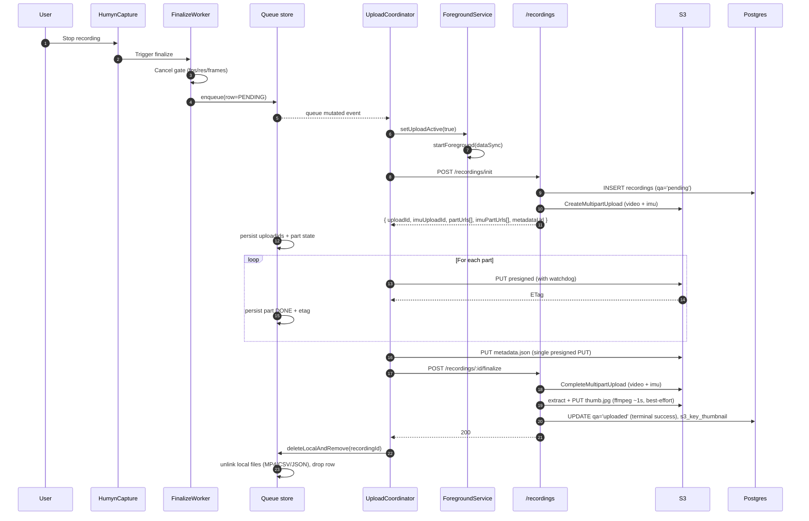
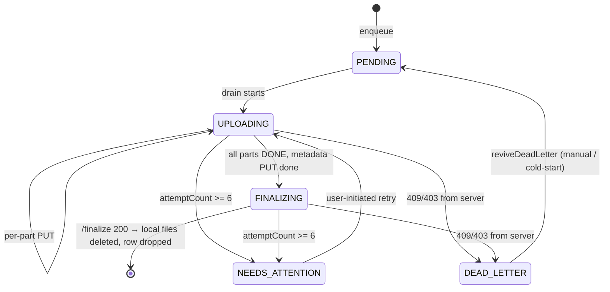
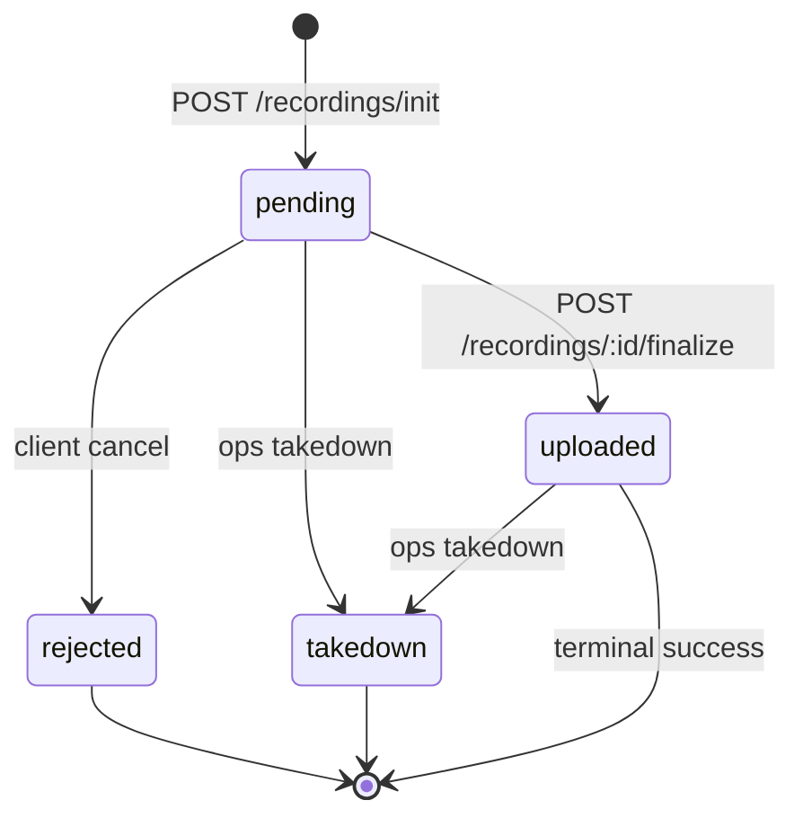

# Video Upload Pipeline — End-to-End

A knowledge-session reference for a senior backend engineer. Covers the full lifecycle of a captured recording bundle from the moment `FinalizeWorker` writes the last byte of MP4 on the device, through S3, to the terminal `qaStatus = 'uploaded'` row in Postgres.

> **Audience assumption:** comfortable with AWS S3 multipart + presigned URLs, Android FGS / app-lifecycle basics, and the React Native ↔ native-module model. Primers on those skipped intentionally.

> **Scope:** Android only. iOS native-module analogues are deferred (`IOS-01..07` in `.planning/REQUIREMENTS.md` §v2). Where this doc says "the app", read "the Android APK". The backend has no idea what platform is uploading — the contract is the same.

> **As of:** 2026-05-23. Reflects metadata schema 1.2.0 (calibration block added 2026-05-22), the capture-quality cancel gate (2026-05-17), and the per-route idempotency-key contract (Wave-1.5, 2026-05-13).

> **⚠ Verification pipeline REMOVED + poster thumbnails ADDED — 2026-06-04 (Enh 3 / D1 + Bug 6 / D5; owner sign-off `.planning/260604-locked-override-signoff.md`).** The entire hash-verify / verification pipeline — the server hash-verify worker, the SQS poller, the BullMQ verify queue, the `recordings_to_verify` durability backstop, the server→client outbox, the verify-sweep cron, and the device-side SHA-256 of `video.mp4` + `imu.csv` — was **deleted** (migration `0011_remove_hash_verify_flow.sql`). **`'uploaded'` is now the terminal success state.** The device deletes its local MP4 / CSV / JSON on a **`/finalize` 200** response (NOT on a server `'verified'` event — there is no such event, no outbox, no re-upload path, no server→client recording-event channel anymore). Separately, the server now generates a **poster thumbnail** at `/finalize` (Bug 6 / D5). **§13–§16 below (hash-verify worker / S3-events→BullMQ / durability backstop / server→client outbox), the `AWAITING_VERIFY → VERIFIED` device states, the hash-mismatch re-upload path, and the verify-sweep cron describe a system that NO LONGER EXISTS** — they are retained as historical reference only, gutted to one-line stubs. For current behavior read the corrected **§1 / §3 / §4 / §17**. The `qa_status` enum still _contains_ the legacy `'verified'` / `'hash-mismatch'` values (Postgres can't cheaply drop enum values), but nothing writes them — read paths treat `'verified'` as a success synonym for `'uploaded'`. Trail: `IMPLEMENTATION-PLAN-260604.md` §6.

---

## Reading guide

If you read top-to-bottom you get the linear story. If you only have 10 minutes, read:

1. **§1 Thirty-second TL;DR**
2. **§3 The bundle contract** — what literally travels over the wire
3. **§4 Happy-path sequence diagram**
4. **§17 State machines (device + server)**
5. **§18 Idempotency contract**
6. **§19 Failure modes — read the table**

Everything else is reference material for when oncall pings you about a stuck upload.

---

## §1. Thirty-second TL;DR

- A recording is **three files**: `video.mp4` (HEVC), `imu.csv` (RFC 4180), `metadata.json`. **Files are never re-encoded.** They travel byte-for-byte device → S3.
- On-device queue is **JSON-on-disk, native-owned, atomic-rename persisted**. NOT MMKV (CLAUDE.md is slightly stale — the upload queue specifically lives in `filesDir/upload-queue/queue.json`; everything else app-wide is MMKV).
- Upload runs inside an **Android FGS** that starts as `camera|microphone|dataSync` during recording, then **downgrades in-place to `dataSync`** once recording ends and uploads start. Idles itself after 5 min with no work. Hands off to a UIDT JobService at the Android-15 6-hour cap.
- Three S3 multipart uploads per recording (one each for `video.mp4`, `imu.csv`, `metadata.json` — the last is a single PUT, not multipart). All **presigned by the backend**; the device never holds AWS credentials.
- Two handshakes with the backend: **`POST /recordings/init`** (mint upload IDs, presign every part, persist the pending row) and **`POST /recordings/:id/finalize`** (S3 CompleteMultipartUpload server-side, transition row to `'uploaded'` — the terminal success state — and generate a poster thumbnail).
- **No verification.** Nothing is re-hashed, on the device or on the server. There is **no** S3→EventBridge→SQS path, **no** BullMQ verify queue, **no** hash-verify worker, **no** Redis, **no** `recordings_to_verify` backstop, and **no** server→client outbox (all removed 2026-06-04 — Enh 3 / D1). `metadata.json` no longer carries `file_sha256` / `imu_sha256`.
- **`'uploaded'` is terminal success.** On a `/finalize` 200, the device deletes its local MP4 / CSV / JSON immediately (`UploadQueueStore.deleteLocalAndRemove`). There is no `'verified'` event to wait for — the local cleanup is driven by the HTTP 200, not by any server push.
- **Poster thumbnail (Bug 6 / D5, 2026-06-04):** at `/finalize` the server best-effort extracts a poster JPEG (ffmpeg seek ~1 s) and PUTs it to `recordings/{userId}/{recordingId}/thumb.jpg` (`recordings.s3_key_thumbnail`, NULL if generation fails or for legacy rows). `GET /recordings` and `GET /recordings/:id` return a short-TTL signed `thumbnail_url`. The captured three files are still **never re-encoded** — the poster is a new derived object.

---

## §2. System map

```mermaid
flowchart LR
    subgraph Device["📱 Android device"]
        Cap[HumynCapture<br/>Camera2 + MediaCodec]
        Fin[FinalizeWorker<br/>cancel gate + metadata]
        Q[(upload-queue/<br/>queue.json)]
        Coord[UploadCoordinator<br/>drainer]
        Chunk[ChunkUploader<br/>OkHttp + watchdog]
        FGS[HumynForegroundService<br/>camera|microphone|dataSync<br/>→ dataSync]
        UJS[UploadJobService<br/>UIDT fallback]
        Bridge[HumynUploadModule<br/>RN ↔ Kotlin]
        JS[uploadReconcile.ts<br/>+ History UI]
    end

    subgraph Backend["🖥 Fastify backend (apps/api)"]
        Init["/recordings/init"]
        Parts["/recordings/:id/parts"]
        Final["/recordings/:id/finalize<br/>+ poster thumbnail"]
        DB[(Postgres 17<br/>recordings)]
    end

    subgraph AWS["☁️ AWS"]
        S3[(S3<br/>humyn-recordings<br/>video/imu/metadata/thumb.jpg)]
    end

    Cap --> Fin --> Q
    Q <--> Coord
    Coord --> Chunk
    Coord -- "/init, /parts, /finalize" --> Init
    Chunk -- "PUT presigned" --> S3
    FGS -. drives .-> Coord
    UJS -. fallback .-> Coord
    Bridge <--> Coord
    Bridge <--> JS
    Init --> DB
    Final --> DB
    Final -- "extract + PUT thumb.jpg" --> S3
    Final -- "200 → device deletes local files" --> Coord
```

> **Removed 2026-06-04 (Enh 3 / D1):** the diagram used to carry a `Worker` box (sqs-poller / BullMQ / hash-verify) and an AWS `EventBridge`/`SQS` chain that flipped the row to `'verified'`, plus a `recordings_to_verify`/`outbox_events`/`verify-sweep` durability path that drained back to the client. None of that exists now — `/finalize` is the end of the line and `'uploaded'` is terminal success.

One simplification remains for readability: the backend is a single Fastify image (`node dist/server.js`) with no separate worker entrypoint — there is no longer a second ECS task. Poster-thumbnail extraction happens inline in the `/finalize` handler.

---

## §3. The bundle contract — what gets uploaded

### 3.1 Three files per recording

**Nothing is hashed** — neither on the device nor on the server (Enh 3 / D1, 2026-06-04). The three files travel byte-for-byte device → S3 with no SHA-256 step anywhere.

| File            | Source                                           | S3 key                                            |
| --------------- | ------------------------------------------------ | ------------------------------------------------- |
| `video.mp4`     | `HumynCapture` (Camera2 + MediaCodec HEVC)       | `recordings/{userId}/{recordingId}/video.mp4`     |
| `imu.csv`       | `SensorManager` accel+gyro samples, RFC 4180 CSV | `recordings/{userId}/{recordingId}/imu.csv`       |
| `metadata.json` | `MetadataComposer` (schema 1.2.0)                | `recordings/{userId}/{recordingId}/metadata.json` |

A fourth, **server-derived** object — the poster thumbnail `recordings/{userId}/{recordingId}/thumb.jpg` — is generated at `/finalize` (Bug 6 / D5, see §12). It is not part of the device upload bundle.

The key shape is **canonical and fixed** — `apps/api/src/lib/s3-client.ts:36-51` (`recordingKeys()`). The device-side coordinator (when constructing the S3 PUT request) derives keys from the identity tuple `(userId, recordingId)`. **Never** from the local filename.

### 3.2 Filename prefix on device (2026-05-22)

On disk, local files now carry a ULID + timestamp prefix:

```
{recordingId}_{YYYYMMDD_HHMMSS_NNN}.{ext}
```

For example: `01HXJ2K3M4N5P6Q7R8S9T0V1W2_20260522_143045_001.mp4`

The S3 key **does not** carry the prefix. The key is derived solely from `recordingKeys()`. This is important because:

- Two devices owned by the same user could collide on a non-ULID timestamp.
- The `recordingId` (ULID, time-sortable) is the canonical correlation key.
- The backend never needs to parse the local filename.

**Backward compatibility:** `FilenameGenerator.nextBase`'s per-day NNN ls-scan strips a leading 26-char ULID prefix before parsing, so legacy un-prefixed files still scan correctly.

### 3.3 `metadata.json` (schema 1.2.0)

The structure that lands in S3. **Not** the structure the device POSTs to `/recordings/init` — that one is a hand-picked subset (see §11.3).

```json
{
  "metadata_version": "1.5.0",
  "recording_id": "01HXJ...",
  "task_id": "01HXJ...",
  "practice": false,
  "start_timestamp": "2026-05-22T14:30:45.123Z",
  "duration_seconds": 120.0,

  "file_size_bytes": 524288000,
  "imu_size_bytes": 5242880,

  "fps": 30,
  "resolution": { "width": 1920, "height": 1080 },
  "video_codec": "hevc",
  "video_profile": "main",
  "bitrate_bps": 16000000,
  "bitrate_mode": "cbr",
  "gop": 30,
  "color_space": "bt709",
  "color_depth_bits": 8,
  "b_frames": 0,
  "orientation": "landscape-left",
  "hdr": false,
  "image_stabilization": "off",

  "imu_video_drift_max_ms": 6.16,
  "imu_video_drift_mean_ms": 5.58,
  "imu_video_drift_p99_ms": 5.63,
  "imu_min_rate_hz_observed_p1": 102.4,

  "calibration": {
    "camera": {
      "model": "...",
      "resolution": { "width": 1920, "height": 1080 },
      "params": { "fx": null, "fy": null, "cx": null, "cy": null, "skew": null },
      "distortion_coeffs": null,
      "intrinsics_source": "camera2_uncalibrated"
    },
    "cam_imu_extrinsics": {
      "T_cam_imu": null,
      "T_imu_cam": null,
      "T_cam_imu_translation_mm": null,
      "timeshift": 0.0,
      "extrinsics_source": "camera2_no_imu_reference"
    }
  }
}
```

Notes:

- **No `file_sha256` / `imu_sha256`** — removed 2026-06-04 (Enh 3 / D1). `metadata.json` no longer carries the data-file hashes (nothing re-hashes them anymore). The size fields (`file_size_bytes` / `imu_size_bytes`) stay.
- **`metadata_version` is `"1.5.0"`.** The `1.4.0` → `1.5.0` bump (Bug 3 / D3, 2026-06-04) changed `capture_device_info.location` from a coarse string to the precise object `{ lat, lng, accuracy_m, provider, captured_at, label }`; the consent text was updated + the consent version bumped. (The earlier `1.3.0` → `1.4.0` step was the Enh 3 / D1 SHA removal.)
- **All capture-spec fields are derived at runtime** (encoder `OUTPUT_FORMAT_CHANGED` MediaFormat + MediaExtractor track-header + measured surface rotation). `MetadataComposer.compose()` no longer carries hardcoded literals as of 2026-05-17.
- **`hdr` + `image_stabilization`** stay configured-literal (cited to `EncoderProbe`).
- **Drift fields** record `{max, mean, p99}` per the relaxed gate banner — measured every segment, **not** gated on at MVP. The original ±1 ms spec is unchanged in `idea-brief.md §2.1`; enforcement is descoped pending the ultrawide pipeline tradeoff.
- **`calibration.camera`** and **`calibration.cam_imu_extrinsics`** are always present (the block has the full key structure even when the device reports UNCALIBRATED). On Pixels these are typically `null` with `intrinsics_source = "camera2_uncalibrated"`. The `CameraCalibrationReader` is non-throwing — it can never block capture.

### 3.4 Capture-quality cancel gate (2026-05-17)

The gate runs in `FinalizeWorker` **before** the row hits the upload queue. Three cancel reasons:

| `cancelReason`        | Triggered when                                                                                                                 | History UI copy                  |
| --------------------- | ------------------------------------------------------------------------------------------------------------------------------ | -------------------------------- |
| `fps_dropped`         | `mean_fps < 29` (threshold tightened from 28 → 29 same day after Pixel-10a + Pixel-8a cancel-walks both stamped ~30 fps clean) | "Canceled — frame rate dropped"  |
| `resolution_dropped`  | MP4 track-header `width < 1920 OR height < 1080`                                                                               | "Canceled — resolution dropped"  |
| `insufficient_frames` | `videoFrameTimestamps.size < 2`                                                                                                | "Canceled — recording too short" |

Cancellation happens **after** the encoder finishes (not as a live abort), and **before** enqueue. The cancelled artifact (MP4 + IMU CSV + JSON) is deleted from `cacheDir` after the History ledger entry is persisted (write-then-delete). **The server is never notified.** The upload queue refuses any row with a non-null `cancelReason` (`UploadQueueStore.kt:153-163`).

The gate is enforcement-only. `idea-brief.md §2.1` (1080p/30fps) didn't change; this code makes "spec-fail = local cancel" a hard guarantee.

---

## §4. Happy-path sequence



---

## §5. Device side — trigger and enqueue

### 5.1 Trigger source

The enqueue is **not** triggered by the JS layer. It is triggered by `FinalizeWorker` (Kotlin, inside `HumynCapture`'s native module). The JS layer only finds out about the new queued row through the `onUploadQueueChanged` event.

This matters because:

- **Recording continues to finalize even if the RN bridge is dead.** If the app crashes during the last 100 ms of recording, the FGS keeps the process alive long enough for `FinalizeWorker` to complete, write the bundle, and enqueue.
- **`MainActivity` re-creation** during config changes does not lose the row.
- The JS-side `RecordingScreen.onSegmentCanceled` is a belt-and-braces check; the queue store also refuses cancelled rows on its own (`UploadQueueStore.kt:153-163`).

### 5.2 Enqueue contract

`HumynUploadModule.enqueue(recordingId, mp4Path, csvPath, jsonPath, taskId, isPractice, ownerUserId)` (`apps/mobile/android/app/src/main/java/ai/humynlabs/capture/upload/HumynUploadModule.kt:57+`).

- **`ownerUserId`** is the Google `sub` at the moment of enqueue, not "the currently signed-in user". Critical for cross-account isolation: if user A enqueues, signs out, user B signs in, user B's `bootstrap(currentSub)` filters out A's rows and leaves them on disk untouched (`UploadQueueStore.kt:211-224`).
- **Idempotent on `recordingId`.** Re-enqueueing an already-present row is a no-op.
- **Refuses** `cancelReason != null` rows (CAPTURE-QA-04, 2026-05-17) and practice recordings where `taskId == "__practice__"` or the path contains `/practice/`.
- **Mints three UUIDv4 idempotency keys** at row construction (`initIdempotencyKey`, `partsIdempotencyKey`, `finalizeIdempotencyKey`) — **never rotated** now that the hash-mismatch re-upload path is gone (Enh 3 / D1, 2026-06-04). See §18.

### 5.3 Migration on read

`UploadQueueStore.read()` (`UploadQueueStore.kt:70-100`) tolerates corrupt files (returns empty list, never crashes) and migrates legacy rows missing any of the three idempotency keys — fresh UUIDs are minted, persisted back to disk, and subsequent reads see the same keys. This closes a cross-boot key-drift hole found in Wave-1.5 Item 7. (The legacy `reuploadIdempotencyKey` is no longer read — Enh 3 / D1.)

---

## §6. Device side — the queue store

### 6.1 Why JSON, not MMKV

`CLAUDE.md` says "MMKV-backed, native-module-owned". The actual implementation is **JSON-on-disk** at `filesDir/upload-queue/queue.json`. The reason is bridge isolation:

- App-wide MMKV is the JS layer's source of truth for everything else (auth tokens are in Keychain, but app state is MMKV). The native upload module needs to write the queue from Kotlin threads with no JS bridge contention.
- MMKV's atomic-write semantics across processes are weaker than `Files.move(ATOMIC_MOVE, REPLACE_EXISTING)`. A JSON file rewritten atomically via NIO rename is fully durable across kernel-level crashes.

**Atomic write contract** (`UploadQueueStore.kt:104-126`):

1. Serialize the entire queue (small — typically <50 rows) to bytes.
2. Write to `queue.json.partial`.
3. `Files.move(partial, live, ATOMIC_MOVE, REPLACE_EXISTING)`. Fall back to `renameTo()` on filesystems that don't support `ATOMIC_MOVE`.

The whole queue is rewritten on every mutation. This is fine — queue size is bounded, JSON is small, and writes are infrequent (one per part-completion, not one per byte).

### 6.2 The row schema

`UploadRow` data class (`apps/mobile/android/app/src/main/java/ai/humynlabs/capture/upload/UploadModels.kt:136-432`).

**Identity:**

- `recordingId` (ULID), `ownerUserId` (Google `sub`), `taskId`, `isPractice`.

**Local file paths:**

- `mp4Path`, `csvPath`, `jsonPath` (absolute on-device paths, ULID-prefixed filenames).

**Lifecycle:**

- `state: UploadState` enum (`UploadModels.kt:71-79`): `PENDING`, `UPLOADING`, `FINALIZING`, `DEAD_LETTER`, `NEEDS_ATTENTION`. (The `AWAITING_VERIFY` / `VERIFIED` states were removed 2026-06-04 — Enh 3 / D1; there is no post-`/finalize` wait state, the row is deleted on the 200.)

**Multipart state:**

- `uploadId` (video S3 multipart ID, set by `/init`), `imuUploadId` (IMU S3 multipart ID, set by `/init`).
- `partsCount`, `chunkBytes` (pinned at enqueue — cellular = 5 MiB, Wi-Fi = 8 MiB; see §9.2).
- `videoParts: List<PartState>`, `imuParts: List<PartState>` — each part is `{n, status, etag, retryCount}`.
- `metadataPut: PartStatus` — the metadata.json PUT is a single object, not multipart.

**Failure tracking** (Wave-1.5 Item 4, 2026-05-18):

- `attemptCount` — drives per-row exponential backoff; hits NEEDS_ATTENTION at threshold 6.
- `lastFailureAt`, `lastFailureState`, `lastFailureReason` (sanitized, ≤160 chars, URLs stripped).
- `deadLetterReason` — permanent server-rejection (409/403).

**Idempotency:**

- `initIdempotencyKey`, `partsIdempotencyKey`, `finalizeIdempotencyKey` — per-route UUIDv4s, never rotated. See §18. (The `reuploadIdempotencyKey` was removed 2026-06-04 — Enh 3 / D1.)

### 6.3 App-kill survival

`bootstrap(currentSub)` (`UploadQueueStore.kt:211-224`):

1. Read `queue.json`, tolerating corruption.
2. Return rows where `ownerUserId == currentSub`. (There is no longer a terminal `VERIFIED` state to filter out — a successfully finalized row was already deleted from the queue on the `/finalize` 200; see §6.4.)

The JS layer also calls `HumynUpload.drainNow()` on boot (`apps/mobile/src/services/uploadReconcile.ts:74-108`) to kick the drainer immediately rather than wait for the next user action.

### 6.4 Terminal-success cleanup (Enh 3 / D1, 2026-06-04)

A `/finalize` 200 **is** success — there is no verification step and no `'verified'` event to wait for. On the 200, `UploadCoordinator` calls `UploadQueueStore.deleteLocalAndRemove(recordingId)` (`UploadCoordinator.kt:754`, `UploadQueueStore.kt:242`):

- Local files (MP4, CSV, JSON) are unlinked (best-effort — a missing file is fine).
- The queue row is dropped on the same persist cycle.

The JS reconcile path also exposes `HumynUpload.clearUploaded([recordingId])` (renamed from the old `clearVerified`) as a **boot-time backstop** for any row the device finalized but failed to delete before a process kill — it re-runs the same local-unlink + row-drop. It is no longer driven by a server event.

---

## §7. Device side — the foreground service

### 7.1 The two-phase service

`HumynForegroundService` (`apps/mobile/android/app/src/main/java/ai/humynlabs/capture/fgs/HumynForegroundService.kt:1-274`) runs in two distinct phases driven by `startForeground()` calls with different `foregroundServiceType` bitmasks.

**Phase 1 — Recording (`camera | microphone | dataSync`):**

```kotlin
startForeground(NOTIF_ID, recordingNotif,
    FGS_TYPE_RECORDING)   // = CAMERA | MICROPHONE | DATA_SYNC
```

`HumynForegroundService.kt:127`. Notification copy: **"Recording in progress"**. Bitmask must exactly match the `android:foregroundServiceType` in the manifest — Android 14+ enforces a strict two-sided lock.

**Phase 2 — Upload (`dataSync` only):**

```kotlin
startForeground(NOTIF_ID, uploadingNotif,
    FGS_TYPE_UPLOADING)   // = DATA_SYNC
```

`HumynForegroundService.kt:206`. Notification copy: **"Uploading recordings…"**. The downgrade happens **in place** — same service, same `NOTIF_ID = 9001`, second `startForeground()` call. Same channel.

**Why downgrade?** Android 14+ throttles `dataSync` more leniently than `camera|microphone`. By the time recording has ended, the camera and microphone permissions are no longer needed; holding them keeps the system from optimizing power.

**Constraint — the downgrade only happens while the app is in the FOREGROUND** (Pitfall 4, `HumynForegroundService.kt:40-44`). Android forbids a background process from `startForeground()`-ing into a type it wasn't already in. Background-resumed drains use `UploadJobService` instead.

### 7.2 Manifest declarations

`apps/mobile/android/app/src/main/AndroidManifest.xml:23-50`:

```xml
<uses-permission android:name="android.permission.FOREGROUND_SERVICE"/>
<uses-permission android:name="android.permission.FOREGROUND_SERVICE_CAMERA"/>
<uses-permission android:name="android.permission.FOREGROUND_SERVICE_MICROPHONE"/>
<uses-permission android:name="android.permission.FOREGROUND_SERVICE_DATA_SYNC"/>
<service
    android:name=".fgs.HumynForegroundService"
    android:foregroundServiceType="camera|microphone|dataSync"
    android:exported="false"/>
```

Note `FOREGROUND_SERVICE_MICROPHONE` is declared **even though audio is dropped** (2026-05-11). The bitmask cannot be partial — if the recording phase declares `microphone`, the matching permission must be in the manifest. The microphone is opened by Camera2 for the duration of the recording phase but no AAC encoder runs.

### 7.3 The upload drain thread

`startUploadDrain()` (`HumynForegroundService.kt:211-222`):

1. Creates a `HandlerThread("humyn-upload-fgs")` on first transition to upload phase.
2. Posts `UploadCoordinator.getShared(applicationContext).drainNow()` to the thread.
3. After drain completes (synchronous from the caller's POV), posts `maybeScheduleIdleStop()` back to the main looper.

`drainNow()` is the synchronous entry point that:

- Picks the next eligible row.
- Submits it to the worker pool (`newFixedThreadPool(parallelismCap=2)`).
- Returns when the worker pool drains or there are no more rows to schedule.

### 7.4 Idle stop & lifecycle

`maybeScheduleIdleStop()` (`HumynForegroundService.kt:224-236`):

- Schedules an `idleStopRunnable` after `IDLE_STOP_MS = 5 * 60 * 1000` ms if `queueHasWork()` returns false.
- `idleStopRunnable` calls `ServiceCompat.stopForeground(this, STOP_FOREGROUND_REMOVE)` then `stopSelf()`.
- `cancelIdleStop()` removes any pending callback (called when a new row arrives).

### 7.5 Android 15 — the 6-hour cap

Android 15 caps `dataSync` foreground services at 6 hours. The OS calls `onTimeout(startId, fgsType)` within a few seconds of the cap.

`HumynForegroundService.kt:176-188`:

```kotlin
override fun onTimeout(startId: Int, fgsType: Int) {
    if (queueHasWork()) {
        UploadJobService.scheduleUidt(this)
    }
    ServiceCompat.stopForeground(this, STOP_FOREGROUND_REMOVE)
    stopSelf()
}
```

UIDT = "user-initiated data transfer", a JobScheduler job type allowed from the background, designed exactly for this case. `UploadJobService` (`apps/mobile/android/app/src/main/java/ai/humynlabs/capture/upload/UploadJobService.kt:1-85`) re-enters `UploadCoordinator.drainNow()` until the queue is empty.

### 7.6 Crash recovery

`onStartCommand()` (`HumynForegroundService.kt:85-131`):

```kotlin
if (intent == null) {
    // OS re-delivery after process kill — FGS state is out of sync.
    // The stale "Recording" notification would be a privacy hazard.
    stopSelf()
    return START_NOT_STICKY
}
```

A null intent on the next start means the OS killed the process and is re-delivering. Don't try to figure out what state we were in — let the next user action restart cleanly.

---

## §8. Device side — the RN ↔ native bridge

### 8.1 Module surface

`HumynUploadModule` (`apps/mobile/android/app/src/main/java/ai/humynlabs/capture/upload/HumynUploadModule.kt`). Name: `"HumynUpload"`. Methods are all `@ReactMethod` async / returning `Promise<T>`.

| Method                                                                                                                       | Purpose                                                                                                                                  |
| ---------------------------------------------------------------------------------------------------------------------------- | ---------------------------------------------------------------------------------------------------------------------------------------- |
| `setUploadContext(apiBaseUrl, bearerToken, sub)`                                                                             | Push auth state. Called post-sign-in and on app resume.                                                                                  |
| `enqueue(recordingId, mp4Path, csvPath, jsonPath, taskId, isPractice, ownerUserId)`                                          | Add bundle. Idempotent on `recordingId`.                                                                                                 |
| `pause()`                                                                                                                    | Pause uploads during recording (called by `HumynCapture.start()`).                                                                       |
| `resume()`                                                                                                                   | Resume uploads (called by `HumynCapture.stop()`).                                                                                        |
| `getQueue()`                                                                                                                 | Returns all rows (JS filters by current `sub`).                                                                                          |
| `clearUploaded(recordingIds[])`                                                                                              | Reconcile backstop — unlink files + drop rows the server already reports at terminal success (renamed from `clearVerified`; Enh 3 / D1). |
| `drainNow()`                                                                                                                 | Kick drainer (used by reconcile sweep on boot).                                                                                          |
| `reviveDeadLetter(recordingId)`                                                                                              | Safe revival of a DEAD_LETTER row. Only acts on DEAD_LETTER.                                                                             |
| `retryNeedsAttention(recordingId)`                                                                                           | User-initiated retry from History UI. Resets `attemptCount`.                                                                             |
| `setUploadActive(active)`                                                                                                    | Explicit FGS signal.                                                                                                                     |
| `getConnectivity()`                                                                                                          | Synchronous read for the offline banner.                                                                                                 |
| `isBatteryOptimizationExempt()` / `requestBatteryOptimizationExemption()` / `oemAutostartAvailable()` / `openOemAutostart()` | Power-management UX.                                                                                                                     |

### 8.2 Events emitted

Via `RCTDeviceEventEmitter`:

| Event                   | Payload                                    | When                             |
| ----------------------- | ------------------------------------------ | -------------------------------- |
| `onUploadQueueChanged`  | `WritableArray<UploadQueueRow>`            | After any queue mutation         |
| `onUploadProgress`      | `{recordingId, bytesUploaded, bytesTotal}` | Per row, debounced ≤ once/500 ms |
| `onConnectivityChanged` | `{online: boolean}`                        | When default network changes     |

### 8.3 JS-side wrapper

`apps/mobile/src/native/HumynUpload.ts` exposes a typed interface. Notable:

- Methods with `-Safe` suffixes (`getQueueSafe()`, `drainNowSafe()`, `setUploadContextSafe()`) are no-crash variants used at boot before the native module is guaranteed wired.
- `UploadQueueRow` (lines 40-121) mirrors the Kotlin row schema.
- Callers must `subscription.remove()` on unmount — there's no auto-cleanup.

### 8.4 The reconcile sweep

`apps/mobile/src/services/uploadReconcile.ts:74-140`. Runs on:

- App cold start (after sign-in resolves).
- App resume from background.

What it does (Enh 3 / D1 — no outbox, no events, no re-upload):

1. Refreshes the coordinator's auth context, then calls `HumynUpload.getQueueSafe()` and filters to the current user's rows.
2. For any stale `{PENDING, UPLOADING}` row, calls `HumynUpload.drainNowSafe()` to kick the drainer.
3. Issues a `GET /recordings` (first page — the canonical list, **not** the removed `GET /recordings/verified-ids` / outbox cursor).
4. For any row the **server** reports at terminal success (`qa_status === 'uploaded'`, or a legacy `'verified'`) that **still** has a local queue row, calls `HumynUpload.clearUploaded([recordingId])` — the local-files-still-present backstop for a `/finalize` 200 whose response was lost before the device deleted.

---

## §9. Device side — drain and multipart mechanics

### 9.1 The coordinator

`UploadCoordinator` (`apps/mobile/android/app/src/main/java/ai/humynlabs/capture/upload/UploadCoordinator.kt:1-1223`).

**Executor model:**

- **Drain dispatch** — single-thread; picks the next eligible row and submits to the worker pool.
- **Worker pool** — `newFixedThreadPool(parallelismCap = 2)`. Each worker runs one row's `uploadOne()` to completion.
- **Per-part semaphore** — 6 permits across all workers. With 2 workers each pushing 3 parts in parallel, the global cap is 6 in-flight PUTs.

### 9.2 Part sizing

Pinned **once** at enqueue, never changed mid-upload:

| Network  | Part size                      |
| -------- | ------------------------------ |
| Wi-Fi    | 8 MiB (`WIFI_CHUNK_BYTES`)     |
| Cellular | 5 MiB (`CELLULAR_CHUNK_BYTES`) |

Why not smaller on cellular? Because S3's minimum non-final part size is 5 MiB. The cap on parts is 1000 (planner-locked below AWS's 10000 ceiling — see `MAX_PARTS_PER_UPLOAD` in `apps/api/src/lib/s3-client.ts:55`).

`partsCount = ceil(videoSizeBytes / chunkBytes)`. The MP4 drives part count; the small IMU CSV uses exactly part 1.

### 9.3 The HTTP client

`UploadCoordinator.kt:1198-1204`. OkHttp 4.x with:

- Custom socket factory `MssSocketFactory()` clamping TCP_MAXSEG=1280 (best-effort, for UP-19 cellular-MTU mitigation).
- Connect timeout: 30 s.
- Read / write / call-wide: 0 (disabled). Stall handling is delegated to the per-part watchdog.

The only per-call timeout is for `/finalize` and `GET /recordings/:id` (60 s, via `executeTrackedWithTimeout`).

### 9.4 Per-part PUT with watchdog

`ChunkUploader.putPart()` (`apps/mobile/android/app/src/main/java/ai/humynlabs/capture/upload/ChunkUploader.kt:150-179`).

**The watchdog** (`ChunkUploader.kt:41-48, 124-131`):

- A `ScheduledExecutorService` task polls every ~5 s (30 s window / 6 = polling cadence).
- It tracks `bytesWritten` on the `RequestBody`.
- If no bytes have moved in 30 s, calls `Call.cancel()` — closes the socket.
- The next retry gets a fresh TCP connection with fresh MSS negotiation.

**Retry sequence:** 2 s, 4 s, 8 s, 16 s, 32 s, 64 s (6 retries). On the 7th failure, throws `DeadLetterException`.

**DONE-part idempotency:** `parts[n-1].status == DONE && etag != null` returns the cached ETag **without** a new request. A DONE part is **never** re-PUT (UP-04). This is what makes process-death recovery cheap: the row is read off disk, the DONE parts are skipped, only the not-yet-DONE parts are uploaded.

### 9.5 Persistence of part state

After each successful part PUT, the entire queue file is rewritten with the new `{etag, status}` on the row's `videoParts[n-1]` or `imuParts[n-1]`. That's expensive in absolute terms (the whole file is rewritten) but cheap in relative terms (the queue is small, parts complete on the order of seconds to tens of seconds, not milliseconds).

### 9.6 Multipart resumption

When `UploadCoordinator.uploadOne()` re-enters for a row with `uploadId != null`:

1. **Take the `/recordings/:id/parts` re-presign branch** (`UploadCoordinator.kt:640`) instead of `/recordings/init`. Preserves the existing multipart upload IDs.
2. Re-presign returns fresh URLs for the SAME multipart IDs. DONE parts keep their ETags (idempotent re-presign, plan 05-09 CR-01).
3. Skip DONE parts (`UploadCoordinator.kt:683`).
4. Resume PUTs on the remaining parts.

The S3-side multipart upload state survives the device process death (S3 holds it for 7 days by default, can be configured). The device persists what it needs to address into that state: `uploadId`, `imuUploadId`, plus per-part `{n, etag}`.

### 9.7 The metadata.json PUT

`metadata.json` is a single PUT against the URL returned in `metadataUrl` from `/recordings/init`. Not multipart. Tracked in `row.metadataPut: PartStatus`.

The metadata PUT comes **after** both video and IMU multiparts complete locally (i.e., all parts have ETags), but **before** the `/recordings/:id/finalize` call. Order: video parts → IMU parts → metadata PUT → finalize.

### 9.8 Token refresh during long uploads

The Bearer token is process-lived in `UploadAuthContext` (`UploadCoordinator.kt:1215-1223`). JS refreshes it and calls `HumynUpload.setUploadContext()`:

- On app resume.
- After any silent token refresh (e.g., after Google Sign-In silent re-auth).
- Before `uploadReconcile.reconcileOnce()` runs.

The next API request uses the fresh token. There's no per-request refresh — the auth context is a snapshot updated periodically.

---

## §10. The handshake — `POST /recordings/init`

### 10.1 Route

`apps/api/src/routes/recordings/init.ts:208-434`.

Auth: `preHandler: [app.requireAuth]` — JWT validated upstream (see §22).

### 10.2 Request body

From `RecordingsInitRequestSchema` in `shared/types/src/recording.ts:92-121`:

```ts
{
  recordingId: string; // 26-char ULID
  taskId: string; // 26-char ULID
  practice: boolean;
  partsCount: number; // 1..1000 (server-rejected outside this range)
  durationMs: number;
  fileSizeBytes: number;
  imuSizeBytes: number;
  capturedAt: string; // ISO 8601 (numeric offset allowed)
  calibration: CalibrationBlock | null | undefined; // jsonb, schema 1.2.0
}
// fileSha256 / imuSha256 were removed from the schema 2026-06-04 (Enh 3 / D1).
```

Constructed on the device at `UploadCoordinator.kt:931-953`. The device forwards the `calibration` block verbatim from `metadata.json` — the server validates with zod, tolerates `null` params, and persists it on the row's `calibration` jsonb column.

### 10.3 Response

`RecordingsInitResponseSchema` in `shared/types/src/recording.ts:128-138`:

```ts
{
  recordingId: string;
  uploadId: string; // S3 multipart ID for video
  partsCount: number;
  partUrls: [{ partNumber: (1).N, url: presigned }];
  imuUploadId: string; // S3 multipart ID for IMU (NOT persisted server-side)
  imuPartUrls: [{ partNumber: 1, url: presigned }];
  metadataUrl: string; // single-PUT presigned URL
  expiresAt: string; // ISO; 15 min from sign time
}
```

### 10.4 Server-side flow

`apps/api/src/routes/recordings/init.ts:267-419`. The CR-02 idempotent self-heal path:

```
SELECT recording WHERE id = $recordingId AND userId = $sub
├── not found:
│   1. CreateMultipartUpload(video.mp4) → uploadId
│   2. CreateMultipartUpload(imu.csv) → imuUploadId  (NOT persisted)
│   3. presignVideoParts(uploadId, partsCount)
│   4. presignImuStream(imuUploadId, 1)
│   5. presignMetadata()
│   6. BEGIN; INSERT recordings (qa='pending', uploadId, ipAddress, calibration, ...); COMMIT
│       ├── on PK uniq-violation (race): GOTO 'found, qa=pending'
│       └── ok: return {uploadId, partUrls, imuUploadId, imuPartUrls, metadataUrl}
├── found, qa='pending':
│   1. Re-presign video parts against THIS recording's persisted uploadId
│   2. Fresh CreateMultipartUpload(imu.csv) → new imuUploadId (IMU id never persisted)
│   3. Fresh metadata URL
│   4. Return same shape — DONE video parts on the client side stay valid
└── found, qa != 'pending':  →  409 Conflict (idempotent terminal state)
```

**Why is `imuUploadId` not persisted?** Because IMU is small (typically <10 MB) and a single part. Re-`CreateMultipartUpload` on every `/init` retry is cheap, and not persisting it dodges a class of multipart-orphan bugs that only matter for tiny streams.

**Idempotency-Key header:** The client sends `initIdempotencyKey` (UUIDv4 minted at row construction, never rotated). The `@fastify/...idempotency-key` plugin caches the response for 24 h. The SELECT-first guards are the **second** line of defense — even if the cache is bypassed, the server self-heals.

### 10.5 Rate limit

30 req/min per user. The keyGenerator does a best-effort `jwtVerify()` before `requireAuth` runs, so the rate-limit key is the user `sub` (not the IP).

### 10.6 The persisted row

The `recordings` row created here lives at:

- `id` = recordingId (ULID).
- `userId` = sub from JWT.
- `taskId` = from request.
- `practice` = from request.
- `qaStatus` = `'pending'`.
- `fileSizeBytes`, `imuSizeBytes`, `durationMs`, `capturedAt` = from request. (`fileSha256` / `imuSha256` were dropped from the `recordings` table 2026-06-04 — Enh 3 / D1, migration `0011`.)
- `s3UploadId` = the video multipart ID.
- `partsCount` = client-specified, server-validated (1..1000).
- `calibration` = jsonb, the full block from metadata.json (validated with zod, params can be null).
- `ipAddress` = req.ip (honors Fastify `trustProxy`).
- `flavor` = `'apkRollout' | 'playStore' | 'iosAppStore'` from JWT.
- `s3KeyVideo`, `s3KeyImu`, `s3KeyMetadata` = derived from `recordingKeys()`.

Drift fields (`imuVideoDriftMaxMs`, `imuVideoDriftMeanMs`, `imuVideoDriftP99Ms`, `imuMinRateHzObservedP1`) are populated at **finalize** time, not init — the device knows them after the encoder closes, and the init payload was constructed pre-encoder-close in some flows. See `apps/api/src/routes/recordings/finalize.ts`.

---

## §11. The handshake — `POST /recordings/:id/parts`

### 11.1 Why a separate route?

`/parts` exists to **re-presign** part URLs against an **existing** multipart upload — no `CreateMultipartUpload` is called. This is critical because:

- Presigned URLs expire after 15 minutes. A long upload (e.g., 30 min over 3G) will see URLs expire.
- Process death between `/init` and the last part means the device needs fresh URLs on resume.
- Calling `/init` again would create a NEW multipart, orphaning the parts already uploaded.

### 11.2 Contract

`apps/api/src/routes/recordings/parts.ts:34-173`:

```
POST /recordings/:id/parts
Body: { imuUploadId }  // the client tracks IMU's id locally
Response: { partUrls, imuPartUrls, metadataUrl, expiresAt }
```

- The video upload ID comes from the persisted `recordings.s3UploadId`.
- The IMU upload ID comes from the request body (the server never persisted it).
- The metadata URL is regenerated.
- DONE part ETags on the device side are NOT invalidated — they're still valid against S3 because the multipart ID didn't change.

### 11.3 Does NOT change state

`/parts` does not move the row out of `'pending'`. It's a stateless re-presign endpoint. The state machine only advances on `/finalize`.

---

## §12. The handshake — `POST /recordings/:id/finalize`

### 12.1 Route

`apps/api/src/routes/recordings/finalize.ts:114-249`.

### 12.2 Request body

```ts
{
  videoParts: [{ partNumber, etag }];
  imuParts: [{ partNumber, etag }];
  imuUploadId: string;        // client-tracked
  imuVideoDriftMaxMs?: number;
  imuVideoDriftMeanMs?: number;
  imuVideoDriftP99Ms?: number;
  imuMinRateHzObservedP1?: number;
}
```

### 12.3 Server-side flow

1. SELECT row. If not found → 404. If `qaStatus` is already `'uploaded'` → short-circuit 200 (idempotent retry, WR-01 — the prior finalize's response dropped on the wire). If the row can't transition to `'uploaded'` from its current state → 409.
2. `CompleteMultipartUpload(video.mp4, videoParts)` — S3 stitches the parts into the final object.
3. `CompleteMultipartUpload(imu.csv, imuParts, imuUploadId)`.
4. **Generate the poster thumbnail (Bug 6 / D5, 2026-06-04)** — `generatePosterThumbnail()` (`apps/api/src/lib/thumbnail.ts`) runs AFTER both objects are confirmed present: ffmpeg seeks ~1 s into the MP4, extracts a JPEG, and PUTs it to `recordings/{userId}/{recordingId}/thumb.jpg`. **Best-effort** — ANY failure (ffmpeg missing / unreadable bytes / timeout) is swallowed and `thumbKey` stays `null`; the row still finalizes and the client falls back to its local ledger thumb or the gradient placeholder.
5. UPDATE `recordings` SET `qaStatus = 'uploaded'` (**terminal success**), `uploadCompletedAt = NOW()`, `s3KeyThumbnail = thumbKey`, drift fields. **The device deletes its local MP4/CSV/JSON on the 200** (see §6.4) — there is no verify step.
6. Return 200.

**Removed 2026-06-04 (Enh 3 / D1):** finalize no longer INSERTs into `recordings_to_verify`, no longer enqueues a `verify` job, and there is no dev-vs-prod enqueue split (no BullMQ, no SQS, no EventBridge). `'uploaded'` is the end of the line.

### 12.4 `metadata.json` is NOT part of finalize

The metadata PUT happens client-side directly to S3 via the presigned `metadataUrl`. The server does not see it until `/finalize`. There's nothing to "complete" — it's a single PUT, not multipart.

### 12.5 Idempotent finalize

The client sends `finalizeIdempotencyKey`. Re-POSTing the same finalize is safe:

- `CompleteMultipartUpload` is idempotent on S3 (re-completing an already-completed multipart returns 200 with the same ETag).
- The handler short-circuits — if the row is already `'uploaded'`, it returns 200 without re-running the transition (WR-01).
- Wave-1.5 Item 4 (2026-05-18) added the FINALIZING reconciliation path on the **client** side: if a row is stuck in FINALIZING and `/finalize` times out, the worker does `GET /recordings/:id` to read `qa_status`. If the server says `uploaded` (or a legacy `verified`), the recording is **done** — the worker runs `completeAndCleanup()`, which unlinks the local bundle and drops the row (`UploadCoordinator.kt:582-589`). There is no AWAITING_VERIFY wait state anymore (Enh 3 / D1) — `'uploaded'` is terminal success.

---

## §13. Server-side verification — S3 events to BullMQ

> **REMOVED 2026-06-04 (Enh 3 / D1).** This section described the prod verification ingress — S3 `Object Created` → EventBridge → SQS verify queue (+ DLQ) → a long-polling `sqs-poller.ts` → BullMQ `verify` queue (jobId-deduped on `recordingId`, 5 attempts, exponential backoff, Redis-backed), plus the `WORKER_BOOTSTRAP=false` test gate. The entire chain was deleted: `workers/sqs-poller.ts`, `lib/queue.ts`, the `verify-queue` Terraform module, the `bullmq` / `ioredis` / `@aws-sdk/client-sqs` deps, the dev Redis container, and the S3→EventBridge→SQS wiring are all gone. `/finalize` is now the end of the line. Retained as historical reference only — see the corrected §1 / §4 / §12 for current behavior.

---

## §14. Server-side verification — the hash-verify worker

> **REMOVED 2026-06-04 (Enh 3 / D1).** This section described the BullMQ `verify` worker (`workers/hash-verify.ts`, concurrency 4) that re-hashed `video.mp4` + `imu.csv` from S3 via a memory-bounded streaming `sha256OfS3Object()`, compared them against the `file_sha256` / `imu_sha256` the device wrote into `metadata.json`, and flipped the row to `'verified'` (match) or `'hash-mismatch'` (mismatch) inside a TOCTOU-safe row-conditional transaction that also emitted a server→client outbox event. On mismatch the client drained a `re-upload` event and restarted the upload on the same `recordingId`. **All of it is deleted** — `workers/hash-verify.ts`, `lib/verify-recording.ts`, `lib/sha256-stream.ts`, the `recordings.file_sha256` / `imu_sha256` columns, the `re-upload` path, and the client `reupload` bridge method. Nothing re-hashes anything anymore, on the device or the server. `'uploaded'` is terminal success; the `qa_status` enum retains the legacy `'verified'` / `'hash-mismatch'` values but nothing writes them. Retained as historical reference only.

---

## §15. Server-side verification — the durability backstop

> **REMOVED 2026-06-04 (Enh 3 / D1).** This section described the `recordings_to_verify` table (one row inserted in the same transaction as `'pending' → 'uploaded'`) and the `verify-sweep` cron (`cron/verify-sweep.ts`, every 5 min) that re-enqueued anything stuck > 10 min — a defense-in-depth backstop against EventBridge drops / SQS re-delivery / Redis failover / worker OOM. With verification gone, there is nothing to back-stop: `'uploaded'` is terminal the instant `/finalize` commits. The `recordings_to_verify` table was dropped (migration `0011`) and `cron/verify-sweep.ts` deleted. The "growing `recordings_to_verify` depth" healthcheck signal no longer exists. Retained as historical reference only.

---

## §16. Server → client — the outbox

> **REMOVED 2026-06-04 (Enh 3 / D1).** This section described the `outbox_events` table + the at-least-once delivery channel that piggy-backed server→client state-change events (`verified` / `re-upload`) on the next authenticated API response, draining into `uploadReconcile.ts`. Since `'uploaded'` is now terminal and there is no server-side actor that changes a recording's state after `/finalize`, there is nothing to notify the client about. The `recording_events_outbox` table + `recording_event_type` enum were dropped (migration `0011`), and `plugins/events-outbox.ts`, `lib/recording-events.ts`, `routes/recordings/verified-ids.ts`, and the client `reupload` handler were deleted. The boot reconcile (§8.4) now just reads `GET /recordings` and cleans up any locally-still-present row the server already reports at terminal success. Retained as historical reference only.

---

## §17. State machines

### 17.1 Device-side row state



> Enh 3 / D1 (2026-06-04): the `AWAITING_VERIFY` / `VERIFIED` states and the `re-upload` (hash-mismatch) transition were removed. A `/finalize` 200 deletes the local bundle and drops the row directly (`deleteLocalAndRemove`) — there is no post-finalize wait.

### 17.2 Server-side row state (`recordings.qaStatus`)



> `'uploaded'` is the **terminal success** state (Enh 3 / D1, 2026-06-04). The `uploaded → verified` / `uploaded → hash-mismatch` / `hash-mismatch → pending` (re-upload) edges are gone. The `qa_status` enum still _contains_ the legacy `'verified'` and `'hash-mismatch'` values (Postgres can't cheaply drop enum values) — they are read as terminal success synonyms for pre-Enh-3 rows but are **never written** by any code path. Only `pending` is non-terminal (`lib/recording-state.ts`).

### 17.3 Mapping between them

| Device state    | Server `qaStatus`                                                                                                                  |
| --------------- | ---------------------------------------------------------------------------------------------------------------------------------- |
| PENDING         | `'pending'` (if `/init` already happened) or row doesn't exist yet                                                                 |
| UPLOADING       | `'pending'`                                                                                                                        |
| FINALIZING      | `'pending'` (until `/finalize` 200)                                                                                                |
| _(row deleted)_ | `'uploaded'` — on the `/finalize` 200 the device deletes the local bundle + drops the row; the server row is terminal `'uploaded'` |
| DEAD_LETTER     | depends on the rejection cause — `'rejected'` if the server rejected the row outright                                              |
| NEEDS_ATTENTION | usually `'pending'` (server view is unchanged; the device gave up auto-retrying)                                                   |

---

## §18. Idempotency contract

### 18.1 Three keys per row

Minted **once** at row construction in `UploadQueueStore.ensureIdempotencyKeys()`, **never rotated** (Enh 3 / D1, 2026-06-04 — the hash-mismatch re-upload path that used to rotate them is gone):

| Key                      | Header on                       | Rotated on |
| ------------------------ | ------------------------------- | ---------- |
| `initIdempotencyKey`     | `POST /recordings/init`         | **Never**  |
| `partsIdempotencyKey`    | `POST /recordings/:id/parts`    | **Never**  |
| `finalizeIdempotencyKey` | `POST /recordings/:id/finalize` | **Never**  |

The legacy fourth key, `reuploadIdempotencyKey`, was removed 2026-06-04 along with the re-upload path.

Wave-1.5 Item 7 migrates rows missing any key on `read()` — fresh UUIDs are minted and persisted back to disk so subsequent reads see the same keys (no cross-boot drift).

### 18.2 Server-side @fastify idempotency-key plugin

Caches the response body keyed by `(userId, route, idempotencyKey)` for 24 h. If the same request arrives again, the cached response is returned **without** re-running the route handler.

### 18.3 Second line of defense — SELECT-first guards

Even if the cache is bypassed (TTL expired, Redis cleared, plugin disabled in a future change), the route handlers themselves are idempotent:

- `/init` SELECT-first: see §10.4. Returns same shape for repeat calls in `pending` state.
- `/parts` is stateless re-presign by design.
- `/finalize` conditional UPDATE: see §12.5. Repeat calls on `'uploaded'` are no-ops.

### 18.4 No key rotation

Idempotency keys are **never** rotated (Enh 3 / D1, 2026-06-04). The only path that ever rotated them — the hash-mismatch `re-upload` flow — was removed along with the entire verification pipeline. If you see any of the three keys change after row construction, that's a bug.

---

## §19. Failure modes — the catalog

| Failure                                      | Detection                                            | Recovery                                                                                                                                            |
| -------------------------------------------- | ---------------------------------------------------- | --------------------------------------------------------------------------------------------------------------------------------------------------- |
| Network drop mid-part                        | Watchdog: no bytes in 30 s → `Call.cancel()`         | Per-part retry with backoff 2s/4s/8s/16s/32s/64s; fresh TCP socket                                                                                  |
| All 6 part-retries exhausted                 | `DeadLetterException` from `ChunkUploader.putPart()` | Row → DEAD_LETTER. User-visible chip. `reviveDeadLetter` revives.                                                                                   |
| Process killed mid-upload                    | On next bootstrap, row state is preserved on disk    | Re-enter `/recordings/:id/parts` re-presign branch; DONE parts skipped                                                                              |
| Token expired during upload                  | Server returns 401                                   | JS refreshes token via Google Sign-In, calls `setUploadContext`, next request succeeds                                                              |
| `/init` HTTP 5xx                             | Coordinator catches                                  | Backoff per row schedule (30s/60s/2m/5m/15m/1h); after 6 attempts → NEEDS_ATTENTION                                                                 |
| `/init` HTTP 409 (terminal state mismatch)   | Server returns 409                                   | Row → DEAD_LETTER with `deadLetterReason`                                                                                                           |
| `/finalize` HTTP timeout                     | 60s per-call timeout                                 | Row stays in FINALIZING; next drain does `GET /recordings/:id`; if server says `uploaded`, run `completeAndCleanup` (delete local bundle, drop row) |
| App killed during recording finalize         | FGS keeps process alive for finalize                 | Bundle is written; enqueue completes                                                                                                                |
| Two devices reuploading same recording       | Server SELECT on `(id, userId)` PK                   | Cross-device collision impossible (different userIds)                                                                                               |
| User A signs out, user B signs in mid-upload | `bootstrap(currentSub)` filters by `ownerUserId`     | A's rows stay on disk untouched; B's queue is empty; on A's next sign-in, A's rows resume                                                           |
| Android 15 6-hour FGS cap                    | OS calls `onTimeout()`                               | UIDT JobScheduler job takes over                                                                                                                    |
| Cellular MTU drop (UP-19 cellular MSS bug)   | Watchdog cancels stuck socket                        | Next retry's socket negotiates MSS down to 1280 via `MssSocketFactory`                                                                              |
| LocalStack 4.0 checksum bug                  | SDK throws "Checksum Type mismatch"                  | `requestChecksumCalculation: 'WHEN_REQUIRED'` in `s3-client.ts:23` works around it                                                                  |
| App-wide MMKV corruption                     | Doesn't affect upload queue (separate file)          | Queue continues uninterrupted                                                                                                                       |
| Cancel-gate-canceled segment                 | `FinalizeWorker` sets `cancelReason` before enqueue  | Bundle deleted from cacheDir; row never enters queue                                                                                                |

### 19.1 Per-row backoff schedule

`UploadCoordinator.kt:471-486`:

| `attemptCount` | Next-attempt delay                                    |
| -------------- | ----------------------------------------------------- |
| 0              | 0 ms (immediate)                                      |
| 1              | 30 s                                                  |
| 2              | 60 s                                                  |
| 3              | 2 min                                                 |
| 4              | 5 min                                                 |
| 5              | 15 min                                                |
| ≥ 6            | 1 h (capped) — and row transitions to NEEDS_ATTENTION |

After NEEDS_ATTENTION, auto-retries stop. The History UI shows "Stuck for 12 min — Retry"; tap calls `retryNeedsAttention()`, resets `attemptCount`, transitions to UPLOADING (if `uploadId` set) or PENDING (otherwise).

### 19.2 Per-part backoff schedule

`ChunkUploader.kt:62`:

| Attempt | Delay before retry    |
| ------- | --------------------- |
| 1       | 2 s                   |
| 2       | 4 s                   |
| 3       | 8 s                   |
| 4       | 16 s                  |
| 5       | 32 s                  |
| 6       | 64 s                  |
| 7       | `DeadLetterException` |

Per-part is much more aggressive (2s vs 30s) because part failures are usually transient connectivity hiccups, not server problems. Per-row is gentler because row-level failures often imply server-side issues that take longer to recover.

---

## §20. Auth on the upload path

### 20.1 Token issuance

`POST /auth/google` (`apps/api/src/routes/auth/google.ts`). The device sends:

- Google ID token (from Google Sign-In).
- Play Integrity verdict (Android) or DeviceCheck/App Attest token (iOS, deferred).

The server:

1. Verifies the Google ID token with `google-auth-library`.
2. Verifies Play Integrity (Standard requests, Google-Managed decryption).
3. Issues a JWT with HS256.

### 20.2 JWT shape

```ts
{
  sub: string; // 26-char ULID user id
  iat: number;
  exp: number;
  flavor: 'apkRollout' | 'playStore' | 'iosAppStore';
  applicationId: string;
  integrity_verdict: 'passed' | 'bypassed_apk';
  token_version: number;
}
```

`integrity_verdict: 'bypassed_apk'` only on the APK build flavor when Remote Config bypass is enabled. Play Store builds **cannot** opt into bypass (server-enforced).

### 20.3 Validation on upload routes

`apps/api/src/plugins/auth.ts:49-73`:

```ts
preHandler: [app.requireAuth];
```

Inside `requireAuth`:

1. `req.jwtVerify()` — signature check.
2. `if (token_version < CURRENT_TOKEN_VERSION) return 401 "Re-sign-in required"`.
3. Attach `req.user = { sub, flavor, applicationId, integrity_verdict, token_version }`.

### 20.4 No per-upload attestation

At MVP, Play Integrity is checked **at sign-in only**. Per-upload attestation is deferred (`FRAUD-03..04` in `.planning/REQUIREMENTS.md` §v2). A device that completes Play Integrity at sign-in can upload freely for the JWT lifetime.

### 20.5 No per-account rate cap at MVP

`FRAUD-05` (per-account daily upload-rate cap) was descoped on 2026-05-12. The MVP upload path is **uncapped per account**. Each route has its own rate limit (e.g., `/init` is 30/min per user), but there's no daily quota.

### 20.6 No IMU-liveness analysis at MVP

`FRAUD-03` (server-side IMU-liveness check) was deferred 2026-05-11. The IMU CSV ships in the bundle (training consumes it downstream), but the server does not analyze it. Since the hash-verify worker was removed (Enh 3 / D1, 2026-06-04), **nothing reads the IMU CSV server-side at all** — it is uploaded to S3 and left untouched until the training pipeline picks it up.

---

## §21. Observability and ops levers

### 21.1 Server logs

Pino, JSON in prod (`apps/api/src/plugins/logger.ts`):

- Redaction: `authorization`, `idempotency-key`, `set-cookie`.
- Serializers: `req → {id, method, url, remoteAddress}`, `res → {statusCode}`.
- Log level: `process.env.LOG_LEVEL` (default `info`).

Key structured fields by component:

| Component   | Fields                                                                                          |
| ----------- | ----------------------------------------------------------------------------------------------- |
| `/init`     | `recordingId`, `userId`, `partsCount`, `isReplay`                                               |
| `/finalize` | `recordingId`, `videoEtag`, `imuEtag` (+ a non-fatal warn if poster-thumbnail generation fails) |

(The `sqs-poller` / `hash-verify` / `verify-sweep` log components were removed 2026-06-04 — Enh 3 / D1.)

### 21.2 Healthchecks

- `/healthz` — Fastify default (liveness).
- `/readyz` — DB ping only (the Redis check went away with the verify queue — Enh 3 / D1, 2026-06-04).

### 21.3 Verify-pipeline health signals — REMOVED

> **REMOVED 2026-06-04 (Enh 3 / D1).** The verify pipeline had its own health signals — the SQS verify-queue depth (`AWS/SQS → ApproximateNumberOfMessagesVisible`, which drove ECS worker autoscaling) and the canonical `SELECT COUNT(*) FROM recordings_to_verify WHERE enqueued_at < NOW() - INTERVAL '30 minutes'` backstop query. None of them exist now: there is no SQS queue, no worker ECS task, and no `recordings_to_verify` table. Upload health is observed entirely through the upload routes (§21.1) and device-side Crashlytics (§21.5).

### 21.4 Device-side observability

Logcat (Crashlytics-routed at ERROR):

| Source                         | Level | Key messages                                                                                              |
| ------------------------------ | ----- | --------------------------------------------------------------------------------------------------------- |
| `UploadCoordinator.kt:337`     | ERROR | `worker for {recordingId} crashed (unexpected)`                                                           |
| `UploadCoordinator.kt:399`     | WARN  | `row {recordingId} DEAD_LETTER: {message}`                                                                |
| `UploadCoordinator.kt:424-427` | WARN  | `row {recordingId} NEEDS_ATTENTION after N attempts (last failure in STATE: REASON)`                      |
| `UploadCoordinator.kt:582-589` | INFO  | `row {recordingId} FINALIZING reconciled — server qa_status=uploaded` (local bundle deleted, row dropped) |
| `ChunkUploader.kt:128`         | WARN  | `no-progress watchdog fired — cancelling Call (will retry on a fresh socket)`                             |

### 21.5 Test seams

`UploadCoordinator` constructor (`UploadCoordinator.kt:118-142`) exposes overrides for tests:

- `chunkUploader` — swap with a mock.
- `transientRetryDelayMs` — default 5000 ms; tests use `1L`.
- `parallelismCap` — override worker pool size.
- `finalizeCallTimeoutMs` — override 60s `/finalize` timeout.
- `needsAttentionThreshold` — override 6.

`awaitIdle(timeoutMs)` lets tests assert post-drain state without fixed sleeps.

### 21.6 What does oncall see when uploads are broken?

In rough order of importance (the verify pipeline is gone — Enh 3 / D1 — so the signals are now all upload-path / device-side):

1. **Customer reports** — "my recording's been uploading for 2 hours". Pull the customer's `recordings` row and check `qa_status` (stuck at `'pending'` = the upload never finalized; `'uploaded'` = done).
2. **API logs** — search by `recordingId` across `/init` / `/parts` / `/finalize` for 4xx/5xx or the poster-thumbnail warn.
3. **App Crashlytics** — search by `recordingId` for `DEAD_LETTER` or `NEEDS_ATTENTION` warnings (the device-side reasons a row stops auto-retrying).

---

## §22. What's NOT in the MVP

To save time chasing dead ends, here's what's deferred. Most have a memory or banner trail. (Note: server-side hash-verification is **not** in this table — it shipped and was then _removed_ 2026-06-04, Enh 3 / D1; it is not deferred work. See the banner at the top and §13–§16.)

| Deferred                                                        | What it would do                                                   | Where it's deferred to                                             |
| --------------------------------------------------------------- | ------------------------------------------------------------------ | ------------------------------------------------------------------ |
| Audio capture                                                   | 48 kHz mono AAC-LC alongside video                                 | Dropped 2026-05-11 (drift regression on Pixel 10a)                 |
| ±1 ms drift gate enforcement                                    | Block phase completion / smoke / finalize / upload on drift > 1 ms | Relaxed 2026-05-12 (ultrawide tradeoff); still measured & recorded |
| IMU-liveness fraud check                                        | Server-side gravity-axis / saccade / gait-FFT analysis on IMU      | v2 (`FRAUD-03`)                                                    |
| Per-upload Play Integrity                                       | Re-attest on every `/init`                                         | v2 (`FRAUD-04`)                                                    |
| Per-account daily upload cap                                    | Throttle per-user upload volume                                    | v2 (`FRAUD-05`); MVP is uncapped                                   |
| Pre-payout fraud dashboard                                      | Internal ops dashboard for fraud review                            | v2 (`FRAUD-06`)                                                    |
| Semantic search (pgvector RRF) on client                        | Hybrid task search exposed in app                                  | Backend shipped, client surface descoped (`SEARCH-V2-01`)          |
| Play Store staged rollout                                       | App distribution via Google Play                                   | Follow-on milestone (`DIST-05`)                                    |
| iOS App Store distribution                                      | App distribution via Apple                                         | Follow-on milestone (`DIST-06`)                                    |
| iOS native modules                                              | `HumynCaptureIOS`, `HumynUploadIOS`, etc.                          | Follow-on milestone (`IOS-01..07`)                                 |
| Push notifications                                              | FCM/APNs notify on upload state changes                            | Out of scope at MVP                                                |
| FCM/APNs in general                                             | —                                                                  | Out of scope at MVP                                                |
| Sentry / Datadog / Bugsnag                                      | Third-party APM                                                    | Crashlytics + Firebase Analytics only at MVP                       |
| Per-user fraud dashboard                                        | Internal ops review tooling                                        | v2                                                                 |
| `recordings.calibration` non-null values from non-Pixel devices | Most Android devices report UNCALIBRATED                           | By design — null-fallback is the contract                          |

---

## §23. Surprising gotchas

Things that will trip you up if you don't know them.

### 23.1 The upload queue is NOT in MMKV

`CLAUDE.md` says MMKV-backed. The actual implementation is JSON-on-disk at `filesDir/upload-queue/queue.json` with atomic-rename persistence. This is intentional (see §6.1) — the doc is slightly stale.

### 23.3 IMU upload ID is NEVER persisted server-side

`/init` mints a fresh IMU multipart upload on EVERY call (including idempotent retries). The IMU is tiny and not worth the orphan-multipart bug class. The client tracks it locally and passes it in the `/parts` re-presign request and the `/finalize` request body.

### 23.4 The S3 key shape does NOT include the filename prefix

Local files: `{recordingId}_{YYYYMMDD_HHMMSS_NNN}.mp4`. S3 key: `recordings/{userId}/{recordingId}/video.mp4`. The key is derived from `recordingKeys()` (`apps/api/src/lib/s3-client.ts:36-51`), never from the local filename.

### 23.5 The FGS bitmask MUST match the manifest declaration

Android 14+ enforces a strict two-sided lock between `<service android:foregroundServiceType=...>` and the bitmask passed to `startForeground()`. The recording phase declares `camera|microphone|dataSync`. The microphone permission is held even though audio is dropped — required by the bitmask.

### 23.12 Precise location captured per recording (Bug 3 / D3)

`idea-brief.md §5.2` (consent updated 2026-06-04). The upload bundle's `metadata.json` now carries a **precise-GPS** `capture_device_info.location` object `{ lat, lng, accuracy_m, provider, captured_at, label }` (or `null`), mirrored to `recordings.location jsonb` at `/init`. `req.ip` is still captured server-side (`recordings.ipAddress`) at `/init`. This **overrides the formerly-LOCKED coarse-only rule** (sign-off D3; consent text updated + consent version bumped `1.0.0` → `1.1.0`).

### 23.13 The drift gate is relaxed, but drift is still measured

Every recording's `metadata.json` (and the corresponding `recordings.imuVideoDrift*Ms` columns) carry the three drift figures. The hard `±1 ms` gate is descoped (CLAUDE.md banner). Drift is **fleet-health telemetry**, not an upload gate.

---

## §24. Code reference index

### 24.1 Device side

| File                                                                                       | Role                                                                           |
| ------------------------------------------------------------------------------------------ | ------------------------------------------------------------------------------ |
| `apps/mobile/android/app/src/main/java/ai/humynlabs/capture/upload/UploadModels.kt`        | Row schema, state enum, constants                                              |
| `apps/mobile/android/app/src/main/java/ai/humynlabs/capture/upload/UploadQueueStore.kt`    | JSON-on-disk queue, atomic writes, migration                                   |
| `apps/mobile/android/app/src/main/java/ai/humynlabs/capture/upload/UploadCoordinator.kt`   | Drainer, multipart coordinator, `/init`/`/parts`/`/finalize` calls             |
| `apps/mobile/android/app/src/main/java/ai/humynlabs/capture/upload/ChunkUploader.kt`       | Per-part PUT, watchdog, OkHttp client                                          |
| `apps/mobile/android/app/src/main/java/ai/humynlabs/capture/upload/HumynUploadModule.kt`   | RN bridge, methods, event emitter                                              |
| `apps/mobile/android/app/src/main/java/ai/humynlabs/capture/upload/UploadJobService.kt`    | UIDT JobScheduler fallback                                                     |
| `apps/mobile/android/app/src/main/java/ai/humynlabs/capture/fgs/HumynForegroundService.kt` | FGS lifecycle, two-phase startForeground                                       |
| `apps/mobile/android/app/src/main/AndroidManifest.xml`                                     | Permission + service-type declarations                                         |
| `apps/mobile/src/native/HumynUpload.ts`                                                    | JS-side typed wrapper                                                          |
| `apps/mobile/src/services/uploadReconcile.ts`                                              | Boot reconcile sweep (`GET /recordings` → `clearUploaded` backstop; no outbox) |

### 24.2 Backend

| File                                              | Role                                                                                                        |
| ------------------------------------------------- | ----------------------------------------------------------------------------------------------------------- |
| `apps/api/src/routes/recordings/init.ts`          | `/recordings/init` route, idempotent self-heal                                                              |
| `apps/api/src/routes/recordings/parts.ts`         | `/recordings/:id/parts` re-presign                                                                          |
| `apps/api/src/routes/recordings/finalize.ts`      | `/recordings/:id/finalize`, `qa='uploaded'` (terminal) + poster thumbnail (D5)                              |
| `apps/api/src/routes/recordings/complete-part.ts` | Part completion state-probe                                                                                 |
| `apps/api/src/lib/s3-client.ts`                   | S3 client, `recordingKeys()` (incl. `thumb.jpg`), constants                                                 |
| `apps/api/src/lib/recording-state.ts`             | State-machine transitions — `'uploaded'` is terminal success (Enh 3 / D1); only `'pending'` is non-terminal |
| `apps/api/src/lib/thumbnail.ts`                   | Poster-thumbnail extraction (ffmpeg ~1s seek, best-effort) — Bug 6 / D5                                     |
| `apps/api/src/db/schema.ts`                       | Drizzle schema (`recordings`, incl. `s3_key_thumbnail`)                                                     |
| `apps/api/src/plugins/auth.ts`                    | JWT validation, requireAuth                                                                                 |
| `apps/api/src/plugins/logger.ts`                  | Pino config                                                                                                 |
| `shared/types/src/recording.ts`                   | Zod schemas (init request/response)                                                                         |

### 24.3 Infra

The `infra/terraform/modules/verify-queue` module (EventBridge rule, SQS queue, DLQ, worker autoscaling) was removed 2026-06-04 (Enh 3 / D1). No upload-pipeline-specific Terraform module remains — uploads go straight to the S3 bucket presigned by the API.

### 24.4 Tests

| File                                               | Role                                                              |
| -------------------------------------------------- | ----------------------------------------------------------------- |
| `apps/api/test/routes/recordings-init.test.ts`     | Init happy path, partsCount cap, idempotency replay               |
| `apps/api/test/routes/recordings-finalize.test.ts` | Finalize transitions (`qa='uploaded'` terminal), poster thumbnail |

---

## §25. Glossary

- **Cancel gate** — `FinalizeWorker`'s pre-enqueue check that fps/resolution/frame-count meet the capture spec.
- **DEAD_LETTER** — Device-side state. Server returned 409/403 indicating a permanent rejection.
- **dFOV** — Diagonal field of view. The capture spec requires ≥110°.
- **Drift** — `imu_video_drift_{max,mean,p99}_ms`. Measured per segment, no longer gated on.
- **FGS** — Foreground Service. Android's mechanism for keeping a process alive with a user-visible notification.
- **HEVC** — H.265 video codec. The capture output codec.
- **MMKV** — Tencent's key-value store. App-wide state. NOT used for the upload queue.
- **NEEDS_ATTENTION** — Device-side state. Auto-retries exhausted; waiting for user-initiated retry.
- **Recording ID** — 26-char ULID, time-sortable, the canonical correlation key.
- **Sub** — The `sub` claim in the Google ID token. The canonical user identity at sign-in. Mapped to `users.id` (a ULID) server-side.
- **UIDT** — User-Initiated Data Transfer. Android JobScheduler job type allowed from the background, used as the post-FGS fallback for long-running uploads.
- **ULID** — Lexicographically sortable, time-ordered 128-bit identifier. Crockford Base32 (no `I`, `L`, `O`, `U`).
- **Watchdog** — `ChunkUploader`'s per-part no-progress monitor. Cancels stuck sockets after 30 s of no bytes moved.

---

## Appendix A — Things worth covering in the live session

If this is being read aloud, here's a 25-minute outline that hits the high-value spots:

1. **3 min** — TL;DR + system map (§1, §2). Lead with the 2026-06-04 banner: verification removed, `'uploaded'` is terminal, device deletes local files on the `/finalize` 200.
2. **3 min** — The bundle contract (§3): three never-re-encoded files (no hashing anywhere) + the server-derived poster thumbnail at `/finalize`.
3. **5 min** — Walk the happy-path sequence (§4) live — note it ends at the `/finalize` 200.
4. **4 min** — `/init` SELECT-first idempotency (§10.4) — the most subtle server-side correctness contract.
5. **3 min** — `/finalize`: dual `CompleteMultipartUpload` + the best-effort poster thumbnail + the terminal `'uploaded'` transition (§12).
6. **2 min** — Q&A on failure modes (§19). Have the table on screen; let questions drive depth.
7. **2 min** — Glossary scan + close.

Skip mentally during the talk: filename prefix detail, calibration block shape (just say "additive in 1.2.0"), backoff schedules (point at the table), most of §22 unless someone asks.

Always have ready: the customer's `recordings` row + its `qa_status` (§21.6) — `'pending'` means the upload never finalized, `'uploaded'` means done. That's the single thing oncall needs at 3 AM.

---

_This document reflects the codebase as of 2026-05-23 (commit `38f321f`), with the verification pipeline removed + thumbnails added 2026-06-04 (Enh 3 / D1 + Bug 6 / D5). It will go stale; treat the linked file paths as starting points, not perpetual truth._
